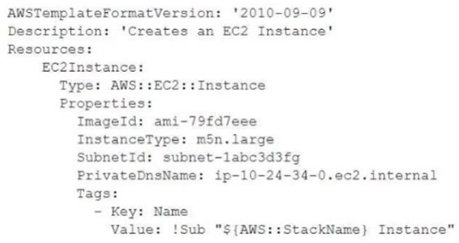

### Question 1/71

* A company needs to deploy an Amazon EC2 instance and attach a storage mount for the operating system and application files. Which AWS service will meet these requirements?

A. Amazon Elastic File System (Amazon EFS)

B. Amazon Elastic Block Store (Amazon EBS)

C. AWS Backup

D. Amazon S3

**Correct Answer: D**

### Question 1/299

* "A company has an internal web application that runs on Amazon EC2 instances behind an Application Load Balancer. The instances run in an Amazon EC2 Auto Scaling group in a single Availability Zone. A SysOps administrator must make the application highly available. 
Which action should the SysOps administrator take to meet this requirement?"	

**Correct Answer: Update the Auto Scaling group to launch new instances in a second Availability Zone in the same AWS Region.**

"A company hosts a website on multiple Amazon EC2 instances that run in an Auto Scaling group. Users are reporting slow responses during peak times between
6 PM and 11 PM every weekend. A SysOps administrator must implement a solution to improve performance during these peak times.
What is the MOST operationally efficient solution that meets these requirements?"	Configure a scheduled scaling action with a recurrence option to change the desired capacity before and after peak times

"A company is running a website on Amazon EC2 instances behind an Application Load Balancer (ALB). The company configured an Amazon CloudFront distribution and set the ALB as the origin. The company created an Amazon Route 53 CNAME record to send all traffic through the CloudFront distribution. As an unintended side effect, mobile users are now being served the desktop version of the website.
Which action should a SysOps administrator take to resolve this issue?"	Configure the CloudFront distribution behavior to forward the User-Agent header.

"A SysOps administrator has enabled AWS CloudTrail in an AWS account. If CloudTrail is disabled, it must be re-enabled immediately.
What should the SysOps administrator do to meet these requirements WITHOUT writing custom code?"	Create an AWS Config rule that is invoked when CloudTrail configuration changes. Apply the AWS-ConfigureCloudTrailLogging automatic remediation action.

"A company hosts its website on Amazon EC2 instances behind an Application Load Balancer. The company manages its DNS with Amazon Route 53, and wants to point its domain's zone apex to the website.
Which type of record should be used to meet these requirements?"	An alias record for the domain's zone apex

"A company must ensure that any objects uploaded to an S3 bucket are encrypted.
Which of the following actions will meet this requirement? (Choose two.)"	"Implement Amazon S3 default encryption to make sure that any object being uploaded is encrypted before it is stored.      
        Implement S3 bucket policies to deny unencrypted objects from being uploaded to the buckets"

"A company has a stateful web application that is hosted on Amazon EC2 instances in an Auto Scaling group. The instances run behind an Application Load
Balancer (ALB) that has a single target group. The ALB is configured as the origin in an Amazon CloudFront distribution. Users are reporting random logouts from the web application.
Which combination of actions should a SysOps administrator take to resolve this problem? (Choose two.)"	"Configure cookie forwarding in the CloudFront distribution cache behavior. 
Enable sticky sessions on the ALB target group."

"A company is running a serverless application on AWS Lambda. The application stores data in an Amazon RDS for MySQL DB instance. Usage has steadily increased, and recently there have been numerous ""too many connections"" errors when the Lambda function attempts to connect to the database. The company already has configured the database to use the maximum max_connections value that is possible.
What should a SysOps administrator do to resolve these errors?"	Use Amazon RDS Proxy to create a proxy. Update the connection string in the Lambda function.

"A SysOps administrator is deploying an application on 10 Amazon EC2 instances. The application must be highly available. The instances must be placed on distinct underlying hardware.
What should the SysOps administrator do to meet these requirements?"	Launch the instances into a spread placement group in a single AWS Region.

"A SysOps administrator is troubleshooting an AWS CloudFormation template whereby multiple Amazon EC2 instances are being created. The template is working in us-east-1, but it is failing in us-west-2 with the error code:
AMI [ami-12345678] does not exist
How should the Administrator ensure that the AWS CloudFormation template is working in every region?"	Modify the AWS CloudFormation template by including the AMI IDs in the ג€Mappingsג€ section. Refer to the proper mapping within the template for the proper AMI ID

"A SysOps administrator is provisioning an Amazon Elastic File System (Amazon EFS) file system to provide shared storage across multiple Amazon EC2 instances. The instances all exist in the same VPC across multiple Availability Zones. There are two instances in each Availability Zone. The SysOps administrator must make the file system accessible to each instance with the lowest possible latency.
Which solution will meet these requirements?"	Create a mount target in each Availability Zone of the VPC. Use the mount target to mount the EFS file system on the instances in the respective Availability Zone.

"A SysOps administrator has successfully deployed a VPC with an AWS CloudFormation template. The SysOps administrator wants to deploy the same template across multiple accounts that are managed through AWS Organizations.
Which solution will meet this requirement with the LEAST operational overhead?"	Use AWS CloudFormation StackSets from the management account to deploy the template in each of the accounts.

"A company is running distributed computing software to manage a fleet of 20 Amazon EC2 instances for calculations. The fleet includes 2 control nodes and 18 task nodes to run the calculations. Control nodes can automatically start the task nodes.
Currently, all the nodes run on demand. The control nodes must be available 24 hours a day, 7 days a week. The task nodes run for 4 hours each day. A SysOps administrator needs to optimize the cost of this solution.
Which combination of actions will meet these requirements? (Choose two.)"	"Purchase EC2 Instance Savings Plans for the control nodes
Use Spot Instances for the task nodes. Use On-Demand Instances if there is no Spot availability."

"A company is supposed to receive a data file every hour in an Amazon S3 bucket. An S3 event notification invokes an AWS Lambda function each time a file arrives. The function processes the data for use by an application.
The application team notices that sometimes the file does not arrive. The application team wants to receive a notification whenever the file does not arrive.
What is the MOST operationally efficient solution that meets these requirements?"	Create an Amazon CloudWatch alarm to publish a message to an Amazon Simple Notification Service (Amazon SNS) topic to alert the application team when the Invocations metric of the Lambda function is zero for an hour. Configure the alarm to treat missing data as breaching.

"A company recently acquired another corporation and all of that corporation's AWS accounts. A financial analyst needs the cost data from these accounts. A
SysOps administrator uses Cost Explorer to generate cost and usage reports. The SysOps administrator notices that ""No Tagkey"" represents 20% of the monthly cost.
What should the SysOps administrator do to tag the ""No Tagkey"" resources?"	Use Tag Editor to find and tag all the untagged resources

"While setting up an AWS managed VPN connection, a SysOps administrator creates a customer gateway resource in AWS. The customer gateway device resides in a data center with a NAT gateway in front of it.
What address should be used to create the customer gateway resource?"	The public IP address of the NAT device in front of the customer gateway device

"A company has a web application that is experiencing performance problems many times each night. A root cause analysis reveals sudden increases in CPU utilization that last 5 minutes on an Amazon EC2 Linux instance. A SysOps administrator must find the process ID (PID) of the service or process that is consuming more CPU.
What should the SysOps administrator do to collect the process utilization information with the LEAST amount of effort?"	Configure the Amazon CloudWatch agent procstat plugin to capture CPU process metrics.

"A SysOps administrator configured AWS Backup to capture snapshots from a single Amazon EC2 instance that has one Amazon Elastic Block Store (Amazon
EBS) volume attached. On the first snapshot, the EBS volume has 10 GiB of data. On the second snapshot, the EBS volume still contains 10 GiB of data, but 4
GiB have changed. On the third snapshot, 2 GiB of data have been added to the volume, for a total of 12 GiB.
How much total storage is required to store these snapshots?"	16 GiB

"A team is managing an AWS account that is a member of an organization in AWS Organizations. The organization has consolidated billing features enabled. The account hosts several applications.
A SysOps administrator has applied tags to resources within the account to reflect the environment. The team needs a report of the breakdown of charges by environment.
What should the SysOps administrator do to meet this requirement?"	Activate the tag keys for cost allocation on the organization's management account

"A company uses an AWS CloudFormation template to provision an Amazon EC2 instance and an Amazon RDS DB instance. A SysOps administrator must update the template to ensure that the DB instance is created before the EC2 instance is launched.
What should the SysOps administrator do to meet this requirement?"	Add the DependsOn attribute to the EC2 instance resource, and provide the logical name of the RDS resource.

"A company hosts a static website on Amazon S3. The website is served by an Amazon CloudFront distribution with a default TTL of 86,400 seconds.
The company recently uploaded an updated version of the website to Amazon S3. However, users still see the old content when they refresh the site. A SysOps administrator must make the new version of the website visible to users as soon as possible.
Which solution meets these requirements?"	Create an invalidation on the CloudFront distribution for the old S3 objects.

"A SysOps administrator is responsible for managing a company's cloud infrastructure with AWS CloudFormation. The SysOps administrator needs to create a single resource that consists of multiple AWS services. The resource must support creation and deletion through the CloudFormation console.
Which CloudFormation resource type should the SysOps administrator create to meet these requirements?"	Custom::MyCustomType

"A new website will run on Amazon EC2 instances behind an Application Load Balancer. Amazon Route 53 will be used to manage DNS records.
What type of record should be set in Route 53 to point the website's apex domain name (for example, `company.com`) to the Application Load Balancer?"	ALIAS

"A company is implementing security and compliance by using AWS Trusted Advisor. The company's SysOps team is validating the list of Trusted Advisor checks that it can access.
Which factor will affect the quantity of available Trusted Advisor checks?"	The AWS Support plan

"A SysOps administrator is investigating issues on an Amazon RDS for MariaDB DB instance. The SysOps administrator wants to display the database load categorized by detailed wait events.
How can the SysOps administrator accomplish this goal?"	Enable Amazon RDS Performance Insights

"A company is planning to host an application on a set of Amazon EC2 instances that are distributed across multiple Availability Zones. The application must be able to scale to millions of requests each second.
A SysOps administrator must design a solution to distribute the traffic to the EC2 instances. The solution must be optimized to handle sudden and volatile traffic patterns while using a single static IP address for each Availability Zone.
Which solution will meet these requirements?"	Network Load Balancer

"A SysOps administrator is using AWS CloudFormation StackSets to create AWS resources in two AWS Regions in the same AWS account. A stack operation fails in one Region and returns the stack instance status of OUTDATED.
What is the cause of this failure?"	The CloudFormation template is trying to create a global resource that is not unique.

"A SysOps administrator must configure Amazon S3 to host a simple nonproduction webpage. The SysOps administrator has created an empty S3 bucket from the
AWS Management Console. The S3 bucket has the default configuration in place.
Which combination of actions should the SysOps administrator take to complete this process? (Choose two.)"	" Turn off the ""Block all public access"" setting. Set a bucket policy that allows ""Principal"": the s3:GetObject action.
Create an index.html document. Configure static website hosting, and upload the index document to the S3 bucket"

"A company is using an Amazon Aurora MySQL DB cluster that has point-in-time recovery, backtracking, and automatic backup enabled. A SysOps administrator needs to be able to roll back the DB cluster to a specific recovery point within the previous 72 hours. Restores must be completed in the same production DB cluster.
Which solution will meet these requirements?"	Use backtracking to rewind the existing DB cluster to the desired recovery point.

"A user working in the Amazon EC2 console increased the size of an Amazon Elastic Block Store (Amazon EBS) volume attached to an Amazon EC2 Windows instance. The change is not reflected in the file system.
What should a SysOps administrator do to resolve this issue?"	Extend the file system with operating system-level tools to use the new storage capacity.

"A SysOps administrator is using Amazon EC2 instances to host an application. The SysOps administrator needs to grant permissions for the application to access an Amazon DynamoDB table.
Which solution will meet this requirement?"	Create an IAM role to access the DynamoDB table. Assign the IAM role to the EC2 instance profile.

"A SysOps administrator wants to protect objects in an Amazon S3 bucket from accidental overwrite and deletion. Noncurrent objects must be kept for 90 days and then must be permanently deleted. Objects must reside within the same AWS Region as the original S3 bucket.
Which solution meets these requirements?"	Enable S3 Versioning on the S3 bucket. Create an S3 Lifecycle policy for the bucket to expire noncurrent objects after 90 days.

"A company has an application that customers use to search for records on a website. The application's data is stored in an Amazon Aurora DB cluster. The application's usage varies by season and by day of the week.
The website's popularity is increasing, and the website is experiencing slower performance because of increased load on the DB cluster during periods of peak activity. The application logs show that the performance issues occur when users are searching for information. The same search is rarely performed multiple times.
A SysOps administrator must improve the performance of the platform by using a solution that maximizes resource efficiency.
Which solution will meet these requirements?"	 Deploy an Aurora Replica for the DB cluster. Modify the application to use the reader endpoint for search operations. Use Aurora Auto Scaling to scale the number of replicas based on load.

"A company uses AWS Organizations to manage multiple AWS accounts. Corporate policy mandates that only specific AWS Regions can be used to store and process customer data. A SysOps administrator must prevent the provisioning of Amazon EC2 instances in unauthorized Regions by anyone in the company.
What is the MOST operationally efficient solution that meets these requirements?"	Create a service control policy (SCP) in AWS Organizations to deny the ec2:RunInstances action in all unauthorized Regions. Attach this policy to the root level of the organization.

"A company's public website is hosted in an Amazon S3 bucket in the us-east-1 Region behind an Amazon CloudFront distribution. The company wants to ensure that the website is protected from DDoS attacks. A SysOps administrator needs to deploy a solution that gives the company the ability to maintain control over the rate limit at which DDoS protections are applied.
Which solution will meet these requirements?"	Deploy a global-scoped AWS WAF web ACL with an allow default action. Configure an AWS WAF rate-based rule to block matching traffic. Associate the web ACL with the CloudFront distribution

"A SysOps administrator developed a Python script that uses the AWS SDK to conduct several maintenance tasks. The script needs to run automatically every night.
What is the MOST operationally efficient solution that meets this requirement?"	Convert the Python script to an AWS Lambda function. Use an Amazon EventBridge (Amazon CloudWatch Events) rule to invoke the function every night. 

"A SysOps administrator must create a solution that immediately notifies software developers if an AWS Lambda function experiences an error.
Which solution will meet this requirement?"	 Create an Amazon Simple Notification Service (Amazon SNS) topic with an email subscription for each developer. Create an Amazon CloudWatch alarm by using the Errors metric and the Lambda function name as a dimension. Configure the alarm to send a notification to the SNS topic when the alarm state reaches ALARM

"A company has a private Amazon S3 bucket that contains sensitive information. A SysOps administrator needs to keep logs of the IP addresses from authentication failures that result from attempts to access objects in the bucket. The logs must be stored so that they cannot be overwritten or deleted for 90 days.
Which solution will meet these requirements?"	Turn on access logging for the S3 bucket. Configure the access logs to be saved in a second S3 bucket. Turn on S3 Object Lock on the second S3 bucket, and configure a default retention period of 90 days.

"A SysOps administrator migrates NAT instances to NAT gateways. After the migration, an application that is hosted on Amazon EC2 instances in a private subnet cannot access the internet.
Which of the following are possible reasons for this problem? (Choose two.)"	"The application is using a protocol that the NAT gateway does not support.
The NAT gateway is not in the Available state"

"A company runs an application on an Amazon EC2 instance. A SysOps administrator creates an Auto Scaling group and an Application Load Balancer (ALB) to handle an increase in demand. However, the EC2 instances are failing the health check.
What should the SysOps administrator do to troubleshoot this issue?"	Verify that the application is running on the protocol and the port that the listener is expecting

"A SysOps administrator has created an AWS Service Catalog portfolio and has shared the portfolio with a second AWS account in the company. The second account is controlled by a different administrator.
Which action will the administrator of the second account be able to perform?"	 Add a product from the imported portfolio to a local portfolio.

"A company has migrated its application to AWS. The company will host the application on Amazon EC2 instances of multiple instance families.
During initial testing, a SysOps administrator identifies performance issues on selected EC2 instances. The company has a strict budget allocation policy, so the
SysOps administrator must use the right resource types with the performance characteristics to match the workload.
What should the SysOps administrator do to meet this requirement?"	 Review and take action on AWS Compute Optimizer recommendations. Purchase Compute Savings Plans to reduce the cost that is required to run the compute resources.

"A SysOps administrator is tasked with deploying a company's infrastructure as code. The SysOps administrator want to write a single template that can be reused for multiple environments.
How should the SysOps administrator use AWS CloudFormation to create a solution?"	Use parameters in a CloudFormation template

"A SysOps administrator is responsible for a large fleet of Amazon EC2 instances and must know whether any instances will be affected by upcoming hardware maintenance.
Which option would provide this information with the LEAST administrative overhead?"	Review the AWS Personal Health Dashboard

"A SysOps administrator is attempting to deploy resources by using an AWS CloudFormation template. An Amazon EC2 instance that is defined in the template fails to launch and produces an InsufficientInstanceCapacity error.
Which actions should the SysOps administrator take to resolve this error? (Choose two.)"	"Modify the AWS CloudFormation template to not specify an Availability Zone for the EC2 instance.
 Modify the AWS CloudFormation template to use a different EC2 instance type."

"A company hosts a web application on Amazon EC2 instances behind an Application Load Balancer (ALB). The company uses Amazon Route 53 to route traffic.
The company also has a static website that is configured in an Amazon S3 bucket.
A SysOps administrator must use the static website as a backup to the web application. The failover to the static website must be fully automated.
Which combination of actions will meet these requirements? (Choose two.)"	" Create a primary failover routing policy record. Configure the value to be the ALB. Associate the record with a Route 53 health check.
Create a secondary failover routing policy record. Configure the value to be the static website."

"A data analytics application is running on an Amazon EC2 instance. A SysOps administrator must add custom dimensions to the metrics collected by the Amazon
CloudWatch agent.
How can the SysOps administrator meet this requirement?"	Create an append_dimensions field in the Amazon CloudWatch agent configuration file to collect the metrics

"A company stores its data in an Amazon S3 bucket. The company is required to classify the data and find any sensitive personal information in its S3 files.
Which solution will meet these requirements?"	Enable Amazon Macie. Create a discovery job that uses the managed data identifier. 

### Question 50/299

"A company hosts a web portal on Amazon EC2 instances. The web portal uses an Elastic Load Balancer (ELB) and Amazon Route 53 for its public DNS service.
The ELB and the EC2 instances are deployed by way of a single AWS CloudFormation stack in the us-east-1 Region. The web portal must be highly available across multiple Regions.
Which configuration will meet these requirements?"	

**R: Deploy a copy of the stack in the us-west-2 Region. Create an additional A record in Route 53 that includes the ELB in us-west-2 as an alias target. Configure the A records with a failover routing policy and health checks. Use the ELB in us-east-1 as the primary record and the ELB in us-west-2 as the secondary record.**

### Question 51/299

"A SysOps administrator is investigating why a user has been unable to use RDP to connect over the internet from their home computer to a bastion server running on an Amazon EC2 Windows instance.
Which of the following are possible causes of this issue? (Choose two.)"	"A network ACL associated with the bastion's subnet is blocking the network traffic
The route table associated with the bastion's subnet does not have a route to the internet gateway."

### Question 52/299

* "A SysOps administrator is examining the following AWS CloudFormation template"

"Why will the stack creation fail?"

**R: The PrivateDnsName cannot be set from a CloudFormation template.**