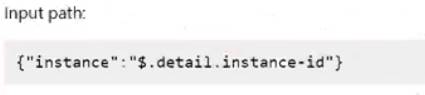
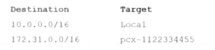

### QUESTION 1

- (Exam Topic 1)
A company hosts its website in the us-east-1 Region. The company is preparing to deploy its website into the eu-central-1 Region. Website visitors who are located in Europe should access the website that is hosted in eu-central-1. All other visitors access the website that is hosted in us-east-1. The company uses Amazon Route 53 to manage the website's DNS records.
Which routing policy should a SysOps administrator apply to the Route 53 record set to meet these requirements?

    A.
    Geolocation routing policy
    B.
    Geoproximity routing policy
    C.
    Latency routing policy
    D.
    Multivalue answer routing policy

Correct Answer: A
geolocation "Geolocation routing lets you choose the resources that serve your traffic based on the geographic location of your users, meaning the location that DNS queries originate from. For example, you might want all queries from Europe to be routed to an ELB load balancer in the Frankfurt region."
Could be confused with geoproximity - "Geoproximity routing lets Amazon Route 53 route traffic to your resources based on the geographic location of your users and your resources. You can also optionally choose to route more traffic or less to a given resource by specifying a value, known as a bias. A bias expands or shrinks the size of the geographic region from which traffic is routed to a resource" the use case is not needed as per question.
https://docs.aws.amazon.com/Route53/latest/DeveloperGuide/routing-policy.html 

### QUESTION 2

- (Exam Topic 1)
A company uses Amazon Elasticsearch Service (Amazon ES) to analyze sales and customer usage data. Members of the company's geographically dispersed sales team are traveling. They need to log in to Kibana by using their existing corporate credentials that are stored in Active Directory. The company has deployed
Active Directory Federation Services (AD FS) to enable authentication to cloud services. Which solution will meet these requirements?

    A.
    Configure Active Directory as an authentication provider in Amazon E
    B.
    Add the Active Directory server's domain name to Amazon E
    C.
    Configure Kibana to use Amazon ES authentication.
    D.
    Deploy an Amazon Cognito user poo
    E.
    Configure Active Directory as an external identity provider for the user poo
    F.
    Enable Amazon Cognito authentication for Kibana on Amazon ES.
    G.
    Enable Active Directory user authentication in Kiban
    H.
    Create an IP-based custom domain access policy in Amazon ES that includes the Active Directory server's IP address.
    I.
    Establish a trust relationship with Kibana on the Active Directory serve
    J.
    Enable Active Directory user authentication in Kiban
    K.
    Add the Active Directory server's IP address to Kibana.

Correct Answer: B
https://aws.amazon.com/blogs/security/how-to-enable-secure-access-to-kibana-using-aws-single-sign-on/ https://docs.aws.amazon.com/elasticsearch-service/latest/developerguide/es-cognito-auth.html 

### QUESTION 3

- (Exam Topic 1)
A SysOps administrator must ensure that a company's Amazon EC2 instances auto scale as expected The SysOps administrator configures an Amazon EC2 Auto Scaling Lifecycle hook to send an event to Amazon EventBridge (Amazon CloudWatch Events), which then invokes an AWS Lambda function to configure the EC2 distances When the configuration is complete, the Lambda function calls the complete Lifecycle-action event to put the EC2 instances into service. In testing, the SysOps administrator discovers that the Lambda function is not invoked when the EC2 instances auto scale.
What should the SysOps administrator do to reserve this issue?

    A.
    Add a permission to the Lambda function so that it can be invoked by the EventBridge (CloudWatch Events) rule.
    B.
    Change the lifecycle hook action to CONTINUE if the lifecycle hook experiences a fa* we or timeout.
    C.
    Configure a retry policy in the EventBridge (CloudWatch Events) rule to retry the Lambda function invocation upon failure.
    D.
    Update the Lambda function execution role so that it has permission to call the complete lifecycle-action event

Correct Answer: D 

### QUESTION 4

- (Exam Topic 1)
An Amazon EC2 instance is running an application that uses Amazon Simple Queue Service (Amazon SQS} queues A SysOps administrator must ensure that the application can read, write, and delete messages from the SQS queues
Which solution will meet these requirements in the MOST secure manner?

    A.
    Create an IAM user with an IAM policy that allows the sqs SendMessage permission, the sqs ReceiveMessage permission, and the sqs DeleteMessage permission to the appropriate queues Embed the IAM user's credentials in the application's configuration
    B.
    Create an IAM user with an IAM policy that allows the sqs SendMessage permission, the sqs ReceiveMessage permission, and the sqs DeleteMessage permission to the appropriate queues Export the IAM user's access key and secret access key as environment variables on the EC2 instance
    C.
    Create and associate an IAM role that allows EC2 instances to call AWS services Attach an IAM policy to the role that allows sqs." permissions to the appropriate queues
    D.
    Create and associate an IAM role that allows EC2 instances to call AWS services Attach an IAM policy to the role that allows the sqs SendMessage permission, the sqs ReceiveMessage permission, and the sqs DeleteMessage permission to the appropriate queues

Correct Answer: D 

### QUESTION 5

- (Exam Topic 1)
A company has multiple AWS Site-to-Site VPN connections between a VPC and its branch offices. The company manages an Amazon Elasticsearch Service (Amazon ES) domain that is configured with public
access. The Amazon ES domain has an open domain access policy. A SysOps administrator needs to ensure that Amazon ES can be accessed only from the branch offices while preserving existing data.
Which solution will meet these requirements?

    A.
    Configure an identity-based access policy on Amazon E
    B.
    Add an allow statement to the policy that includes the Amazon Resource Name (ARN) for each branch office VPN connection.
    C.
    Configure an IP-based domain access policy on Amazon E
    D.
    Add an allow statement to the policy that includes the private IP CIDR blocks from each branch office network.
    E.
    Deploy a new Amazon ES domain in private subnets in a VPC, and import a snapshot from the old domai
    F.
    Create a security group that allows inbound traffic from the branch office CIDR blocks.
    G.
    Reconfigure the Amazon ES domain in private subnets in a VP
    H.
    Create a security group that allows inbound traffic from the branch office CIDR blocks.

Correct Answer: B 

### QUESTION 6

- (Exam Topic 1)
A Sysops administrator has created an Amazon EC2 instance using an AWS CloudFormation template in the us-east-I Region. The administrator finds that this
template has failed to create an EC2 instance in the us-west-2 Region. What is one cause for this failure?

    A.
    Resource tags defined in the CloudFormation template are specific to the us-east-I Region.
    B.
    The Amazon Machine Image (AMI) ID referenced in the CloudFormation template could not be found in the us-west-2 Region.
    C.
    The cfn-init script did not run during resource provisioning in the us-west-2 Region.
    D.
    The IAM user was not created in the specified Region.

Correct Answer: B
One possible cause for the failure of the CloudFormation template to create an EC2 instance in the us-west-2 Region is that the Amazon Machine Image (AMI) ID referenced in the template could not be found in the us-west-2 Region. This could be due to the fact that the AMI is not available in that region, or the credentials used to access the AMI were not configured properly. The other options (resource tags defined in the CloudFormation template are specific to the us-east-I Region, the cfn-init script did not run during resource provisioning in the us-west-2 Region, and the IAM user was not created in the specified Region) are not valid causes for this failure. 

### QUESTION 7

- (Exam Topic 1)
A company has a public website that recently experienced problems. Some links led to missing webpages, and other links rendered incorrect webpages. The application infrastructure was running properly, and all the provisioned resources were healthy. Application logs and dashboards did not show any errors, and no monitoring alarms were raised. Systems administrators were not aware of any problems until end users reported the issues.
The company needs to proactively monitor the website for such issues in the future and must implement a solution as soon as possible.
Which solution will meet these requirements with the LEAST operational overhead?

    A.
    Rewrite the application to surface a custom error to the application log when issues occur.Automatically parse logs for error
    B.
    Create an Amazon CloudWatch alarm to provide alerts when issues are detected.
    C.
    Create an AWS Lambda function to test the websit
    D.
    Configure the Lambda function to emit an Amazon CloudWatch custom metric when errors are detecte
    E.
    Configure a CloudWatch alarm to provide alerts when issues are detected.
    F.
    Create an Amazon CloudWatch Synthetics canar
    G.
    Use the CloudWatch Synthetics Recorder plugin to generate the script for the canary ru
    H.
    Configure the canary in line with requirement
    I.
    Create an alarm to provide alerts when issues are detected.

Correct Answer: A 

### QUESTION 8

- (Exam Topic 1)
A company hosts a database on an Amazon RDS Multi-AZ DB instance. The database is not encrypted. The company's new security policy requires all AWS resources to be encrypted at rest and in transit.
What should a SysOps administrator do to encrypt the database?

    A.
    Configure encryption on the existing DB instance.
    B.
    Take a snapshot of the DB instanc
    C.
    Encrypt the snapsho
    D.
    Restore the snapshot to the same DB instance.
    E.
    Encrypt the standby replica in a secondary Availability Zon
    F.
    Promote the standby replica to the primary DB instance.
    G.
    Take a snapshot of the DB instanc
    H.
    Copy and encrypt the snapsho
    I.
    Create a new DB instance by restoring the encrypted copy.

Correct Answer: B 

### QUESTION 9

- (Exam Topic 1)
A company has an Amazon CloudFront distribution that uses an Amazon S3 bucket as its origin. During a review of the access logs, the company determines that some requests are going directly to the S3 bucket by using the website hosting endpoint. A SysOps administrator must secure the S3 bucket to allow requests only from CloudFront.
What should the SysOps administrator do to meet this requirement?

    A.
    Create an origin access identity (OAI) in CloudFron
    B.
    Associate the OAI with the distributio
    C.
    Remove access to and from other principals in the S3 bucket polic
    D.
    Update the S3 bucket policy to allow accessonly from the OAI.
    E.
    Create an origin access identity (OAI) in CloudFron
    F.
    Associate the OAI with the distributio
    G.
    Update the S3 bucket policy to allow access only from the OA
    H.
    Create a new origin, and specify the S3 bucket as the new origi
    I.
    Update the distribution behavior to use the new origi
    J.
    Remove the existing origin.
    K.
    Create an origin access identity (OAI) in CloudFron
    L.
    Associate the OAI with the distributio
    M.
    Update the S3 bucket policy to allow access only from the OA
    N.
    Disable website hostin
    O.
    Create a new origin, and specify the S3 bucket as the new origi
    P.
    Update the distribution behavior to use the new origi
    Q.
    Remove the existing origin.
    R.
    Update the S3 bucket policy to allow access only from the CloudFront distributio
    S.
    Remove access to and from other principals in the S3 bucket polic
    T.
    Disable website hostin
    .
    Create a new origin, and specify the S3 bucket as the new origi
    .
    Update the distribution behavior to use the new origi
    .
    Remove the existing origin.

Correct Answer: A 

### QUESTION 10

- (Exam Topic 1)
A SysOps administrator is investigating why a user has been unable to use RDP to connect over the internet from their home computer to a bastion server running on an Amazon EC2 Windows instance.
Which of the following are possible causes of this issue? (Choose two.)

    A.
    A network ACL associated with the bastion's subnet is blocking the network traffic.
    B.
    The instance does not have a private IP address.
    C.
    The route table associated with the bastion's subnet does not have a route to the internet gateway.
    D.
    The security group for the instance does not have an inbound rule on port 22.
    E.
    The security group for the instance does not have an outbound rule on port 3389.

Correct Answer: A C 

### QUESTION 11

- (Exam Topic 1)
A SysOps administrator recently configured Amazon S3 Cross-Region Replication on an S3 bucket Which of the following does this feature replicate to the destination S3 bucket by default?

    A.
    Objects in the source S3 bucket for which the bucket owner does not have permissions
    B.
    Objects that are stored in S3 Glacier
    C.
    Objects that existed before replication was configured
    D.
    Object metadata

Correct Answer: B 

### QUESTION 12

- (Exam Topic 1)
A SysOps administrator is required to monitor free space on Amazon EBS volumes attached to Microsoft Windows-based Amazon EC2 instances within a company’s account. The administrator must be alerted to potential issues.
What should the administrator do to receive email alerts before low storage space affects EC2 instance performance?

    A.
    Use built-in Amazon CloudWatch metrics, and configure CloudWatch alarms and an Amazon SNS topic for email notifications
    B.
    Use AWS CloudTrail logs and configure the trail to send notifications to an Amazon SNS topic.
    C.
    Use the Amazon CloudWatch agent to send disk space metrics, then set up CloudWatch alarms using an Amazon SNS topic.
    D.
    Use AWS Trusted Advisor and enable email notification alerts for EC2 disk space

Correct Answer: C 

### QUESTION 13

- (Exam Topic 1)
A SysOps administrator is creating an Amazon EC2 Auto Scaling group in a new AWS account. After adding some instances, the SysOps administrator notices that the group has not reached the minimum number of instances. The SysOps administrator receives the following error message:
AWS-SysOps dumps exhibit
Which action will resolve this issue?

    A.
    Adjust the account spending limits for Amazon EC2 on the AWS Billing and Cost Management console
    B.
    Modify the EC2 quota for that AWS Region in the EC2 Settings section of the EC2 console.
    C.
    Request a quota Increase for the Instance type family by using Service Quotas on the AWS Management Console.
    D.
    Use the Rebalance action In the Auto Scaling group on the AWS Management Console.

Correct Answer: C 

### QUESTION 14

- (Exam Topic 1)
A company has a stateless application that runs on four Amazon EC2 instances. The application requires tour instances at all times to support all traffic. A SysOps administrator must design a highly available,
fault-tolerant architecture that continually supports all traffic if one Availability Zone becomes unavailable.
Which configuration meets these requirements?

    A.
    Deploy two Auto Scaling groups in two Availability Zones with a minimum capacity of two instances in each group.
    B.
    Deploy an Auto Scaling group across two Availability Zones with a minimum capacity of four instances.
    C.
    Deploy an Auto Scaling group across three Availability Zones with a minimum capacity of four instances.
    D.
    Deploy an Auto Scaling group across three Availability Zones with a minimum capacity of six instances.

Correct Answer: C 

### QUESTION 15

- (Exam Topic 1)
A company's financial department needs to view the cost details of each project in an AWS account A SysOps administrator must perform the initial configuration that is required to view cost for each project in Cost Explorer
Which solution will meet this requirement?

    A.
    Activate cost allocation tags Add a project tag to the appropriate resources
    B.
    Configure consolidated billing Create AWS Cost and Usage Reports
    C.
    Use AWS Budgets Create AWS Budgets reports
    D.
    Use cost categories to define custom groups that are based on AWS cost and usage dimensions

Correct Answer: A 

### QUESTION 16

- (Exam Topic 1)
A company's SysOps administrator deploys a public Network Load Balancer (NLB) in front of the company's web application. The web application does not use any Elastic IP addresses. Users must access the web application by using the company's domain name. The SysOps administrator needs to configure Amazon Route 53 to route traffic to the NLB.
Which solution will meet these requirements MOST cost-effectively?

    A.
    Create a Route 53 AAAA record for the NLB.
    B.
    Create a Route 53 alias record for the NLB.
    C.
    Create a Route 53 CAA record for the NLB.
    D.
    Create a Route 53 CNAME record for the NLB.

Correct Answer: B 

### QUESTION 17

- (Exam Topic 1)
A large company is using AWS Organizations to manage hundreds of AWS accounts across multiple AWS Regions. The company has turned on AWS Config throughout the organization.
The company requires all Amazon S3 buckets to block public read access. A SysOps administrator must generate a monthly report that shows all the S3 buckets and whether they comply with this requirement.
Which combination of steps should the SysOps administrator take to collect this data? {Select TWO).

    A.
    Create an AWS Config aggregator in an aggregator accoun
    B.
    Use the organization as the source.Retrieve the compliance data from the aggregator.
    C.
    Create an AWS Config aggregator in each accoun
    D.
    Use an S3 bucket in an aggregator account as the destinatio
    E.
    Retrieve the compliance data from the S3 bucket
    F.
    Edit the AWS Config policy in AWS Organization
    G.
    Use the organization's management account to turn on the s3-bucket-public-read-prohibited rule for the entire organization.
    H.
    Use the AWS Config compliance report from the organization's management accoun
    I.
    Filter the results by resource, and select Amazon S3.
    J.
    Use the AWS Config API to apply the s3-bucket-public-read-prohibited rule in all accounts for all available Regions.

Correct Answer: C D 

### QUESTION 18

- (Exam Topic 1)
A company's SysOps administrator deploys four new Amazon EC2 instances by using the standard Amazon Linux 2 Amazon Machine Image (AMI). The company needs to be able to use AWS Systems Manager to manage the instances The SysOps administrator notices that the instances do not appear in the Systems Manager console
What must the SysOps administrator do to resolve this issue?

    A.
    Connect to each instance by using SSH Install Systems Manager Agent on each instance Configure Systems Manager Agent to start automatically when the instances start up
    B.
    Use AWS Certificate Manager (ACM) to create a TLS certificate Import the certificate into each instance Configure Systems Manager Agent to use the TLS certificate for secure communications
    C.
    Connect to each instance by using SSH Create an ssm-user account Add the ssm-user account to the/etcsudoers d directory
    D.
    Attach an IAM instance profile to the instances Ensure that the instance profile contains the AmazonSSMManagedinstanceCore policy

Correct Answer: D 

### QUESTION 19

- (Exam Topic 1)
A SysOps administrator is trying to set up an Amazon Route 53 domain name to route traffic to a website hosted on Amazon S3. The domain name of the website is www.anycompany.com and the S3 bucket name is anycompany-static. After the record set is set up in Route 53, the domain name www.anycompany.com does not seem to work, and the static website is not displayed in the browser.
Which of the following is a cause of this?

    A.
    The S3 bucket must be configured with Amazon CloudFront first.
    B.
    The Route 53 record set must have an IAM role that allows access to the S3 bucket.
    C.
    The Route 53 record set must be in the same region as the S3 bucket.
    D.
    The S3 bucket name must match the record set name in Route 53.

Correct Answer: D 

### QUESTION 20

- (Exam Topic 1)
A company needs to view a list of security groups that are open to the internet on port 3389. What should a SysOps administrator do to meet this requirement?

    A.
    Configure Amazon GuardDuly to scan security groups and report unrestricted access on port 3389.
    B.
    Configure a service control policy (SCP) to identify security groups that allow unrestricted access on port 3389
    C.
    Use AWS Identity and Access Management Access Analyzer to find any instances that have unrestricted access on port 3389.
    D.
    Use AWS Trusted Advisor to find security groups that allow unrestricted access on port 3389.

Correct Answer: D 

### QUESTION 21

- (Exam Topic 1)
A gaming application is deployed on four Amazon EC2 instances in a default VPC. The SysOps administrator has noticed consistently high latency in responses as data is transferred among the four instances. There is no way for the administrator to alter the application code.
The MOST effective way to reduce latency is to relaunch the EC2 instances in:

    A.
    a dedicated VPC.
    B.
    a single subnet inside the VPC.
    C.
    a placement group.
    D.
    a single Availability Zone.

Correct Answer: C 

### QUESTION 22

- (Exam Topic 1)
A company runs an application on Amazon EC2 instances. The EC2 instances are in an Auto Scaling group and run behind an Application Load Balancer (ALB). The application experiences errors when total requests exceed 100 requests per second. A SysOps administrator must collect information about total requests for a 2-week period to determine when requests exceeded this threshold.
What should the SysOps administrator do to collect this data?

    A.
    Use the ALB’s RequestCount metri
    B.
    Configure a time range of 2 weeks and a period of 1 minute.Examine the chart to determine peak traffic times and volumes.
    C.
    Use Amazon CloudWatch metric math to generate a sum of request counts for all the EC2 instances over a 2-week perio
    D.
    Sort by a 1-minute interval.
    E.
    Create Amazon CloudWatch custom metrics on the EC2 launch configuration templates to create aggregated request metrics across all the EC2 instances.
    F.
    Create an Amazon EventBridge (Amazon CloudWatch Events) rul
    G.
    Configure an EC2 event matching pattern that creates a metric that is based on EC2 request
    H.
    Display the data in a graph.

Correct Answer: A
Using the ALB’s RequestCount metric will allow the SysOps administrator to collect information about total requests for a 2-week period and determine when requests exceeded the threshold of 100 requests per second. Configuring a time range of 2 weeks and a period of 1 minute will ensure that the data can be accurately examined to determine peak traffic times and volumes. 

### QUESTION 23

- (Exam Topic 1)
A company uses AWS Cloud Formation templates to deploy cloud infrastructure. An analysis of all the company's templates shows that the company has declared the same components in multiple templates. A SysOps administrator needs to create dedicated templates that have their own parameters and conditions for these common components.
Which solution will meet this requirement?

    A.
    Develop a CloudFormaiion change set.
    B.
    Develop CloudFormation macros.
    C.
    Develop CloudFormation nested stacks.
    D.
    Develop CloudFormation stack sets.

Correct Answer: C 

### QUESTION 24

- (Exam Topic 1)
A database is running on an Amazon RDS Mufti-AZ DB instance. A recent security audit found the database to be out of compliance because it was not encrypted. Which approach will resolve the encryption requirement?

    A.
    Log in to the RDS console and select the encryption box to encrypt the database
    B.
    Create a new encrypted Amazon EBS volume and attach it to the instance
    C.
    Encrypt the standby replica in the secondary Availability Zone and promote it to the primary instance.
    D.
    Take a snapshot of the RDS instance, copy and encrypt the snapshot and then restore to the new RDS instance

Correct Answer: D 

### QUESTION 25

- (Exam Topic 1)
A company has an internal web application that runs on Amazon EC2 instances behind an Application Load
Balancer. The instances run in an Amazon EC2 Auto Scaling group in a single Availability Zone. A SysOps administrator must make the application highly available.
Which action should the SysOps administrator take to meet this requirement?

    A.
    Increase the maximum number of instances in the Auto Scaling group to meet the capacity that is required at peak usage.
    B.
    Increase the minimum number of instances in the Auto Scaling group to meet the capacity that is required at peak usage.
    C.
    Update the Auto Scaling group to launch new instances in a second Availability Zone in the same AWS Region.
    D.
    Update the Auto Scaling group to launch new instances in an Availability Zone in a second AWS Region.

Correct Answer: C 

### QUESTION 26

- (Exam Topic 1)
A company is running a serverless application on AWS Lambda The application stores data in an Amazon RDS for MySQL DB instance Usage has steadily increased and recently there have been numerous "too many connections" errors when the Lambda function attempts to connect to the database The company already has configured the database to use the maximum max_connections value that is possible
What should a SysOps administrator do to resolve these errors'?

    A.
    Create a read replica of the database Use Amazon Route 53 to create a weighted DNS record that contains both databases
    B.
    Use Amazon RDS Proxy to create a proxy Update the connection string in the Lambda function
    C.
    Increase the value in the max_connect_errors parameter in the parameter group that the database uses
    D.
    Update the Lambda function's reserved concurrency to a higher value

Correct Answer: B
https://aws.amazon.com/blogs/compute/using-amazon-rds-proxy-with-aws-lambda/
RDS Proxy acts as an intermediary between your application and an RDS database. RDS Proxy establishes and manages the necessary connection pools to your database so that your application creates fewer database connections. Your Lambda functions interact with RDS Proxy instead of your database instance. It handles the connection pooling necessary for scaling many simultaneous connections created by concurrent Lambda functions. This allows your Lambda applications to reuse existing connections, rather than creating new connections for every function invocation.
Check "Database proxy for Amazon RDS" section in the link to see how RDS proxy help Lambda handle huge connections to RDS MySQL
https://aws.amazon.com/blogs/compute/using-amazon-rds-proxy-with-aws-lambda/ 

### QUESTION 27

- (Exam Topic 1)
A SysOps administrator needs to delete an AWS CloudFormation stack that is no longer in use. The CloudFormation stack is in the DELETE_FAILED state. The SysOps administrator has validated the permissions that are required to delete the Cloud Formation stack.

    A.
    The configured timeout to delete the stack was too low for the delete operation to complete.
    B.
    The stack contains nested stacks that must be manually deleted fast.
    C.
    The stack was deployed with the -disable rollback option.
    D.
    There are additional resources associated with a security group in the stack
    E.
    There are Amazon S3 buckets that still contain objects in the stack.

Correct Answer: D E 

### QUESTION 28

- (Exam Topic 1)
A company is using an Amazon DynamoDB table for data. A SysOps administrator must configure replication of the table to another AWS Region for disaster recovery.
What should the SysOps administrator do to meet this requirement?

    A.
    Enable DynamoDB Accelerator (DAX).
    B.
    Enable DynamoDB Streams, and add a global secondary index (GSI).
    C.
    Enable DynamoDB Streams, and-add a global table Region.
    D.
    Enable point-in-time recovery.

Correct Answer: C 

### QUESTION 29

- (Exam Topic 1)
A company has a VPC with public and private subnets. An Amazon EC2 based application resides in the private subnets and needs to process raw .csv files stored in an Amazon S3 bucket. A SysOps administrator has set up the correct IAM role with the required permissions for the application to access the S3 bucket, but the application is unable to communicate with the S3 bucket.
Which action will solve this problem while adhering to least privilege access?

    A.
    Add a bucket policy to the S3 bucket permitting access from the IAM role.
    B.
    Attach an S3 gateway endpoint to the VP
    C.
    Configure the route table for the private subnet.
    D.
    Configure the route table to allow the instances on the private subnet access through the internet gateway.
    E.
    Create a NAT gateway in a private subnet and configure the route table for the private subnets.

Correct Answer: B
Technology to use is a VPC endpoint - "A VPC endpoint enables private connections between your VPC and supported AWS services and VPC endpoint services powered by AWS PrivateLink. AWS PrivateLink is a technology that enables you to privately access services by using private IP addresses. Traffic between your VPC and the other service does not leave the Amazon network." S3 is an example of a gateway endpoint. We want to see services in AWS while not leaving the VPC. 

### QUESTION 30

- (Exam Topic 1)
A company has an existing web application that runs on two Amazon EC2 instances behind an Application Load Balancer (ALB) across two Availability Zones The application uses an Amazon RDS Multi-AZ DB Instance Amazon Route 53 record sets route requests tor dynamic content to the load balancer and requests for static content to an Amazon S3 bucket Site visitors are reporting extremely long loading times.
Which actions should be taken to improve the performance of the website? (Select TWO )

    A.
    Add Amazon CloudFront caching for static content
    B.
    Change the load balancer listener from HTTPS to TCP
    C.
    Enable Amazon Route 53 latency-based routing
    D.
    Implement Amazon EC2 Auto Scaling for the web servers
    E.
    Move the static content from Amazon S3 to the web servers

Correct Answer: A D 

### QUESTION 31

- (Exam Topic 1)
A company is trying to connect two applications. One application runs in an on-premises data center that has a hostname of hostl .onprem.private. The other application runs on an Amazon EC2 instance that has a hostname of hostl.awscloud.private. An AWS Site-to-Site VPN connection is in place between the on-premises network and AWS.
The application that runs in the data center tries to connect to the application that runs on the EC2 instance, but DNS resolution fails. A SysOps administrator must implement DNS resolution between on-premises and AWS resources.
Which solution allows the on-premises application to resolve the EC2 instance hostname?

    A.
    Set up an Amazon Route 53 inbound resolver endpoint with a forwarding rule for the onprem.private hosted zon
    B.
    Associate the resolver with the VPC of the EC2 instanc
    C.
    Configure the on-premises DNS resolver to forward onprem.private DNS queries to the inbound resolver endpoint.
    D.
    Set up an Amazon Route 53 inbound resolver endpoin
    E.
    Associate the resolver with the VPC of the EC2 instanc
    F.
    Configure the on-premises DNS resolver to forward awscloud.private DNS queries to the inbound resolver endpoint.
    G.
    Set up an Amazon Route 53 outbound resolver endpoint with a forwarding rule for the onprem.private hosted zon
    H.
    Associate the resolver with the AWS Region of the EC2 instanc
    I.
    Configure theon-premises DNS resolver to forward onprem.private DNS queries to the outbound resolver endpoint.
    J.
    Set up an Amazon Route 53 outbound resolver endpoin
    K.
    Associate the resolver with the AWS Region of the EC2 instanc
    L.
    Configure the on-premises DNS resolver to forward awscloud.private DNS queries to the outbound resolver endpoint.

Correct Answer: C 

### QUESTION 32

- (Exam Topic 1)
A SysOps administrator is provisioning an Amazon Elastic File System (Amazon EFS) file system to provide shared storage across multiple Amazon EC2 instances The instances all exist in the same VPC across multiple Availability Zones. There are two instances In each Availability Zone. The SysOps administrator must make the file system accessible to each instance with the lowest possible latency.
Which solution will meet these requirements?

    A.
    Create a mount target for the EFS file system in the VP
    B.
    Use the mount target to mount the file system on each of the instances
    C.
    Create a mount target for the EFS file system in one Availability Zone of the VP
    D.
    Use the mount target to mount the file system on the instances in that Availability Zon
    E.
    Share the directory with the other instances.
    F.
    Create a mount target for each instanc
    G.
    Use each mount target to mount the EFS file system on each respective instance.
    H.
    Create a mount target in each Availability Zone of the VPC Use the mount target to mount the EFS file system on the Instances in the respective Availability Zone.

Correct Answer: D
A mount target provides an IP address for an NFSv4 endpoint at which you can mount an Amazon EFS file system. You mount your file system using its Domain Name Service (DNS) name, which resolves to the IP address of the EFS mount target in the same Availability Zone as your EC2 instance. You can create one mount target in each Availability Zone in an AWS Region. If there are multiple subnets in an Availability Zone in your VPC, you create a mount target in one of the subnets. Then all EC2 instances in that Availability Zone share that mount target. https://docs.aws.amazon.com/efs/latest/ug/how-it-works.html 

### QUESTION 33

- (Exam Topic 1)
A company is planning to host its stateful web-based applications on AWS A SysOps administrator is using an Auto Scaling group of Amazon EC2 instances The web applications will run 24 hours a day 7 days a week throughout the year The company must be able to change the instance type within the same instance family later in the year based on the traffic and usage patterns
Which EC2 instance purchasing option will meet these requirements MOST cost-effectively?

    A.
    Convertible Reserved Instances
    B.
    On-Demand instances
    C.
    Spot instances
    D.
    Standard Reserved instances

Correct Answer: A
https://docs.aws.amazon.com/AWSEC2/latest/UserGuide/ri-convertible-exchange.html 

### QUESTION 34

- (Exam Topic 1)
A SysOps administrator is setting up an automated process to recover an Amazon EC2 instance In the event of an underlying hardware failure. The recovered instance must have the same private IP address and the same Elastic IP address that the original instance had. The SysOps team must receive an email notification when the recovery process is initiated.
Which solution will meet these requirements?

    A.
    Create an Amazon CloudWatch alarm for the EC2 instance, and specify the SiatusCheckFailedjnstance metri
    B.
    Add an EC2 action to the alarm to recover the instanc
    C.
    Add an alarm notification to publish a message to an Amazon Simple Notification Service (Amazon SNS> topi
    D.
    Subscribe the SysOps team email address to the SNS topic.
    E.
    Create an Amazon CloudWatch alarm for the EC2 Instance, and specify the StatusCheckFailed_System metri
    F.
    Add an EC2 action to the alarm to recover the instanc
    G.
    Add an alarm notification to publish a message to an Amazon Simple Notification Service (Amazon SNS) topi
    H.
    Subscribe the SysOps team email address to the SNS topic.
    I.
    Create an Auto Scaling group across three different subnets in the same Availability Zone with a minimum, maximum, and desired size of 1. Configure the Auto Seating group to use a launch template that specifies the private IP address and the Elastic IP addres
    J.
    Add an activity notification for the Auto Scaling group to send an email message to the SysOps team through Amazon Simple Email Service (Amazon SES).
    K.
    Create an Auto Scaling group across three Availability Zones with a minimum, maximum, and desired size of 1. Configure the Auto Scaling group to use a launch template that specifies the private IP addressand the Elastic IP addres
    L.
    Add an activity notification for the Auto Scaling group to publish a message to an Amazon Simple Notification Service (Amazon SNS) topi
    M.
    Subscribe the SysOps team email address to the SNS topic.

Correct Answer: B
You can create an Amazon CloudWatch alarm that monitors an Amazon EC2 instance and automatically recovers the instance if it becomes impaired due to an underlying hardware failure or a problem that requires AWS involvement to repair. Terminated instances cannot be recovered. A recovered instance is identical to the original instance, including the instance ID, private IP addresses, Elastic IP addresses, and all instance metadata. If the impaired instance has a public IPv4 address, the instance retains the public IPv4 address after recovery. If the impaired instance is in a placement group, the recovered instance runs in the placement group. When the StatusCheckFailed_System alarm is triggered, and the recover action is initiated, you will be notified by the Amazon SNS topic that you selected when you created the alarm and associated the recover action. https://docs.aws.amazon.com/AWSEC2/latest/UserGuide/ec2-instance-recover.html 

### QUESTION 35

- (Exam Topic 1)
A company is creating a new multi-account architecture. A Sysops administrator must implement a login solution to centrally manage user access and permissions across all AWS accounts. The solution must be integrated with AWS Organizations and must be connected to a third-party Security Assertion Markup Language (SAML) 2.0 identity provider (IdP).
What should the SysOps administrator do to meet these requirements?

    A.
    Configure an Amazon Cognito user poo
    B.
    Integrate the user pool with the third-party IdP.
    C.
    Enable and configure AWS Single Sign-On with the third-party IdP.
    D.
    Federate the third-party IdP with AWS Identity and Access Management (IAM) for each AWS account in the organization.
    E.
    Integrate the third-party IdP directly with AWS Organizations.

Correct Answer: A 

### QUESTION 36

- (Exam Topic 1)
A SysOps administrator must create a solution that automatically shuts down any Amazon EC2 instances that have less than 10% average CPU utilization for 60 minutes or more.
Which solution will meet this requirement In the MOST operationally efficient manner?

    A.
    Implement a cron job on each EC2 instance to run once every 60 minutes and calculate the current CPU utilizatio
    B.
    Initiate an instance shutdown If CPU utilization is less than 10%.
    C.
    Implement an Amazon CloudWatch alarm for each EC2 instance to monitor average CPU utilization.Set the period at 1 hour, and set the threshold at 10%. Configure an EC2 action on the alarm to stop the instance.
    D.
    Install the unified Amazon CloudWatch agent on each EC2 instance, and enable the Basic level predefined metric se
    E.
    Log CPU utilization every 60 minutes, and initiate an instance shutdown if CPU utilization is less than 10%.
    F.
    Use AWS Systems Manager Run Command to get CPU utilization from each EC2 instance every 60 minute
    G.
    Initiate an instance shutdown if CPU utilization is less than 10%.

Correct Answer: B
https://docs.aws.amazon.com/AmazonCloudWatch/latest/monitoring/UsingAlarmActions.html 

### QUESTION 37

- (Exam Topic 1)
A global company handles a large amount of personally identifiable information (Pll) through an internal web portal. The company's application runs in a corporate data center that is connected to AWS through an AWS Direct Connect connection. The application stores the Pll in Amazon S3. According to a compliance requirement, traffic from the web portal to Amazon S3 must not travel across the internet.
What should a SysOps administrator do to meet the compliance requirement?

    A.
    Provision an interface VPC endpoint for Amazon S3. Modify the application to use the interface endpoint.
    B.
    Configure AWS Network Firewall to redirect traffic to the internal S3 address.
    C.
    Modify the application to use the S3 path-style endpoint.
    D.
    Set up a range of VPC network ACLs to redirect traffic to the Internal S3 address.

Correct Answer: B 

### QUESTION 38

- (Exam Topic 1)
A company recently its server infrastructure to Amazon EC2 instances. The company wants to use Amazon CloudWatch metrics to track instance memory utilization and available disk space.
What should a SysOps administrator do to meet these requirements?

    A.
    Configure CloudWatch from the AWS Management Console tor all the instances that require monitoring by CloudWatc
    B.
    AWS automatically installs and configures the agents far the specified instances.
    C.
    Install and configure the CloudWatch agent on all the instance
    D.
    Attach an IAM role to allow theinstances to write logs to CloudWatch.
    E.
    Install and configure the CloudWatch agent on all the instance
    F.
    Attach an IAM user to allow the instances to write logs to CloudWatch.
    G.
    Install and configure the CloudWatch agent on all the instance
    H.
    Attach the necessary security groups to allow the instances to write logs to CloudWatch

Correct Answer: C 
 
### QUESTION 39

- (Exam Topic 1)
A company runs a website from Sydney, Australia. Users in the United States (US) and Europe are reporting that images and videos are taking a long time to load. However, local testing in Australia indicates no performance issues. The website has a large amount of static content in the form of images and videos that are stored m Amazon S3.
Which solution will result In the MOST Improvement In the user experience for users In the US and Europe?

    A.
    Configure AWS PrivateLink for Amazon S3.
    B.
    Configure S3 Transfer Acceleration.
    C.
    Create an Amazon CloudFront distributio
    D.
    Distribute the static content to the CloudFront edge locations
    E.
    Create an Amazon API Gateway API in each AWS Regio
    F.
    Cache the content locally.

Correct Answer: D 

### QUESTION 40

- (Exam Topic 1)
A SysOps administrator is reviewing AWS Trusted Advisor warnings and encounters a warning for an S3 bucket policy that has open access permissions. While discussing the issue with the bucket owner, the administrator realizes the S3 bucket is an origin for an Amazon CloudFront web distribution.
Which action should the administrator take to ensure that users access objects in Amazon S3 by using only CloudFront URLs?

    A.
    Encrypt the S3 bucket content with Server-Side Encryption with Amazon S3-Managed Keys (SSE-S3).
    B.
    Create an origin access identity and grant it permissions to read objects in the S3 bucket.
    C.
    Assign an 1AM user to the CloudFront distribution and grant the user permissions in the S3 bucket policy.
    D.
    Assign an 1AM role to the CloudFront distribution and grant the role permissions in the S3 bucket policy.

Correct Answer: B
https://docs.aws.amazon.com/AmazonCloudFront/latest/DeveloperGuide/private-content-restricting-access-to-s3 

### QUESTION 41

- (Exam Topic 1)
A SysOps administrator must set up notifications for whenever combined billing exceeds a certain threshold for all AWS accounts within a company. The administrator has set up AWS Organizations and enabled Consolidated Billing.
Which additional steps must the administrator perform to set up the billing alerts?

    A.
    In the payer account: Enable billing alerts in the Billing and Cost Management console; publish an Amazon SNS message when the billing alert triggers.
    B.
    In each account: Enable billing alerts in the Billing and Cost Management console; set up a billing alarm in Amazon CloudWatch; publish an SNS message when the alarm triggers.
    C.
    In the payer account: Enable billing alerts in the Billing and Cost Management console; set up a billing alarm in the Billing and Cost Management console to publish an SNS message when the alarm triggers.
    D.
    In the payer account: Enable billing alerts in the Billing and Cost Management console; set up a billing alarm in Amazon CloudWatch; publish an SNS message when the alarm triggers.

Correct Answer: D 

### QUESTION 42

- (Exam Topic 1)
A large company is using AWS Organizations to manage its multi-account AWS environment. According to company policy, all users should have read-level access to a particular Amazon S3 bucket in a central account. The S3 bucket data should not be available outside the organization. A SysOps administrator must set up the permissions and add a bucket policy to the S3 bucket.
Which parameters should be specified to accomplish this in the MOST efficient manner?

    A.
    Specify "' as the principal and PrincipalOrgld as a condition.
    B.
    Specify all account numbers as the principal.
    C.
    Specify PrincipalOrgld as the principal.
    D.
    Specify the organization's management account as the principal.

Correct Answer: A
https://aws.amazon.com/blogs/security/control-access-to-aws-resources-by-using-the-aws-organization-of-iam-p 

### QUESTION 43

- (Exam Topic 1)
A SysOps Administrator runs a web application that is using a microservices approach whereby different responsibilities of the application have been divided in a separate microservice running on a different Amazon EC2 instance. The administrator has been tasked with reconfiguring the infrastructure to support this approach.
How can the administrator accomplish this with the LEAST administrative overhead?

    A.
    Use Amazon CloudFront to log the URL and forward the request.
    B.
    Use Amazon CloudFront to rewrite the header based on the microservice and forward the request.
    C.
    Use an Application Load Balancer (ALB) and do path-based routing.
    D.
    Use a Network Load Balancer (NLB) and do path-based routing.

Correct Answer: C
https://aws.amazon.com/premiumsupport/knowledge-center/elb-achieve-path-based-routing-alb/ 

### QUESTION 44

- (Exam Topic 1)
A company has a stateless application that is hosted on a fleet of 10 Amazon EC2 On-Demand Instances in an Auto Scaling group. A minimum of 6 instances are needed to meet service requirements.
Which action will maintain uptime for the application MOST cost-effectively?

    A.
    Use a Spot Fleet with an On-Demand capacity of 6 instances.
    B.
    Update the Auto Scaling group with a minimum of 6 On-Demand Instances and a maximum of 10 On-Demand Instances.
    C.
    Update the Auto Scaling group with a minimum of 1 On-Demand Instance and a maximum of 6 On-Demand Instances.
    D.
    Use a Spot Fleet with a target capacity of 6 instances.

Correct Answer: A 

### QUESTION 45

- (Exam Topic 1)
While setting up an AWS managed VPN connection, a SysOps administrator creates a customer gateway resource in AWS. The customer gateway device resides in a data center with a NAT gateway in front of it.
What address should be used to create the customer gateway resource?

    A.
    The private IP address of the customer gateway device
    B.
    The MAC address of the NAT device in front of the customer gateway device
    C.
    The public IP address of the customer gateway device
    D.
    The public IP address of the NAT device in front of the customer gateway device

Correct Answer: D 

### QUESTION 46

- (Exam Topic 1)
An environment consists of 100 Amazon EC2 Windows instances The Amazon CloudWatch agent Is deployed and running on at EC2 instances with a baseline configuration file to capture log files There is a new requirement to capture the DHCP tog tiles that exist on 50 of the instances
What is the MOST operational efficient way to meet this new requirement?

    A.
    Create an additional CloudWatch agent configuration file to capture the DHCP logs Use the AWS Systems Manager Run Command to restart the CloudWatch agent on each EC2 instance with the append-config option to apply the additional configuration file
    B.
    Log in to each EC2 instance with administrator rights Create a PowerShell script to push the needed baseline log files and DHCP log files to CloudWatch
    C.
    Run the CloudWatch agent configuration file wizard on each EC2 instance Verify that the base the log files are included and add the DHCP tog files during the wizard creation process
    D.
    Run the CloudWatch agent configuration file wizard on each EC2 instance and select the advanced detail leve
    E.
    This wifi capture the operating system log files.

Correct Answer: A 

### QUESTION 47

- (Exam Topic 1)
A SysOps administrator launches an Amazon EC2 Linux instance in a public subnet. When the instance is running, the SysOps administrator obtains the public IP address and attempts to remotely connect to the instance multiple times. However, the SysOps administrator always receives a timeout error.
Which action will allow the SysOps administrator to remotely connect to the instance?

    A.
    Add a route table entry in the public subnet for the SysOps administrator's IP address.
    B.
    Add an outbound network ACL rule to allow TCP port 22 for the SysOps administrator's IP address.
    C.
    Modify the instance security group to allow inbound SSH traffic from the SysOps administrator's IP address.
    D.
    Modify the instance security group to allow outbound SSH traffic to the SysOps administrator's IP address.

Correct Answer: C 

### QUESTION 48

- (Exam Topic 1)
A SysOps administrator has successfully deployed a VPC with an AWS Cloud Formation template The SysOps administrator wants to deploy me same template across multiple accounts that are managed through AWS Organizations.
Which solution will meet this requirement with the LEAST operational overhead?

    A.
    Assume the OrganizationAccountAcccssKolc IAM role from the management accoun
    B.
    Deploy the template in each of the accounts
    C.
    Create an AWS Lambda function to assume a role in each account Deploy the template by using the AWS CloudFormation CreateStack API call
    D.
    Create an AWS Lambda function to query fc a list of accounts Deploy the template by using the AWS Cloudformation CreateStack API call.
    E.
    Use AWS CloudFormation StackSets from the management account to deploy the template in each of the accounts

Correct Answer: D
AWS CloudFormation StackSets extends the capability of stacks by enabling you to create, update, or delete stacks across multiple accounts and AWS Regions 

### QUESTION 49

- (Exam Topic 1)
A SysOps administrator is reviewing AWS Trusted Advisor recommendations. The SysOps administrator notices that all the application servers for a finance application are listed in the Low Utilization Amazon EC2 Instances check. The application runs on three instances across three Availability Zones. The SysOps administrator must reduce the cost of running the application without affecting the application's availability or design.
Which solution will meet these requirements?

    A.
    Reduce the number of application servers.
    B.
    Apply rightsizing recommendations from AWS Cost Explorer to reduce the instance size.
    C.
    Provision an Application Load Balancer in front of the instances.
    D.
    Scale up the instance size of the application servers.

Correct Answer: C 

### QUESTION 50

- (Exam Topic 1)
An application runs on multiple Amazon EC2 instances in an Auto Scaling group The Auto Scaling group is
configured to use the latest version of a launch template A SysOps administrator must devise a solution that centrally manages the application logs and retains the logs for no more than 90 days
Which solution will meet these requirements?

    A.
    Launch an Amazon Machine Image (AMI) that is preconfigured with the Amazon CloudWatch Logs agent to send logs to an Amazon S3 bucket Apply a 90-day S3 Lifecycle policy on the S3 bucket to expire the application logs
    B.
    Launch an Amazon Machine Image (AMI) that is preconfigured with the Amazon CloudWatch Logs agent to send logs to a log group Create an Amazon EventBridge (Amazon CloudWatch Events) scheduled rule to perform an instance refresh every 90 days
    C.
    Update the launch template user data to install and configure the Amazon CloudWatch Logs agent to send logs to a log group Configure the retention period on the log group to be 90 days
    D.
    Update the launch template user data to install and configure the Amazon CloudWatch Logs agent to send logs to a log group Set the log rotation configuration of the EC2 instances to 90 days

Correct Answer: C 

### QUESTION 51

- (Exam Topic 1)
A company's SysOps administrator attempts to restore an Amazon Elastic Block Store (Amazon EBS) snapshot. However, the snapshot is missing because another system administrator accidentally deleted the snapshot. The company needs the ability to recover snapshots for a specified period of time after snapshots are deleted.
Which solution will provide this functionality?

    A.
    Turn on deletion protection on individual EBS snapshots that need to be kept.
    B.
    Create an 1AM policy that denies the deletion of EBS snapshots by using a condition statement for the snapshot age Apply the policy to all users
    C.
    Create a Recycle Bin retention rule for EBS snapshots for the desired retention period.
    D.
    Use Amazon EventBridge (Amazon CloudWatch Events) to schedule an AWS Lambda function to copy EBS snapshots to Amazon S3 Glacier.

Correct Answer: B 

### QUESTION 52

- (Exam Topic 1)
A company has a critical serverless application that uses multiple AWS Lambda functions. Each Lambda function generates 1 GB of log data daily in tts own Amazon CloudWatch Logs log group. The company's security team asks for a count of application errors, grouped by type, across all of the log groups.
What should a SysOps administrator do to meet this requirement?

    A.
    Perform a CloudWatch Logs Insights query that uses the stats command and count function.
    B.
    Perform a CloudWatch Logs search that uses the groupby keyword and count function.
    C.
    Perform an Amazon Athena query that uses the SELECT and GROUP BY keywords.
    D.
    Perform an Amazon RDS query that uses the SELECT and GROUP BY keywords.

Correct Answer: A 

### QUESTION 53

- (Exam Topic 1)
A company is testing Amazon Elasticsearch Service (Amazon ES) as a solution for analyzing system logs from a fleet of Amazon EC2 instances. During the test phase, the domain operates on a single-node cluster. A SysOps administrator needs to transition the test domain into a highly available production-grade deployment.
Which Amazon ES configuration should the SysOps administrator use to meet this requirement?

    A.
    Use a cluster of four data nodes across two AWS Region
    B.
    Deploy four dedicated master nodes in each Region.
    C.
    Use a cluster of six data nodes across three Availability Zone
    D.
    Use three dedicated master nodes.
    E.
    Use a cluster of six data nodes across three Availability Zone
    F.
    Use six dedicated master nodes.
    G.
    Use a cluster of eight data nodes across two Availability Zone
    H.
    Deploy four master nodes in a failover AWS Region.

Correct Answer: B 

### QUESTION 54

- (Exam Topic 1)
A company is releasing a new static website hosted on Amazon S3. The static website hosting feature was enabled on the bucket and content was uploaded: however, upon navigating to the site, the following error message is received:
403 Forbidden - Access Denied
What change should be made to fix this error?

    A.
    Add a bucket policy that grants everyone read access to the bucket.
    B.
    Add a bucket policy that grants everyone read access to the bucket objects.
    C.
    Remove the default bucket policy that denies read access to the bucket.
    D.
    Configure cross-origin resource sharing (CORS) on the bucket.

Correct Answer: B 

### QUESTION 55

- (Exam Topic 1)
A company has an Auto Scaling group of Amazon EC2 instances that scale based on average CPU utilization. The Auto Scaling group events log indicates an InsufficientlnstanceCapacity error.
Which actions should a SysOps administrator take to remediate this issue? (Select TWO.

    A.
    Change the instance type that the company is using.
    B.
    Configure the Auto Scaling group in different Availability Zones.
    C.
    Configure the Auto Scaling group to use different Amazon Elastic Block Store (Amazon EBS) volume sizes.
    D.
    Increase the maximum size of the Auto Scaling group.
    E.
    Request an increase in the instance service quota.

Correct Answer: A B 

### QUESTION 56

- (Exam Topic 1)
A company uses an Amazon Elastic File System (Amazon EFS) file system to share files across many Linux Amazon EC2 instances. A SysOps administrator notices that the file system's PercentIOLimit metric is consistently at 100% for 15 minutes or longer. The SysOps administrator also notices that the application that reads and writes to that file system is performing poorly. They application requires high throughput and IOPS while accessing the file system.
What should the SysOps administrator do to remediate the consistently high PercentIOLimit metric?

    A.
    Create a new EFS file system that uses Max I/O performance mod
    B.
    Use AWS DataSync to migrate data to the new EFS file system.
    C.
    Create an EFS lifecycle policy to transition future files to the Infrequent Access (IA) storage class to improve performanc
    D.
    Use AWS DataSync to migrate existing data to IA storage.
    E.
    Modify the existing EFS file system and activate Max I/O performance mode.
    F.
    Modify the existing EFS file system and activate Provisioned Throughput mode.

Correct Answer: A
To support a wide variety of cloud storage workloads, Amazon EFS offers two performance modes, General Purpose mode and Max I/O mode. You choose a file system's performance mode when you create it, and it cannot be changed. If the PercentIOLimit percentage returned was at or near 100 percent for a significant amount of time during the test, your application should use the Max I/O performance mode. https://docs.aws.amazon.com/efs/latest/ug/performance.html 

### QUESTION 57

- (Exam Topic 1)
A company creates a new member account by using AWS Organizations. A SysOps administrator needs to add AWS Business Support to the new account
Which combination of steps must the SysOps administrator take to meet this requirement? (Select TWO.)

    A.
    Sign in to the new account by using 1AM credential
    B.
    Change the support plan.
    C.
    Sign in to the new account by using root user credential
    D.
    Change the support plan.
    E.
    Use the AWS Support API to change the support plan.
    F.
    Reset the password of the account root user.
    G.
    Create an IAM user that has administrator privileges in the new account.

Correct Answer: B E
The best combination of steps to meet this requirement is to sign in to the new account by using root user credentials and change the support plan, and to create an IAM user that has administrator privileges in the new account.
Signing in to the new account by using root user credentials will allow the SysOps administrator to access the account and change the support plan to AWS Business Support. Additionally, creating an IAM user that has administrator privileges in the new account will ensure that the SysOps administrator has the necessary access to manage the account and make changes to the support plan if necessary.
Reference:
[1] https://docs.aws.amazon.com/organizations/latest/userguide/orgs_manage_accounts_access.html#orgs_ma 

### QUESTION 58

- (Exam Topic 1)
A SysOps administrator needs to create alerts that are based on the read and write metrics of Amazon Elastic Block Store (Amazon EBS) volumes that are attached to an Amazon EC2 instance. The SysOps administrator creates and enables Amazon CloudWatch alarms for the DiskReadBytes metric and the DiskWriteBytes metric.
A custom monitoring tool that is installed on the EC2 instance with the same alarm configuration indicates that the volume metrics have exceeded the threshold. However, the CloudWatch alarms were not in ALARM state.
Which action will ensure that the CloudWatch alarms function correctly?

    A.
    Install and configure the CloudWatch agent on the EC2 instance to capture the desired metrics.
    B.
    Install and configure AWS Systems Manager Agent on the EC2 instance to capture the desired metrics.
    C.
    Reconfigure the CloudWatch alarms to use the VolumeReadBytes metric and the VolumeWriteBytes metric for the EBS volumes.
    D.
    Reconfigure the CloudWatch alarms to use the VolumeReadBytes metric and the VolumeWriteBytes metric for the EC2 instance.

Correct Answer: A 

### QUESTION 59

- (Exam Topic 1)
An organization with a large IT department has decided to migrate to AWS With different job functions in the IT department it is not desirable to give all users access to all AWS resources Currently the organization handles access via LDAP group membership
What is the BEST method to allow access using current LDAP credentials?

    A.
    Create an AWS Directory Service Simple AD Replicate the on-premises LDAP directory to Simple AD
    B.
    Create a Lambda function to read LDAP groups and automate the creation of IAM users
    C.
    Use AWS CloudFormation to create IAM roles Deploy Direct Connect to allow access to the on-premises LDAP server
    D.
    Federate the LDAP directory with IAM using SAML Create different IAM roles to correspond to different LDAP groups to limit permissions

Correct Answer: D 

### QUESTION 60

- (Exam Topic 1)
An existing, deployed solution uses Amazon EC2 instances with Amazon EBS General Purpose SSD volumes, an Amazon RDS PostgreSQL database, an Amazon EFS file system, and static objects stored in an Amazon S3 bucket. The Security team now mandates that at-rest encryption be turned on immediately for all aspects of the application, without creating new resources and without any downtime.
To satisfy the requirements, which one of these services can the SysOps administrator enable at-rest encryption on?

    A.
    EBS General Purpose SSD volumes
    B.
    RDS PostgreSQL database
    C.
    Amazon EFS file systems
    D.
    S3 objects within a bucket

Correct Answer: D
https://docs.aws.amazon.com/AmazonS3/latest/userguide/UsingEncryption.html 

### QUESTION 61

- (Exam Topic 1)
A company is using an Amazon Aurora MySQL DB cluster that has point-in-time recovery, backtracking, and automatic backup enabled. A SysOps administrator needs to be able to roll back the DB cluster to a specific recovery point within the previous 72 hours. Restores must be completed in the same production DB cluster.
Which solution will meet these requirements?

    A.
    Create an Aurora Replic
    B.
    Promote the replica to replace the primary DB instance.
    C.
    Create an AWS Lambda function to restore an automatic backup to the existing DB cluster.
    D.
    Use backtracking to rewind the existing DB cluster to the desired recovery point.
    E.
    Use point-in-time recovery to restore the existing DB cluster to the desired recovery point.

Correct Answer: C
"The limit for a backtrack window is 72 hours.....Backtracking is only available for DB clusters that were created with the Backtrack feature enabled....Backtracking "rewinds" the DB cluster to the time you specify. Backtracking is not a replacement for backing up your DB cluster so that you can restore it to a point in time....You can backtrack a DB cluster quickly. Restoring a DB cluster to a point in time launches a new DB cluster and restores it from backup data or a DB cluster snapshot, which can take hours."
https://docs.aws.amazon.com/AmazonRDS/latest/AuroraUserGuide/AuroraMySQL.Managing.Backtrack.html 

### QUESTION 62

- (Exam Topic 2)
If your AWS Management Console browser does not show that you are logged in to an AWS account, close the browser and relaunch the
console by using the AWS Management Console shortcut from the VM desktop.
If the copy-paste functionality is not working in your environment, refer to the instructions file on the VM desktop and use Ctrl+C, Ctrl+V or Command-C , Command-V.
Configure Amazon EventBridge to meet the following requirements.
* 1. use the us-east-2 Region for all resources,
* 2. Unless specified below, use the default configuration settings.
* 3. Use your own resource naming unless a resource name is specified below.
* 4. Ensure all Amazon EC2 events in the default event bus are replayable for the past 90 days.
* 5. Create a rule named RunFunction to send the exact message every 1 5 minutes to an existing AWS Lambda function named LogEventFunction.
* 6. Create a rule named SpotWarning to send a notification to a new standard Amazon SNS topic named TopicEvents whenever an Amazon EC2
Spot Instance is interrupted. Do NOT create any topic subscriptions. The notification must match the following structure:
AWS-SysOps dumps exhibit
Input Path:

{“instance” : “$.detail.instance-id”}

Input template:
“ The EC2 Spot Instance has been on account.

Solution:
Here are the steps to configure Amazon EventBridge to meet the above requirements:
AWS-SysOps dumps exhibit Log in to the AWS Management Console by using the AWS Management Console shortcut from the VM desktop. Make sure that you are logged in to the desired AWS account.
~~~
AWS-SysOps dumps exhibit Go to the EventBridge service in the us-east-2 Region.
AWS-SysOps dumps exhibit In the EventBridge service, navigate to the "Event buses" page.
AWS-SysOps dumps exhibit Click on the "Create event bus" button.
AWS-SysOps dumps exhibit Give a name to your event bus, and select "default" as the event source type.
AWS-SysOps dumps exhibit Navigate to "Rules" page and create a new rule named "RunFunction"
AWS-SysOps dumps exhibit In the "Event pattern" section, select "Schedule" as the event source and set the schedule to run every 15 minutes.
AWS-SysOps dumps exhibit In the "Actions" section, select "Send to Lambda" and choose the existing AWS Lambda function named "LogEventFunction"
AWS-SysOps dumps exhibit Create another rule named "SpotWarning"
AWS-SysOps dumps exhibit In the "Event pattern" section, select "EC2" as the event source, and filter the events on "EC2 Spot Instance interruption"
AWS-SysOps dumps exhibit In the "Actions" section, select "Send to SNS topic" and create a new standard Amazon SNS topic named "TopicEvents"
AWS-SysOps dumps exhibit In the "Input Transformer" section, set the Input Path to {“instance” : “$.detail.instance-id”} and Input template to “The EC2 Spot Instance has been interrupted on account.
AWS-SysOps dumps exhibit Now all Amazon EC2 events in the default event bus will be replayable for past 90 days. Note:
AWS-SysOps dumps exhibit You can use the AWS Management Console, AWS CLI, or SDKs to create and manage EventBridge resources.
AWS-SysOps dumps exhibit You can use CloudTrail event history to replay events from the past 90 days.
AWS-SysOps dumps exhibit You can refer to the AWS EventBridge documentation for more information on how to configure and use the service: https://aws.amazon.com/eventbridge/
~~~

Does this meet the goal?

    A.
    Yes
    B.
    No

Correct Answer: A 

### QUESTION 63

- (Exam Topic 1)
A SysOps administrator is reviewing VPC Flow Logs to troubleshoot connectivity issues in a VPC. While reviewing the togs the SysOps administrator notices that rejected traffic is not listed.
What should the SysOps administrator do to ensure that all traffic is logged?

    A.
    Create a new flow tog that has a titter setting to capture all traffic
    B.
    Create a new flow log set the tog record format to a custom format Select the proper fields to include in the tog
    C.
    Edit the existing flow log Change the fitter setting to capture all traffic
    D.
    Edit the existing flow lo
    E.
    Set the log record format to a custom format Select the proper fields to include in the tog

Correct Answer: A 

### QUESTION 64

- (Exam Topic 1)
A new application runs on Amazon EC2 instances and accesses data in an Amazon RDS database instance. When fully deployed in production, the application fails. The database can be queried from a console on a bastion host. When looking at the web server logs, the following error is repeated multiple times:
"** Error Establishing a Database Connection
Which of the following may be causes of the connectivity problems? {Select TWO.)

    A.
    The security group for the database does not have the appropriate egress rule from the database to the web server.
    B.
    The certificate used by the web server is not trusted by the RDS instance.
    C.
    The security group for the database does not have the appropriate ingress rule from the web server to the database.
    D.
    The port used by the application developer does not match the port specified in the RDS configuration.
    E.
    The database is still being created and is not available for connectivity.

Correct Answer: C D 

### QUESTION 65

- (Exam Topic 1)
A SysOps administrator Is troubleshooting an AWS Cloud Formation template whereby multiple Amazon EC2 instances are being created The template is working In us-east-1. but it is failing In us-west-2 with the error code:

    - AMI \[ami-12345678] does not exist

How should the administrator ensure that the AWS Cloud Formation template is working in every region?

    A.
    Copy the source region's Amazon Machine Image (AMI) to the destination region and assign it the same ID.
    B.
    Edit the AWS CloudFormatton template to specify the region code as part of the fully qualified AMI ID.
    C.
    Edit the AWS CloudFormatton template to offer a drop-down list of all AMIs to the user by using the aws :: EC2:: ami :: imageiD control.
    D.
    Modify the AWS CloudFormation template by including the AMI IDs in the "Mappings" sectio
    E.
    Refer to the proper mapping within the template for the proper AMI ID.

Correct Answer: A 

### QUESTION 66

- (Exam Topic 1)
A company runs hundreds of Amazon EC2 instances in a single AWS Region. Each EC2 instance has two attached 1 GiB General Purpose SSD (gp2) Amazon Elastic Block Store (Amazon EBS) volumes. A critical workload is using all the available IOPS capacity on the EBS volumes.
According to company policy, the company cannot change instance types or EBS volume types without completing lengthy acceptance tests to validate that the company’s applications will function properly. A SysOps administrator needs to increase the I/O performance of the EBS volumes as quickly as possible.
Which action should the SysOps administrator take to meet these requirements?

    A.
    Increase the size of the 1 GiB EBS volumes.
    B.
    Add two additional elastic network interfaces on each EC2 instance.
    C.
    Turn on Transfer Acceleration on the EBS volumes in the Region.
    D.
    Add all the EC2 instances to a cluster placement group.

Correct Answer: A
Increasing the size of the 1 GiB EBS volumes will increase the IOPS capacity of the volumes, which will improve the I/O performance of the EBS volumes. This option does not require any changes to the instance types or EBS volume types, so it can be done quickly without the need for lengthy acceptance tests to validate that the company's applications will function properly.
https://docs.aws.amazon.com/AWSEC2/latest/UserGuide/requesting-ebs-volume-modifications.html 

### QUESTION 67

- (Exam Topic 1)
A SysOps administrator is using AWS Systems Manager Patch Manager to patch a fleet of Amazon EC2 instances. The SysOps administrator has configured a patch baseline and a maintenance window. The SysOps administrator also has used an instance tag to identify which instances to patch.
The SysOps administrator must give Systems Manager the ability to access the EC2 instances. Which additional action must the SysOps administrator perform to meet this requirement?

    A.
    Add an inbound rule to the instances' security group.
    B.
    Attach an 1AM instance profile with access to Systems Manager to the instances.
    C.
    Create a Systems Manager activation Then activate the fleet of instances.
    D.
    Manually specify the instances to patch Instead of using tag-based selection.

Correct Answer: A 

### QUESTION 68

- (Exam Topic 1)
A company wants to use only IPv6 for all its Amazon EC2 instances. The EC2 instances must not be accessible from the internet, but the EC2 instances must be able to access the internet. The company creates a dual-stack VPC and IPv6-only subnets.
How should a SysOps administrator configure the VPC to meet these requirements?

    A.
    Create and attach a NAT gatewa
    B.
    Create a custom route table that includes an entry to point all IPv6 traffic to the NAT gatewa
    C.
    Attach the custom route table to the IPv6-only subnets.
    D.
    Create and attach an internet gatewa
    E.
    Create a custom route table that includes an entry to point all IPv6 traffic to the internet gatewa
    F.
    Attach the custom route table to the IPv6-only subnets.
    G.
    Create and attach an egress-only internet gatewa
    H.
    Create a custom route table that includes an entry to point all IPv6 traffic to the egress-only internet gatewa
    I.
    Attach the custom route table to the IPv6-only subnets.
    J.
    Create and attach an internet gateway and a NAT gatewa
    K.
    Create a custom route table that includes an entry to point all IPv6 traffic to the internet gateway and all IPv4 traffic to the NAT gatewa
    L.
    Attach thecustom route table to the IPv6-only subnets.

Correct Answer: C 

### QUESTION 69

- (Exam Topic 1)
A SysOps administrator needs to secure the credentials for an Amazon RDS database that is created by an AWS CloudFormation template. The solution must encrypt the credentials and must support automatic rotation.
Which solution will meet these requirements?

    A.
    Create an AWS::SecretsManager::Secret resource in the CloudFormation templat
    B.
    Reference thecredentials in the AWS::RDS::DBInstance resource by using the resolve:secretsmanager dynamic reference.
    C.
    Create an AWS::SecretsManager::Secret resource in the CloudFormation templat
    D.
    Reference the credentials in the AWS::RDS::DBInstance resource by using the resolve:ssm-secure dynamic reference.
    E.
    Create an AWS::SSM::Parameter resource in the CloudFormation templat
    F.
    Reference the credentials in the AWS::RDS::DBInstance resource by using the resolve:ssm dynamic reference.
    G.
    Create parameters for the database credentials in the CloudFormation templat
    H.
    Use the Ref intrinsic function to provide the credentials to the AWS::RDS::DBInstance resource.

Correct Answer: A 

### QUESTION 70

- (Exam Topic 1)
An Amazon EC2 instance needs to be reachable from the internet. The EC2 instance is in a subnet with the following route table:

Which entry must a SysOps administrator add to the route table to meet this requirement?

    A.
    A route for 0.0.0.0/0 that points to a NAT gateway
    B.
    A route for 0.0.0.0/0 that points to an egress-only internet gateway
    C.
    A route for 0.0.0.0/0 that points to an internet gateway
    D.
    A route for 0.0.0.0/0 that points to an elastic network interface

Correct Answer: C 

### QUESTION 71

- (Exam Topic 1)
A company hosts a web application on an Amazon EC2 instance. The web server logs are published to Amazon CloudWatch Logs. The log events have the same structure and include the HTTP response codes that are associated with the user requests. The company needs to monitor the number of times that the web server returns an HTTP 404 response.
What is the MOST operationally efficient solution that meets these requirements?

    A.
    Create a CloudWatch Logs metric filter that counts the number of times that the web server returns an HTTP 404 response.
    B.
    Create a CloudWatch Logs subscription filter that counts the number of times that the web server returns an HTTP 404 response.
    C.
    Create an AWS Lambda function that runs a CloudWatch Logs Insights query that counts the number of 404 codes in the log events during the past hour.
    D.
    Create a script that runs a CloudWatch Logs Insights query that counts the number of 404 codes in the log events during the past hour.

Correct Answer: A

This is the most operationally efficient solution that meets the requirements, as it will allow the company to monitor the number of times that the web server returns an HTTP 404 response in real-time. The other solutions (creating a CloudWatch Logs subscription filter, an AWS Lambda function, or a script) will require
additional steps and resources to monitor the number of times that the web server returns an HTTP 404 response.
A metric filter allows you to search for specific terms, phrases, or values in your log events, and then to create a metric based on the number of occurrences of those search terms. This allows you to create a CloudWatch Metric that can be used to create alarms and dashboards, which can be used to monitor the number of HTTP 404 responses returned by the web server. 

### QUESTION 72

- (Exam Topic 1)
An application accesses data through a file system interface. The application runs on Amazon EC2 instances in multiple Availability Zones, all of which must share the same data. While the amount of data is currently small, the company anticipates that it will grow to tens of terabytes over the lifetime of the application.
What is the MOST scalable storage solution to fulfill this requirement?

    A.
    Connect a large Amazon EBS volume to multiple instances and schedule snapshots.
    B.
    Deploy Amazon EFS in the VPC and create mount targets in multiple subnets.
    C.
    Launch an EC2 instance and share data using SMB/CIFS or NFS.
    D.
    Deploy an AWS Storage Gateway cached volume on Amazon EC2.

Correct Answer: B 

### QUESTION 73

- (Exam Topic 1)
A company uses AWS Organizations. A SysOps administrator wants to use AWS Compute Optimizer and AWS tag policies in the management account to govern all member accounts in the billing family. The SysOps administrator navigates to the AWS Organizations console but cannot activate tag policies through the management account.
What could be the reason for this issue?

    A.
    All features have not been enabled in the organization.
    B.
    Consolidated billing has not been enabled.
    C.
    The member accounts do not have tags enabled for cost allocation.
    D.
    The member accounts have not manually enabled trusted access for Compute Optimizer.

Correct Answer: C 

### QUESTION 74

- (Exam Topic 1)
A company is running a flash sale on its website. The website is hosted on burstable performance Amazon EC2 instances in an Auto Scaling group. The Auto Scaling group is configured to launch instances when the CPU utilization is above 70%.
A couple of hours into the sale, users report slow load times and error messages for refused connections. A SysOps administrator reviews Amazon CloudWatch metrics and notices that the CPU utilization is at 20% across the entire fleet of instances.
The SysOps administrator must restore the website's functionality without making changes to the network infrastructure.
Which solution will meet these requirements?

    A.
    Activate unlimited mode for the instances in the Auto Scaling group.
    B.
    Implement an Amazon CloudFront distribution to offload the traffic from the Auto Scaling group.
    C.
    Move the website to a different AWS Region that is closer to the users.
    D.
    Reduce the desired size of the Auto Scaling group to artificially increase CPU average utilization.

Correct Answer: B

Implement an Amazon CloudFront distribution to offload the traffic from the Auto Scaling group does not breach the requirement of no changes in the network infrastructure. Reason is that cloudfront is a distribution that allows you to distribute content using a worldwide network of edge locations that provide low latency and high data transfer speeds. It plug in to existing setup, not changes to it. 

### QUESTION 75

- (Exam Topic 1)
A data storage company provides a service that gives users the ability to upload and download files as needed. The files are stored in Amazon S3 Standard and must be immediately retrievable for 1 year. Users access files frequently during the first 30 days after the files are stored. Users rarely access files after 30 days.
The company's SysOps administrator must use S3 Lifecycle policies to implement a solution that maintains object availability and minimizes cost.
Which solution will meet these requirements?

    A.
    Move objects to S3 Glacier after 30 days.
    B.
    Move objects to S3 One Zone-Infrequent Access (S3 One Zone-IA) after 30 days.
    C.
    Move objects to S3 Standard-Infrequent Access (S3 Standard-IA) after 30 days.
    D.
    Move objects to S3 Standard-Infrequent Access (S3 Standard-IA) immediately.

Correct Answer: C

https://aws.amazon.com/s3/storage-classes/ 

### QUESTION 76

- (Exam Topic 1)
A SysOps administrator has created a VPC that contains a public subnet and a private subnet. Amazon EC2 instances that were launched in the private subnet cannot access the internet. The default network ACL is active on all subnets in the VPC, and all security groups allow all outbound traffic:
Which solution will provide the EC2 instances in the private subnet with access to the internet?

    A.
    Create a NAT gateway in the public subne
    B.
    Create a route from the private subnet to the NAT gateway.
    C.
    Create a NAT gateway in the public subne
    D.
    Create a route from the public subnet to the NAT gateway.
    E.
    Create a NAT gateway in the private subne
    F.
    Create a route from the public subnet to the NAT gateway.
    G.
    Create a NAT gateway in the private subne
    H.
    Create a route from the private subnet to the NAT gateway.

Correct Answer: A

NAT Gateway resides in public subnet, and traffic should be routed from private subnet to NAT Gateway: https://docs.aws.amazon.com/vpc/latest/userguide/vpc-nat-gateway.html 

### QUESTION 77

- (Exam Topic 1)
A SysOps administrator created an Amazon VPC with an IPv6 CIDR block, which requires access to the internet. However, access from the internet towards the VPC is prohibited. After adding and configuring the required components to the VPC. the administrator is unable to connect to any of the domains that reside on the internet.
What additional route destination rule should the administrator add to the route tables?

    A.
    Route ;:/0 traffic to a NAT gateway
    B.
    Route ::/0 traffic to an internet gateway
    C.
    Route 0.0.0.0/0 traffic to an egress-only internet gateway
    D.
    Route ::/0 traffic to an egress-only internet gateway

Correct Answer: D

https://docs.aws.amazon.com/vpc/latest/userguide/egress-only-internet-gateway.html 

### QUESTION 78

- (Exam Topic 1)
A company has an initiative to reduce costs associated with Amazon EC2 and AWS Lambda. Which action should a SysOps administrator take to meet these requirements?

    A.
    Analyze the AWS Cost and Usage Report by using Amazon Athena to identity cost savings.
    B.
    Create an AWS Budgets alert to alarm when account spend reaches 80% of the budget.
    C.
    Purchase Reserved Instances through the Amazon EC2 console.
    D.
    Use AWS Compute Optimizer and take action on the provided recommendations.

Correct Answer: D 

### QUESTION 79

- (Exam Topic 1)
A company’s reporting job that used to run in 15 minutes is now taking an hour to run. An application generates the reports. The application runs on Amazon EC2 instances and extracts data from an Amazon RDS for MySQL database.
A SysOps administrator checks the Amazon CloudWatch dashboard for the RDS instance and notices that the Read IOPS metrics are high, even when the reports are not running. The SysOps administrator needs to improve the performance and the availability of the RDS instance.
Which solution will meet these requirements?

    A.
    Configure an Amazon ElastiCache cluster in front of the RDS instanc
    B.
    Update the reporting job to query the ElastiCache cluster.
    C.
    Deploy an RDS read replic
    D.
    Update the reporting job to query the reader endpoint.
    E.
    Create an Amazon CloudFront distributio
    F.
    Set the RDS instance as the origi
    G.
    Update the reporting job to query the CloudFront distribution.
    H.
    Increase the size of the RDS instance.

Correct Answer: B

Using an RDS read replica will improve the performance and availability of the RDS instance by offloading read queries to the replica. This will also ensure that the reporting job completes in a timely manner and does not affect the performance of other queries that might be running on the RDS instance. Additionally, updating the reporting job to query the reader endpoint will ensure that all read queries are directed to the read replica.
Reference: [1] https://docs.aws.amazon.com/AmazonRDS/latest/UserGuide/USER_ReadRepl.html 

### QUESTION 80

- (Exam Topic 1)
A company uses AWS Organizations to manage multiple AWS accounts with consolidated billing enabled. Organization member account owners want the benefits of Reserved Instances (RIs) but do not want to share RIs with other accounts.
Which solution will meet these requirements?

    A.
    Purchase RIs in individual member account
    B.
    Disable Rl discount sharing in the management account.
    C.
    Purchase RIs in individual member account
    D.
    Disable Rl discount sharing in the member accounts.
    E.
    Purchase RIs in the management accoun
    F.
    Disable Rl discount sharing in the management account.
    G.
    Purchase RIs in the management accoun
    H.
    Disable Rl discount sharing in the member accounts.

Correct Answer: A

https://aws.amazon.com/premiumsupport/knowledge-center/ec2-ri-consolidated-billing/
RI discounts apply to accounts in an organization's consolidated billing family depending upon whether RI sharing is turned on or off for the accounts. By default, RI sharing for all accounts in an organization is turned on. The management account of an organization can change this setting by turning off RI sharing for an account. The capacity reservation for an RI applies only to the account the RI was purchased on, no matter whether RI sharing is turned on or off. 

### QUESTION 81

- (Exam Topic 1)
A user working in the Amazon EC2 console increased the size of an Amazon Elastic Block Store (Amazon EBS) volume attached to an Amazon EC2 Windows instance. The change is not reflected in the file system.
What should a SysOps administrator do to resolve this issue?

    A.
    Extend the file system with operating system-level tools to use the new storage capacity.
    B.
    Reattach the EBS volume to the EC2 instance.
    C.
    Reboot the EC2 instance that is attached to the EBS volume.
    D.
    Take a snapshot of the EBS volum
    E.
    Replace the original volume with a volume that is created from the snapshot.

Correct Answer: B 

### QUESTION 82

- (Exam Topic 1)
A SysOps administrator is tasked with deploying a company's infrastructure as code. The SysOps administrator want to write a single template that can be reused for multiple environments.
How should the SysOps administrator use AWS CloudFormation to create a solution?

    A.
    Use Amazon EC2 user data in a CloudFormation template
    B.
    Use nested stacks to provision resources
    C.
    Use parameters in a CloudFormation template
    D.
    Use stack policies to provision resources

Correct Answer: C

Reuse templates to replicate stacks in multiple environments After you have your stacks and resources set up, you can reuse your templates to replicate your infrastructure in multiple environments. For example, you can create environments for development, testing, and production so that you can test changes before implementing them into production. To make templates reusable, use the parameters, mappings, and conditions sections so that you can customize your stacks when you create them. For example, for your development environments, you can specify a lower-cost instance type compared to your production environment, but all other configurations and settings remain the same. https://docs.aws.amazon.com/AWSCloudFormation/latest/UserGuide/best-practices.html#reuse 

### QUESTION 83

- (Exam Topic 1)
A company monitors its account activity using AWS CloudTrail. and is concerned that some log files are being tampered with after the logs have been delivered to the account's Amazon S3 bucket.
Moving forward, how can the SysOps administrator confirm that the log files have not been modified after being delivered to the S3 bucket?

    A.
    Stream the CloudTrail logs to Amazon CloudWatch Logs to store logs at a secondary location.
    B.
    Enable log file integrity validation and use digest files to verify the hash value of the log file.
    C.
    Replicate the S3 log bucket across regions, and encrypt log files with S3 managed keys.
    D.
    Enable S3 server access logging to track requests made to the log bucket for security audits.

Correct Answer: B

When you enable log file integrity validation, CloudTrail creates a hash for every log file that it delivers. Every hour, CloudTrail also creates and delivers a file that references the log files for the last hour and contains a hash of each. This file is called a digest file. CloudTrail signs each digest file using the private key of a public and private key pair. After delivery, you can use the public key to validate the digest file. CloudTrail uses different key pairs for each AWS region
https://docs.aws.amazon.com/awscloudtrail/latest/userguide/cloudtrail-log-file-validation-intro.html 

### QUESTION 84

- (Exam Topic 1)
A company is expanding its fleet of Amazon EC2 instances before an expected increase of traffic. When a SysOps administrator attempts to add more instances, an InstanceLimitExceeded error is returned.
What should the SysOps administrator do to resolve this error?

    A.
    Add an additional CIDR block to the VPC.
    B.
    Launch the EC2 instances in a different Availability Zone.
    C.
    Launch new EC2 instances in another VPC.
    D.
    Use Service Quotas to request an EC2 quota increase.

Correct Answer: D 

### QUESTION 85

- (Exam Topic 1)
A SysOps administrator notices a scale-up event for an Amazon EC2 Auto Scaling group Amazon CloudWatch shows a spike in the RequestCount metric for the associated Application Load Balancer The administrator would like to know the IP addresses for the source of the requests
Where can the administrator find this information?

    A.
    Auto Scaling logs
    B.
    AWS CloudTrail logs
    C.
    EC2 instance logs
    D.
    Elastic Load Balancer access logs

Correct Answer: D

Elastic Load Balancing provides access logs that capture detailed information about requests sent to your load balancer. Each log contains information such as the time the request was received, the client's IP address, latencies, request paths, and server responses. You can use these access logs to analyze traffic patterns and troubleshoot issues.
https://docs.aws.amazon.com/elasticloadbalancing/latest/application/load-balancer-access-logs.html 