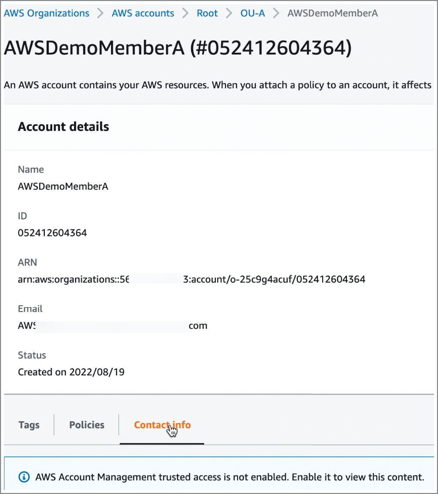

## Chapter 1 AWS Fundamentals

### Review Questions

1. Which of the following injects an additional piece of information into the authentication process?

    A. Defining a secret access ley
    B. Using AWS CloudShell
    C. Implementing MFA
    D. Defining an access key ID

**Correct Answer**
C Implementing multifactor authentication (MFA)
injects an additional piece of information into the
authentication process. MFA can be implemented using
software or hardware tools and will add protection to
your root account and users that goes beyond simple
username and password. Use MFA for all accounts and
users if possible.

2. Which of the following are required to implement CLI programmatic access? (Choose two.)

    A. Defining a secret access key
    B. Using SSH Keygen
    C. Implementing MFA
    D. Defining an access key ID

A, D Configuring programmatic access for the CLI will
require four pieces of information: access key ID,
secret access key, default region name, and default
output format.

3. Which of the following are best practices for AWS account protection? (Choose three.)
    
    A. Defining an account-level password
    B. Using AWS CloudShell
    C. Implementing MFA for all users
    D. Enabling AWS Security Hub
    E. Using Session Manager for EC2 instances
    F. Using service-linked roles

A, C, D Defining an account-level password, enabling
MFA for all users, and enabling AWS Security Hub are
fundamental to protecting your AWS account. Using
CloudShell, Session Manager, and/or service-linked
roles provides a form of security and protection but are
not as fundamental.

4. Which of the following is a best practice for cross–AWS account access?
    
    A. Using AWS Organizations
    B. Using IAM groups
    C. Implementing MFA for all users
    D. Using IAM roles

D IAM roles are essential to provide cross-account
access as well as enabling AWS services to interact
with each other. Learn and understand roles and the
mechanics of role policy creation to maintain a strong
security posture.

5. Which of the following saves you from provisioning keys to operate AWS services in a programmatic way?

    A. The AWS Management Console
    B. AWS CloudShell
    C. Session Manager
    D. IAM groups

B AWS CloudShell provides a mechanism for operators
to use the AWS CLI without having to provision access
keys in a local machine. This adds a new layer of
security as it saves time and effort in executing one-line
and simple administrative CLI commands.

6. Which of the following saves you from configuring SSH or RDP resources to operate EC2 instances?

    A. The AWS Management Console
    B. AWS CloudShell
    C. Session Manager
    D. IAM groups

C Systems Manager Session Manager provides you
with a way to connect to Amazon EC2 instances that
does not require the configuration of SSH or RDP
resources to operate a particular instance. This is a
significantly more secure way to manage EC2
instances.

7. Which of the following represents the URL to log into the AWS Management Console as an IAM user? (Choose two.)

    A. https://aws.amazon.com/console/
    B. https://accountID.signin.aws.amazon.com/console
    C. https://signin.aws.amazon.com/signin
    D. https://signin.aws.amazon.com/signin/console
    E. https://account_alias.signin.aws.amazon.com/console

B, E For console access, IAM users need to use the URL
as follows: https://accountID.signin.aws.amazon.com/console
or https://account_alias.signin.aws.amazon.com/console.

8. Which of the following brings AWS services to the edge of a 5G network?

    A. Edge location
    B. Local zone
    C. Outpost
    D. Wavelength zone

D Wavelength zones bring AWS services to the edge of
a 5G network, reducing the latency to connect to your
application from a mobile device. Application traffic can
reach application servers running in wavelength zones
without leaving the mobile provider's network. They
provide single-digit millisecond latencies to mobile
devices by reducing the extra network hops that may
be needed without such a resource.

9. Which of the following is an extension of a region where you can run low-latency applications using AWS services?

    A. Edge location
    B. Local zone
    C. Outpost
    D. Wavelength zone

B A local zone is an extension of a region where you
can run low-latency applications using AWS services in
proximity to end users. Local zones deliver single-digit
millisecond latencies to users for use cases like media,
entertainment, and real-time gaming, among others.

10. Which of the following bring AWS services, infrastructure, and operating models to your datacenter, co-location space, or physical facility?

    A. Direct Connect location
    B. Local zone
    C. Outpost
    D. Wavelength zone

C Outpost is designed to support applications that need
to remain in your datacenter due to low-latency
requirements or local data processing needs. It brings
AWS services, infrastructure, and operating models to
your datacenter, co-location space, or physical facility.

11. Which of the following is the resource used by AWS to deliver reliable and low-latency performance globally?

    A. Region
    B. Local zone
    C. Edge location
    D. Wavelength zone

C Edge locations are the resource used by AWS to
deliver reliable and low-latency performance globally.
Edge locations are how AWS attains high performance
in countries and territories where a region does not
exist. The global edge network connects thousands of
Tiers 1, 2, and 3 telecom carriers globally and delivershundreds of terabits of capacity. Edge locations are
connected with regions using the AWS backbone, which
is a fully redundant, multiple 100 Gigabit Ethernet
(GbE) parallel fiber infrastructure. The AWS edge
network consists of over 400 edge locations.

12. Which of the following represents a logical group of AWS datacenters?

    A. Region
    B. Local zone
    C. Edge location
    D. Availability zone

D An availability zone is a logical group of datacenters.
These groups are isolated and physically separate.
Each of them includes independent power, cooling,
physical security, and interconnectivity using high
bandwidth and low-latency links. All traffic between
availability zones is encrypted. Also, each availability
zone is implemented separately from other availability
zones but within 60 miles of each other.

13. Which of the following CLI commands will guide you through the process of managing AWS resources?

    A. aws configure wizard
    B. aws configure sso
    C. aws configure import –csv file://path/to/creds.csv
    D. aws configure

A The AWS CLIv2 wizards feature is an improved
version of the –cli-auto-prompt command-line option.
Wizards guide you through the process of managing
AWS resources. You can access the wizards feature by
using the command line:
aws <service-name> wizard <wizard-name>

14. Which AWS services have CLI wizards available? (Choose three.)

    A. Amazon EC2
    B. AWS Lambda functions
    C. Amazon DynamoDB
    D. AWS IAM
    E. Amazon RDS
    F. Amazon S3

B, C, D Wizards will query existing resources and
prompt you for data in the process of setting up for the
service invoked. As of this writing, wizards are
available for configure, dynamodb, iam, and lambda
functions. For example, the command:
aws dynamodb wizard new-table
will guide you in creating a DynamoDB table. Also, note
that the configure command does not use a wizard
name. It's invoked as aws configure wizard.

15. Which of the following CLI commands creates an S3 bucket?

    A. aws s3 ls s3://my-bucket
    B. aws s3 cp file s3://my-bucket/file
    C. aws s3 ls
    D. aws s3 mb s3://my-bucket

D The CLI command to create an Amazon S3 bucket is:
aws s3 mb s3://my-bucket
You can type aws s3 help for details.

16. Which of the following CLI commands copies the content of a local directory to an S3 bucket?

    A. aws s3 cp s3://bucket1/file s3://bucket2/file
    B. aws s3 cp file s3://my-bucket/file
    C. aws s3 sync my-directory s3://my-bucket/
    D. aws s3 mb s3://my-

C The CLI command to copy the contents of a directory
to an Amazon S3 bucket is:
aws s3 sync my-directory s3://my-bucket/
You can type aws s3 help for details.
    

17. Which of the following CLI options provide filtering of the output? (Choose two.)

    A. --query
    B. --filter
    C. --search
    D. --dry-run
    E. --cli-auto-prompt

A, B The --query option can be used to limit the results
displayed from a CLI command. The query is expected
to be structured according to the JMESPath
specification, which defines the syntax for searching a
JSON document.
The --filter option can also be used to manage the
results displayed. However, with the --filter option,
the output is restricted on the server side whereas --
query filters the results at the client side.
The --dry-run option is used to verify that you have the
required permissions to make the request and gives
you an error if you are not authorized. The --dry-run
option does not make the request.

18. Which of the following support options give you access to the AWS Health API? (Choose two.)

    A. Basic
    B. Developer
    C. Business
    D. Enterprise
    E. AWS IQ

C, D The AWS Health API is available directly as part of
an AWS Business Support or AWS Enterprise Support
plan. It allows for chat integration and ingesting events
into Slack, Microsoft Teams, and Amazon Chime. It also
allows integration with dozens of AWS partners such as
DataDog and Splunk, among many others.

19. What is the AWS default quota value for EC2-VPC Elastic IPs?

    A. 50
    B. 5
    C. 5,000
    D. 500

B The AWS default quota value for EC2-VPC Elastic IPs
is 5 and will need an adjustment if you need more IPs.
You can use the Service Quotas page on your
management console to make a request to support and
have the limit increased if needed.

20. Which of the following URLs are useful for the purpose of pricing a solution using AWS? (Choose three.)

    A. https://calculator.s3.amazonaws.com
    B. https://aws.amazon.com/free
    C. https://aws.amazon.com/migration-evaluator
    D. https://calculator.aws
    E. https://tco.aws.amazon.com

B, C, D For details about service pricing and usage
limits included in the AWS free tier, you can visit
https://aws.amazon.com/free.The logic for AWS TCO calculator now resides in the
Migration Evaluator at https://aws.amazon.com/migrationevaluator.
The AWS Pricing Calculator is available at
https://calculator.aws.
The older, simple monthly calculator and TCO
calculator have been deprecated

## Chapter 2: Account Creation, Security, and Compliance

### Review Questions

1. You have been asked by your manager to gather the
AWS reports for an upcoming SOC 3 audit. Which tool
would you open to find the report?
A. AWS Audit Manager
B. Amazon Reports
C. AWS License Manager
D. AWS Artifact

2. You are setting up a directory service for your small but
growing company. There are currently about 5,000
objects, but the plan is to double the number of
employees over the next three years. You have been
directed to use Microsoft Active Directory and the
company is cloud native. Which option would be the
most cost-effective and lowest management overhead
solution for your organization at this time?
A. AWS Directory Services for Microsoft Active
Directory Standard Edition
B. Microsoft Active Directory on EC2 deployed in two
availability zones (AZs)
C. AWS Directory Services for Microsoft Active
Directory Enterprise Edition
D. AWS Simple AD

3. What are the two types of behavior guardrails on AWS
Control Tower?
A. Preventive and detective
B. Preventive and audit
C. Infrastructure and code
D. Enabled and Disabled

4. A service control policy (SCP) was created in your
organization that will allow all users of the Admin role
permission to schedule KMS key deletion ("Action":
"kms:*"). However, when administrators attempt to
actually schedule key deletion, they report error
messages. Why might this error be occurring?
A. Users must have the explicit permission "Action":
"kms:ScheduleKeyDeletion" in order to schedule key
deletion.
B. KMS keys cannot be deleted but only disabled.
C. Administrators must approve the email sent to their
primary email address as a second-factor
authentication when attempting to delete KMS
keys.
D. Service control policies do not grant permissions,
so allowing an action in an SCP has no effect.

5. Inline IAM policies are best used when:
A. Inline policies are not recommended.
B. Customer-managed policies must be kept secure.
C. An appropriate AWS-managed policy does not exist.
D. Resource-based policies must be tightly integrated
with identity-based policies.

6. What are the three required elements of an identity-
based IAM policy? (Choose three.)
A. Action
B. Effect
C. Principal
D. Resource

7. Which of the following is a way in which AWS License
Manager can track Bring Your Own Licenses (BYOLs)
consumed by launched instances?
A. By using a Lambda function to compare the AMI of
each instance to an AWS Launch Manager license
configuration.
B. By associating a license configuration with an AMI.
C. By creating a rule in AWS Config that matches a
license configuration in AWS License Manager.
D. The AWS Systems Manager Agent (SSM)
automatically reports license usage to AWS
Systems Manager. License Manager integrates with
AWS Systems Manager to collect license usage
data.

8. Your client with over 50,000 directory objects has an
on-premises Active Directory domain running Windows
Server 2016. They need to have users access Amazon
WorkDocs and Amazon WorkMail using single sign-on.
No directory data should be cached in the cloud, but
the directory service must be highly available. Which
solution best solves the customer's requirements?
A. Active Directory Connector
B. Amazon Managed Microsoft AD
C. AWS Cognito
D. Simple Active Directory

9. When creating an AWS Organizations member account
in your own organization. you notice that you do not
have permissions for some actions. The error states
that “AWS Account Management trusted access is not
enabled. Enable it to view this content.” Which of the
following will grant the required permissions?

A. In AWS Organizations, navigate to the Policies page
and create an SCP that grants administrators of the
member account full account management
permissions (ALLOW = admin:*).
B. Navigate to AWS Organizations Services and
enable trusted access on AWS Account
Management.
C. Navigate to IAM and add the email address used to
create the member account to the Admin role.
D. The account was created using an email address
rather than a role. Only root accounts can be
created with an email address. The member
account must be deleted and re-created using an
admin role of the parent organizational unit (OU).

10. Your customer wants to manage licenses across
multiple accounts in order to better manage
compliance. However, they have not been able to
manage license usage in any accounts except the one
that License Manager was set up in. What would solve
this customer's problem?
A. AWS License Manager is account-specific and must
be set up separately in each account.
B. Enable AWS Organizations and link AWS License
Manager.
C. From each account to be managed, assign the
service-linked roles to the main account where
License Manager is configured.
D. Install the SSM agent on instances in each account
to be managed. Assign the SSM agents the service-
linked roles in the account where AWS License
Manager is configured.

11. By default, Control Tower creates two accounts. These
are:
A. Audit and Log Archive
B. Security and Log
C. Management and Sandbox
D. Security and Management

12. Which two of the following policy types might be
attached to an S3 bucket to grant permissions to a
specified principal? (Choose two.)
A. Access control lists (ACLs)
B. Identity-based policies
C. Permission boundaries
D. Resource-based policies
E. Organizations service control policies (SCPs)

13. Which of the following are characteristics of permission
boundaries? (Choose two.)
A. Permission boundaries apply only to users and
roles.
B. Permission boundaries define permission limits but
do not grant permissions.
C. Permission boundaries grant permissions.
D. Permission boundary policy statements contain only
DENY effects.

14. Which of the following are supported forms of
multifactor authentication in AWS IAM? (Choose
three.)
A. Google Authenticator
B. Hardware MFA device
C. SMS
D. U2F security key

15. The Control Tower provides a feature that allows
account provisioning following preapproved templates.
What is this feature called?
A. Account Factory
B. Account Vending Machine
C. AWS Config
D. CloudFormation

16. AWS Managed Microsoft AD directories are deployed in
what architecture?
A. In the customer VPC and in the customer's
datacenter with a DirectConnect between in an
active-active configuration
B. In two availability zones in a region and connected
to the customer VPC
C. In two availability zones within the customer VPC
D. In two regions in an active-active configuration and
connected to the customer VPC using PrivateLink

17. To add an existing account to AWS Organization, the
administrator must do which of the following?
A. Add the account to AWS Organizations using the
account ID, access key, and secret access key.
B. Invite the account owner to join using the account
owner's email address.
C. Existing accounts cannot be added but can only be
created using Account Factory.
D. Log into the account as root user and accept the
invitation.

18. The best explanation of when an IMPLICIT DENY occurs is:
A. A resource-based policy and identity-based policy
conflict.
B. A user attempts to access restricted resources as
described in a service control policy (SCP).
C. IAM attempts to parse a policy but encounters a
500 error.
D. When no deny statement or allow statement exists.

19. The principal of trust between two unrelated networks
is known as:
A. Distributed computing
B. Federation
C. Hybrid computing
D. Interoperability

20. Which of the following are valid AWS IAM policy types?
(Choose three.)
A. Access control lists
B. Identity-based policies
C. Permission boundaries
D. Service-based policies
E. System access policies

### Answers

Chapter 2: Account Creation, Security, and
Compliance
1. D Remember that compliance in the cloud is two parts:
AWS and what the customer builds using AWS services.
AWS Artifact is used to retrieve security and
compliance reports and some online agreements
related to AWS's part of the equation. AWS Artifact is
accessed through the management console. AWS Audit
Manager could easily be confused as the correct
answer. However, AWS Audit Manager is used for
continual monitoring of compliance, whereas AWS
Artifact is used simply to pull reports of AWS
compliance.
2. A Any time there are several services doing something
similar, know the use cases for each. Directory services
is an example. AWS Simple AD will not work because
the requirements specify using Microsoft AD. Deploying
on EC2 in two AZs seems like a plausible solution, but a
managed service is typically a better option for the
customer based on price and management overhead
unless the question gives some detail that makes the
managed service not feasible. That leaves Microsoft AD
Standard and Enterprise Editions. In this case you do
not need to know the details of Microsoft AD capacity
planning. Simple AD is not recommended for more than
5,000 users, whereas AWS Directory Service for
Microsoft AD is. Remember that objects do not equal
users and there will generally be more objects than
users. That strongly suggests Standard Edition would
suffice and that Enterprise Edition would most likely be
more expense for capacity that is not yet needed.
3. A Control Tower and its guardrails are a critical part of
governing an enterprise. Be sure to know AWS Control
Tower and AWS Organizations and how they work
together. Know the various types of policies and when
to use each. The structure of guardrails and their
terminology can be confusing. Behavioral controls
either detect noncompliance or prevent noncompliance.
4. D While all of these seem plausible, ultimately SCPs are
not the correct place to grant permissions. Be sure to
know what each policy type does (and doesn't do).
5. A While inline policies are available as an option, they
are not recommended. Inline policies can be difficult to
troubleshoot, and there are almost always better
options.
6. A, B, D Remember EAR (Effect, Action, Resource). A
fourth common policy option (but not required) is
Conditions.
7. B Recall that licenses from AWS Marketplace will
automatically be tracked. What we are considering
here would be Bring Your Own Licenses (BYOLs),
which License Manager does not automatically know
how to associate with an instance. The easiest solution
is to associate the license with the AMI. In this way,
any instance launched from that AMI will be associated
with that license and tracked.
8. A The key criterion in the question is that no data can
be cached in the cloud. Options B, C, and D all store
data in the cloud. AD Connector does not.
9. B Option A is not correct because SCPs cannot grant
permissions. Option C is also incorrect since you want
to follow the principle of least privilege and granting
administrator rights necessarily would violate that
principle. Option D is incorrect because creating an
account can be done when logged in as either an IAM
user or root user, or by assuming a role. However,
remember that using the root user account is not best
practice when a role can be used instead.
10. B The service-linked roles for License Manager cannot
be manually assigned—they are automatically assigned
when setting up the service. The correct answer is that
AWS Organizations is required for AWS License
Manager to work across accounts to discover compute
resources.
11. A The two accounts created by Control Tower are Audit
and Log Archive.
12. A, D ACLs and resource-based policies can both be
attached to a resource such as S3 and grant
permissions to a specified principal in the same or
another account. Permission boundaries can only deny,
not grant, permissions. An identity-based policy is
attached to the user and not to the resource. SCPs, like
permission boundaries, define the limits of permissions
but do not actually grant permissions themselves.
13. A, B Remember that permission boundaries set the
limit of what permissions can be held. They neither
grant nor deny permission on their own.
14. A, B, D AWS no longer supports SMS as an MFA factor
for user accounts in IAM. Note that MFA is still a
supported option in Cognito user pools.
15. A Account Vending Machine was an older term and not
used now, though you may still see reference to
“vending machine” when speaking of Account Factory.
The correct term for the feature is Account Factory.
16. C AWS Managed Microsoft AD resides in a VPC rather
than on-premises. PrivateLink does not support AWS
Manage Directory Services. Multiregion replication for
AWS Managed Microsoft AD is handled by the service
using native Active Directory replication.
17. B Option A is wrong since accounts themselves would
not have keys, and sharing of an account's admin keys
would not make sense from a security perspective.
Option D would not be practical in many cases where
the owner of the inviting account is not also the owner
of the invited account. Accounts can be both created
and invited in AWS Organizations, so option C is also
incorrect.
18. D You will want to be very comfortable with policy
evaluation logic. The use of an implicit deny secures
resources for which no permission is explicitly given
nor denied. See the documentation on identity and
resource-based policy evaluation, especially the section
on the difference between explicit and implicit denies
(https://docs.aws.amazon.com/IAM/latest/UserGuide/reference
:policies_evaluation-logic.html).
19. B Distributed computing is, at its most fundamental,
just computing between two of more computers via
messaging usually along a network. It does not imply
trust. Hybrid computing refers to a combination of
cloud and on-premises resources. Again, no trust is
implied. Interoperability is the ability of one computer
or application to talk to another. Standards and
protocols provide us with interoperability but do not
imply trust.
20. A, B, C You will want to be very familiar with the six
basic policy types and when each is used. Review the
IAM User Guide (https://docs.aws.amazon.com/IAM/latest/UserGuide/access_policies.html)

## Chapter 3: AWS Cost Management

### Review Questions

1. Which of the following tag types are available for use
under cost allocation tags? (Choose two.)
A. User-defined tags
B. Organization-defined tags
C. AWS-generated tags
D. AWS support–generated tags
E. Cost center tags
2. How long can it take for user-defined cost allocation
tags to appear in the AWS Billing dashboard?
A. 30 minutes
B. 60 minutes
C. 24 hours
D. 8 hours
3. The chief financial officer of your organization has
asked you to provide a final Cost and Usage Report for
the AWS spend in your development account. How can
you determine if the report is finalized before sending it
over?
A. Check that the Cost and Usage Report dashboard is
including finalized data.
B. Check that the Cost and Usage Report has the
prefix of Final-Report within the Amazon S3 bucket.
C. Check that the Cost and Usage Report is present as
all reports are final reports.
D. Check that the Cost and Usage Report has the
column Bill/InvoiceID.
4. What is the purpose of a manifest collection found in
the Amazon S3 bucket with your AWS Cost and Usage
Reports?A. The manifest collection provides mapping
information for AWS Cost Explorer to import AWS
Cost and Usage Report data.
B. The manifest collection provides connectivity
details for AWS analytic services to work with the
AWS Cost and Usage Report data.
C. The manifest collection indicates the order in which
multipart AWS Cost and Usage Reports must be
structured and viewed.
D. The manifest collection indicates the naming
convention and prefix data for AWS Cost and Usage
Reports stored in an Amazon S3 bucket.
5. The annual security audit has just been released and
the security team has asked that you prevent any AWS
Cost and Usage Reports from being created outside of
the primary AWS Organizations management account.
What can you do to ensure member accounts cannot
create AWS Cost and Usage Reports?
A. Apply a service control policy to restrict IAM users
within member accounts from configuring AWS
Cost and Usage Reports.
B. Apply an IAM policy within member accounts to
prevent configuring AWS Cost and Usage Reports.
C. Apply a service control policy to restrict all Cost
and Usage Report use for management accounts.
D. Apply a managed IAM policy within member
accounts to only allow management accounts
access to AWS Cost and Usage Reports.
6. The finance department has asked which options are
available to perform analytics on the AWS Cost and
Usage Reports provided for each AWS memberaccount. Which of the following options are provided
within AWS Cost and Usage Reports? (Choose three.)
A. Amazon Athena 1
B. Amazon Redshift
C. Amazon Artifact
D. Amazon Comprehend
E. Amazon QuickSight
F. Amazon PinPoint
7. The compliance officer for the organization has asked
you to confirm the maximum length of historical data
that AWS Cost Explorer provides. Which of the
following options will you provide to the compliance
officer?
A. 24 months
B. 36 months
C. 18 months
D. 12 months
8. You have been tasked with determining the top five
cost-accruing AWS Services within your development
AWS accounts over the last six months. Which AWS
service will provide the fastest visualization of this
data?
A. AWS Cost Explorer
B. AWS Cost and Usage Reports
C. Amazon Athena
D. Amazon Billing Dashboard
9. You have been tasked with securing the organization’s
AWS developer accounts from having access to AWSCost Explorer while retaining access to AWS Cost
Explorer access for nondeveloper accounts. Which of
the following is the best option to accomplish this goal?
A. Disable AWS Cost Explorer access at the
management account level.
B. Deny AWS Cost Explorer access using a service
control policy for developer AWS accounts.
C. Activate IAM access and configure IAM policies for
each AWS member account requiring access to
AWS Cost Explorer.
D. AWS Cost Explorer is disabled for member
accounts by default, so no changes are necessary to
accomplish this goal.
10. Your AWS Account is a member of AWS Organizations
and has access to AWS Cost Explorer. What of the
following options best describes the Cost Explorer data
that you can view?
A. As a member of AWS Organizations, the account
has access to view all AWS Cost Explorer data for
the organization.
B. Only AWS Cost Explorer data from the time the
AWS account joined the AWS Organization.
C. Only AWS Cost Explorer data from before the AWS
account joined the AWS Organization.
D. As a member of AWS Organizations, the account
has access to view AWS Cost Explorer data for all
accounts in the same organizational unit.
11. Which of the following Savings Plans options are
available from AWS to reduce AWS Service cost?
(Choose three.)
A. SageMaker Savings Plans 1B. Network Savings Plans
C. Compute Savings Plans
D. EC2 Instance Savings Plans
E. Lambda Savings Plans
F. EMR Savings Plans
12. Your organization is looking to cost-optimize a project
that runs in North America and in Australia. The
project is very heavily using Amazon EC2 instances
with Microsoft workloads. The organization has a
requirement that if the project moves to another region
the cost optimization plan will still be valid. Which
option satisfies the need of the organization?
A. Compute Savings Plans
B. EC2 Instance Savings Plans
C. SageMaker Savings Plans
D. EC2 Reserved Instances
13. Your organization has heavy utilization requirements
for machine learning in an upcoming project. You have
been tasked with selecting the best cost optimization
option to allow changes between regions, but also
between inference or training workload types. Which of
the following cost optimization option is the best fit?
A. SageMaker free tier
B. Compute Savings Plans 2
C. SageMaker Savings Plans
D. SageMaker Reserved Instances
14. The finance department has tasked you with
determining how much of the On-Demand spend within
an AWS account is not covered by a Compute SavingsPlan. Which Savings Plan monitoring report will
provide the details you are looking for without
requiring customization or detailed exports of Savings
Plans data?
A. Savings Plans utilization reports
B. Savings Plans inventory reports
C. AWS Cost and Usage Reports
D. Savings Plans coverage reports
E. AWS Billing Dashboard
15. Your senior administrator has asked you to set up
notifications for the AWS Budgets configuration in the
organization's developer accounts. Which of the
following notification options are available for AWS
Budgets? (Choose two.)
A. Posting to the Personal Health Dashboard
B. Amazon SNS topics
C. AWS Management Console notifications
D. Direct integration with ServiceNow
E. Direct email recipients
16. You are developing a cost optimization policy that
automatically disables a development organization
member AWS account from launching EC2 instances
when the account budget goes above 90 percent of
forecasted costs. Which of the following AWS Budgets
actions will accomplish this goal?
A. Configure a service control policy to deny Amazon
EC2 instances from launching, which is applied
once the budget reaches 90 percent.
B. Configure an IAM policy to deny the developer
admin accounts from launching Amazon EC2instances.
C. Configure an action using Amazon SNS to send an
SMS message to the developers warning them not
to launch Amazon EC2 instances once the budget
reaches 90 percent.
D. Configure an action using the Trusted Advisor APIs
to record budget overages and notify the AWS
Support concierge to disable Amazon EC2 instance
launching.
17. The finance department for your company is asking
why they are not receiving the forecast Budget alerts
you set up for a new account last week. You configured
AWS Budget alarms for forecasted amounts at multiple
intervals, but on evaluation there is no forecast data.
Which of the following options may be a potential cause
for not seeing any forecasting data?
A. AWS Budgets requires a minimum of two weeks of
historical billing data to be able to forecast budget
spend.
B. AWS Budgets requires a connection to the AWS
Cost and Usage Reports and the account is too new
to produce these reports.
C. AWS Budgets requires a minimum of five weeks of
historical billing data to be able to forecast budget
spend.
D. AWS Budgets requires a connection to Trusted
Advisor and the account is too new to generate
Trusted Advisor checks on spending.
18. Which of the following options is a cost benefit of using
AWS Managed services such as Amazon RDS, AWS
Fargate, or Amazon EFS?A. Managed services are the responsibility of AWS and
only require payment for the use of the service, not
the configuration of the applications.
B. Managed services reduce the IT operational
overhead as you can focus on developing
applications, not running or designing an
infrastructure.
C. Managed services reduce the need for highly
available architectural designs as this is now the
responsibility of AWS.
D. Managed services include all operating system
licensing costs that AWS pays and manages,
essentially eliminating the need to calculate
licensing costs.
19. Your organization has asked for a modification of the
cost optimization plan to include more cost-effective
scaling solutions for their most popular web
application. You have settled on the use of Amazon EC2
Spot instances to help scale during peak hours. Which
of the following options do you use to implement this
change?
A. Modify the Auto Scaling configuration to relaunch
all Amazon EC2 instances as spot instances.
B. Create a new Auto Scaling group that utilizes
Amazon EC2 Spot instances as the primary launch
template.
C. Create a new launch template to replace OnDemand instances with spot instances and apply
the launch template to your existing Auto Scaling
group.
D. Create a new launch template to include the use of
Amazon EC2 Spot instances when scaling and applythe launch template to your existing Auto Scaling
group.
20. Which of the following options represent a potential
drawback of using Amazon EC2 Spot instances for cost
optimization?
A. Amazon EC2 Spot instances can be reclaimed with
a two-minute warning at any time.
B. Amazon EC2 Spot instances need to have bids
refreshed daily.
C. Amazon EC2 Spot instances cannot be used with
Auto Scaling.
D. Amazon EC2 Spot instances are only useful for
short-term projects.

### Answers

1. A, C AWS cost allocation tags support two different
types: user-defined and AWS-generated. User-defined
tags can incorporate useful information such as cost
center, project, or department. AWS-generated tags are
automatically defined, created, and applied to services.
2. C When creating user-defined tags for use in AWS cost
allocation tags, it can take up to 24 hours for the new
tags to show up in the cost allocation reports.
3. D AWS Cost and Usage Reports (CURs) only enter the
finalized state after all pending refunds, credits, or
AWS account support fees are updated for that month.
When the bill is finalized, the CUR will have a column
named Bill/InvoiceID in the CSV file. This indicates the
bill has been finalized by AWS and will not change.
4. B AWS Cost and Usage Report exports into an Amazon
S3 bucket to produce a manifest collection that holds
files to help set up all the resources you need for
Amazon Athena, Amazon Redshift, or Amazon
QuickSight to analyze the report data. The manifest
collection is only created when the option to use these
analytics services is selected when configuring the
AWS Cost and Usage Reports.
5. A The only way to prevent AWS member accounts from
creating AWS Cost and Usage Reports is to apply a
service control policy (SCP) restricting access to theAWS Cost and Usage Report. Be mindful, however, that
SCPs are not retroactive for preexisting accounts.
6. A, B, E AWS Cost and Usage Reports can be configured
to include a manifest collection for use of Amazon
Athena, Amazon Redshift, and Amazon QuickSight.
These additional analytic services provide a deeper look
into cost and usage within AWS membership accounts.
7. D AWS Cost Explorer provides current month, prior 12
months, and the ability to forecast the next 12 months
of AWS cost and usage using the same dataset as the
AWS Cost and Usage reports.
8. A AWS Cost Explorer provides several preconfigured
views to display cost and usage information trends
within AWS accounts. One of the preconfigured reports
is the top five cost-accruing services, and you can
modify the time period dimension of the visualization to
meet the six-month requirement.
9. C AWS Cost Explorer has two options to restrict access.
The first is at the AWS Organizational level, but this
provides an on or off approach for the entire
organization. It will not limit to specific accounts. To
limit specific member accounts, the IAM Access setting
must be turned on in AWS Cost Explorer and an IAM
policy allowing access to Cost Explorer must be created
and applied.
10. B When a stand-alone AWS account joins an AWS
Organization as a member account, the only Cost
Explorer data available is from the time the account
joined. Any data prior to joining is unavailable for
viewing. Once an AWS account is no longer a member
account of the organization, the account can view prior
stand-alone data once again.11. A, C, D AWS offers three Savings Plan models to
decrease cost of AWS services up to 72 percent
compared to On-Demand pricing. The Saving Plan
models currently available are SageMaker Savings
Plans, Compute Savings Plans, and EC2 Instance
Savings Plans.
12. A Compute Savings Plans offer flexibility to apply
savings to EC2 instances and compute resources across
any region, tenancy, or instance type. As the project
changes and moves to a new region, the Compute
Savings Plans will still apply. Compute Savings Plans
are not specific to an operating system, which makes it
the best choice for Microsoft Workloads.
13. C Having the ability to move between regions and
change between inference and training workloads is a
feature of SageMaker Savings Plans. SageMaker
Savings Plans allow region, instance size, and instance
type changes as well as changing between workload
types without losing the cost savings benefits.
14. D Savings Plans coverage reports are the best option as
the reports include a high-level predefined metric
showing On-Demand spend not covered by Savings
Plans. This provides a fast method for viewing coverage
gaps without needing to manually export detailed
information from inventory or utilization reports.
15. B, E When configuring AWS Budgets for notifications,
you can select from emailing up to 10 recipients
directly from the budget configuration. You can also
use Amazon SNS to send SMS messages or take other
actions through event triggers with Lambda.
16. A AWS Budget actions can automatically or with
manual approval take remediation steps to avoid
budget overages based on forecasted results being over90 percent. The best way to limit launching Amazon
EC2 instances is to apply a service control policy (SCP)
and apply it to the development organizational unit or
specific development AWS account preventing the
ec2:RunInstances operation as the remediation step.
17. C AWS Budgets requires a minimum of five weeks of
historical billing data to provide forecasted spending
data. As this data is not available, AWS Budgets is
unable to send alerts for forecasted amounts.
18. B One of the largest benefits to using AWS Managed
services to reduce cost comes in the form of removing
IT overhead for administration. Managed services allow
IT administrators to focus on application maintenance
and support as the need to update operating systems,
design highly available databases, or configure scalable
systems is no longer required for the AWS Managed
services. All these actions are the responsibility of
AWS.
19. D To address this configuration change you must create
a new launch template and add in Amazon Spot
Instances within the scaling policy as we do not want to
replace all EC2 instances, only those needed when
scaling to meet peak utilization.
20. A One of the potential drawbacks of using Amazon EC2
Spot instances is the possibility of AWS interrupting or
reclaiming the EC2 Spot instance due to capacity
limits, high demand of EC2 Spot instances, or the Spot
bid price maximum being exceeded. In the event of a
reclaim, AWS provides a two-minute warning, which
administrators can use to stop or hibernate the spot
instance or run a script to move data to permanent
storage.

## Chapter 4: Automated Security Services and Compliance

### Review Questions

1. Which of the following AWS support plans offer access
to all Trusted Advisor security checks within an AWS
account? (Choose two.)
A. Enterprise Support
B. Developer SupportC. Basic Support
D. Business Support
E. AWS Forums support

2. Which AWS service is required for Security Hub to
evaluate security findings and then perform automated
remediation actions?
A. Amazon CloudWatch
B. AWS Config
C. Amazon EventBridge
D. AWS Step Functions

3. The chief information officer has asked you to provide
reports and warnings for any S3 buckets that have
DeleteBucket and DeleteObject actions taken on them in
the production environment. Which AWS service will
you use to accomplish this task?
A. Amazon Macie
B. Amazon Detective
C. Amazon Inspector
D. Amazon GuardDuty

4. You have been instructed by the security team to locate
and evaluate any vulnerabilities in any available EC2
instances that may have reachable TCP and UDP ports
from the VPC edges. You have decided to use Inspector
for this task. Which of the following finding types will
provide the vulnerability information required?
A. IAM finding type
B. Network reachability finding type
C. Package vulnerability finding typeD. CVE vulnerability finding type

5. You are attempting to encrypt 1,024 KB of data using
AWS Key Management Service, and you are receiving
errors when sending the data to the service. Which of
the following is a potential cause for not being able to
encrypt the data directly with AWS KMS?
A. KMS only allows 4 KB of data to be encrypted or
decrypted directly without the use of envelope
encryption.
B. The plaintext data encryption key is using the
wrong IAM policy.
C. Large datasets can only be encrypted when directly
accessed from EBS.
D. The AWS KMS key permissions are not configured
to allow encryption of datasets above 4 KB in size.

6. The application security team has asked that you assist
in procuring certificates and setting up caching for use
in their web applications running in AWS. The
infrastructure requires the use of CloudFront, and the
applications are spread throughout the US-WEST, APSOUTHEAST, and EU-WEST regions. You decide to use
AWS Certificate Manager for all web certificates, but
when you attempt to locate the certificate for
CloudFront you do not see it in the list of available
certificates. Which of the following will allow
CloudFront to see the certificate for use?
A. Certificate Manager is a regional service, and you
must ensure that is enabled and configured in the
US-WEST, AP-SOUTHEAST, and EU-WEST regions.
B. You cannot use Certificate Manager certificates
with CloudFront. You must purchase the certificatefrom a third party and import IT directly within
CloudFront.
C. CloudFront is a regional service and you will need a
different certificate from Certificate manager for
each region.
D. The web certificates must be present in the USEAST region with AWS Certificate Manager or
imported for use by CloudFront before they are
selectable when configuring CloudFront.

7. The organization that you work for recently took on a
contract to store sensitive proprietary data within S3
buckets for later use by analytical applications. Your
CISO is concerned about potential data breaches from
developers storing this sensitive data in S3 buckets that
are not specified for this project. Which of the following
options will provide a report for any sensitive
information stored in S3 buckets that should not have
this data?
A. Use GuardDuty to identify the network traffic that
is storing the data in the S3 buckets and report
back to Security Hub.
B. Use Inspector to evaluate all S3 buckets for
sensitive data vulnerabilities and produce reports
on which buckets fall out of compliance.
C. Use Macie with custom data identifiers to define
the criteria to match data stored in S3 buckets and
provide reports on which objects and buckets hold
noncompliant data.
D. Use Detective to scan each object uploaded to S3
by developer accounts and produce a report of
findings stored in Security Hub.

8. The application development group has reached out
stating that they are having issues with Secrets
Manager when attempting to retrieve a secret for their
database connection. The team is attempting to connect
using an EC2 instance that was created via an
administrator account. When the application attempts
to retrieve the secret, the team is presented with an
“Unauthorized” error message. Which of the following
actions should you check to resolve the issue?
A. IAM permissions for the secret. Ensure that the
EC2 instance has permissions to access Secrets
Manager and the secret.
B. AWS Secrets Manager API location. Check to
ensure that the web application is using the proper
HTTPS API endpoint instead of an HTTP endpoint.
C. Verify that the latest version of the AWS SDK is
being used by the application. Ensure that the
connection string is formatted in JSON.
D. Ensure that the web application is retrieving the
secret using the AWSCURRENT value and not the
AWSPREVIOUS value.

9. You just received an urgent phone call from several
panicked application owners stating that their website
is down. You also receive several alerts from your
monitoring software that the application has become
unresponsive. On investigation you realize that your
web application is under a TCP SYN flood attack and
you do not have any protection in place to stop this
attack. Which services can the application utilize to
create a TCP SYN proxy to help mitigate this type of
attack in the future and receive help from a specialized
team if the attack occurs again? (Select three.)
A. Amazon CloudFrontB. Amazon Elastic Load Balancer
C. Amazon Shield Advanced
D. Amazon Inspector
E. Amazon Route 53
F. AWS Security Hub

10. You have been tasked by the CISO to protect all web
applications in the production AWS account from SQL
injection attacks and cross-site scripting. Which AWS
service will you use to accomplish this goal?
A. Amazon VPC security groups
B. AWS Web Application Firewall
C. AWS Network Firewall
D. AWS Shield

11. The web development team has asked you to deploy a
method of limiting scanner and crawler traffic coming
into the production web applications. Which AWS WAF
feature will accomplish this task?
A. AWS WAF CAPTCHA
B. AWS WAF Account Takeover Prevention
C. AWS WAF Bot Control
D. AWS WAF client application integration

12. Your organization has recently acquired another web
development company and is in process of combining
AWS account resources. AWS Organizations was
chosen to bring and manage the AWS accounts from
the acquisition, but management of the AWS accounts
to ensure compliance against security group standards
and AWS WAF rule groups is becoming increasinglydifficult. Which of the following AWS services will solve
this problem?
A. AWS Firewall Manager
B. AWS Detective
C. AWS Web Application Firewall
D. AWS Security Hub

13. Your organization is using Detective and GuardDuty to
visualize and investigate potential security issues and
findings. What is the first phase of investigation when
you receive a notification about a suspected high-risk
activity?
A. Scoping
B. Response
C. Triage
D. Remediate

14. Your company has been using AWS WAF for all
production web applications for a little over a year.
During this time, you have created several custom AWS
WAF rule groups that you want to share with other
SysOps administrators across your global organization.
Which of the following methods allows you to share the
rule groups with other AWS accounts?
A. Share the rule group using AWS WAF client
application integration and exporting the rule sets
to a CSV file.
B. Share the rule group by entering the AWS account
number of the destination account when creating a
rule group.
C. Share the rule group by selecting Share on the
WebACL edit screen in the AWS WAF console.D. Share the rule group using PutPermissionPolicy and
the AWS WAF API.

15. Which of the following AWS services is used to view a
global level of aggregated threats over the last day and
at an account level a list of DDoS events detected over
the last year?
A. AWS Shield
B. AWS GuardDuty
C. AWS Detective
D. AWS Security Hub

16. The security team for your organization has asked for a
detailed list of API calls for Secrets Manager used
within your organization. The team is looking to
validate when a select few secrets were last rotated as
part of a recent incident review. What Secrets Manager
logs will you pull for the security team?
A. Provide the security team with access to
CloudWatch and filter metrics based on Secrets
Manager.
B. Provide the security team with access to Detective
and filter findings based on last rotation.
C. Provie the security team with access to Security
Hub and filter results from Secrets Manager.
D. Provide the security team with the CloudTrail logs
within the region where Secrets Manager is being
used.

17. You have been contacted by the security team because
they are receiving too many findings from Macie in
Security Hub. The security team has asked if it is
possible to change the frequency of findings being sentinto Security Hub from Macie. Which of the flowing
frequencies are supported by Macie? (Choose three.)
A. 15 minutes
B. 5 minutes
C. 1 hour
D. 3 hours
E. 6 hours
F. 30 minutes

18. You are helping the web development team with
creating certificates for their new web applications.
The team wants to be able to protect all subdomains for
their application under a single certificate from AWS
Certificate Manager. Which of the following domain
name types will need to be used when requesting the
certificates with Certificate Manager?
A. Root domain name
B. Wildcard domain name
C. Bare domain name
D. Apex domain name

19. You have been tasked with generating a new key in
AWS Key Management Service for use with a new
application hosted on EC2. The key will be used to
encrypt and decrypt data within the production AWS
account only. Which key type will you select when
making the key?
A. PKI key type
B. Asymmetric key type
C. Custom key type
D. Symmetric key type

20. Your organization has decided to standardize on the
use of Inspector for all vulnerability scanning of AWS
accounts assigned to production, development, and
user acceptance testing. You have received reports that
several newly deployed EC2 instances are not being
checked for CVE vulnerabilities by Inspector, but they
are receiving network reachability findings. Which of
the following is a possible cause?
A. The Systems Manager agent is not running or
installed on the EC2 instances.
B. Inspector will only scan AWS Elastic Beanstalk
applications and containers.
C. A security group is blocking access to the CVE item
database.
D. Inspector is not enabled to scan for CVE
vulnerabilities within the same region as the EC2
instances.

### Answers

1. A, D AWS Trusted Advisor offers basic security checks
to all AWS accounts but only Enterprise and Business
support plans can access all available checks within
Trusted Advisor.
2. C Security Hub allows you to automate remediation
actions using EventBridge. Security Hub will
automatically send all new findings and updates to
existing findings to EventBridge as events. EventBridge
events can then be used to perform remedial actions
using AWS Lambda or notifications using SNS.
3. D GuardDuty S3 protection uses CloudTrail
management events and S3 data events to monitor
against threats on S3 resources. GuardDuty will
generate findings for actions on an S3 bucket such as
DeleteBucket and DeleteObject and post these findings in
the GuardDuty console.
4. B There are two finding types used in Inspector:
package vulnerability findings and network reachability
findings. The network reachability findings look for TCP
and UDP ports that are open for resources outside of
the VPC edge locations, like the Internet gateway or
VPC peering connections. This type of access is
considered overly permissive, and Inspector will
provide detailed information in a finding about the EC2
instances involved, the ports discovered, and the
security groups or access control lists (ACLs) involved.
5. A The Key Management Service can only encrypt and
decrypt up to 4 KB datasets when being directly sent to
the service. To encrypt larger datasets, you must use
envelope encryption to retrieve a plaintext data key and
an encrypted data key that are used to encrypt the file,
and then package the file with envelope encryption
using the encrypted data key. The encryption process is
handled outside of KMS and only uses the AWS KMS
API to retrieve the data keys.
6. D In order to use AWS Certificate Manager certificates
in CloudFront, you must either import the certificate in
the US-EAST (N. Virginia) region or provision a
certificate using Certificate Manager before it can be
used. CloudFront-associated Certificate Manager
certificates in this region are distributed to all
geographic locations configured for CloudFront
distribution.
7. C Macie with custom data identifiers is a great solution
to identify any sensitive information stored in objects
across nondesignated S3 buckets. Using the custom
data identifiers, you can define criteria using regex
expressions to match values that hold proprietary data.
Once this information is found, you can have Macie
generate reports or send alerts using EventBridge.
8. A Secrets Manager requires proper permissions to be
set on users, groups, and roles before a secret can be
retrieved. In this scenario, an error stating
unauthorized indicates that the EC2 instance or
application does not have access to retrieve the secret
from Secrets Manager. Check the IAM identity-based
permissions for the user or check the resource-based
policy to verify that the EC2 instance role has
permission to access the secret.
9. A, C, E The application servers are under a TCP SYN
flood attack. To stop this type of attack, you need to
challenge any new connection requests to your web
application and only serve legitimate users. Route 53
and CloudFront have built-in TCP SYN proxy
capabilities to remediate this problem. When using
Shield Advanced in conjunction with CloudFront and
Route 53, you can use the Shield Response Team (SRT)
to assist in mitigation of this type of issue if it were to
occur again.
10. B The AWS Web Application Firewall (AWS WAF) is a
layer 7 firewall used to protect your web applications
from DDoS attacks, SQL injection attacks, and cross-
site scripting attacks. You can also allow, block, or
count web requests coming into an application based
on criteria that you set, such as IP addresses, geo
locations, and HTTP headers.
11. C AWS WAF offers several optional components to
enhance the network and application protection. In this
scenario the web application team has asked you to
limit bot traffic coming from scanners and crawlers.
When using AWS WAF, you can enable the optional Bot
Control feature to use managed rule groups to identify
common bots, verify desirable bots, and detect high-
confidence signatures of bots. You can also monitor,
block, or rate-limit bots like crawlers and scanners
while allowing beneficial bots like search engines to
continue.
12. A AWS Firewall Manager requires the use of AWS
Organizations where you can define an organization
Firewall Manager administrator account to apply rule
groups and policies to every AWS Organization
member. The requirement is to manage compliance
against security groups and AWS WAF rule groups,
which can be accomplished by using AWS WAF policies
and security group policies within Firewall Manager.
When setting the criteria for each of the policies, you
can define an automated action to remediate any
security groups that deviate from the standard policy
security groups. You can do the same for AWS WAF
rules and rule groups to ensure that every member
account has the same rule groups applied and available
for applications.
13. C Detective has three phases of investigation when an
alert or notification is received from a potential high-
risk or suspected malicious activity. The first phase is
Triage, which is when you determine whether a report
is a false positive or needs further investigation. The
next phase is Scoping, where you determine the extent
of the activity and the underlying cause. The final
phase is Response, where you remediate the action
either by resolving the security threat or by marking
the threat as a false positive.
14. D Within AWS WAF you can share custom rule groups
by using the AWS WAF API and the PutPermissionPolicy
API call. You can only attach one policy in each
PutPermissionPolicy request, and the policy must include
an effect, an action, and a principal. You also must
ensure that you are sharing the rule group from the
account and user that is the owner of the rule group.
15. A The AWS Shield console provides a global aggregated
view of threats over the last day, three days, and the
last two weeks. The summary view in the AWS Shield
Management Console displays the DDoS events
detected by Shield for resources that are eligible for
protection by Shield Advanced. Alternatively, you can
use the AWS Shield API operation
DescribeAttackStatistics to retrieve the account-level
details.
16. D Secrets Manager has two logging methods that can
be used to evaluate the behavior of secrets: CloudTrail
and CloudWatch. In this case, the security team wants
to check the details of when a secret was rotated, and
this is stored in CloudTrail within the region where
Secrets Manager is used. The security team can access
the S3 bucket where the CloudTrail logs are stored to
do further analysis using third-party software if needed.
CloudTrail will provide event details when a secret is
deleted, versioned, or rotated. CloudWatch only
provides details on the number of requests against the
AWS Secrets Manager API and can be useful in
identifying applications that are calling the service too
frequently.
17. A, C, E Macie allows customizable frequencies for when
findings are published to Security Hub. You can update
the publication setting to fit the needs of the security
team by adjusting the findings publication from the
default of 15 minutes to either every one hour or every
six hours. If you modify the publication timings within
one region, you will need to modify every other region
where Macie is in use as well.
18. B When requesting certificates that will need to cover
all subdomains of a domain name, you need to use the
wildcard domain type. This means that the certificate
will show a domain name of *.domainname.com, where the
* indicates that all names to the leftmost position of the
domain name will be covered under the certificate. The
wildcard name will appear in the Subject field and the
Subject Alternative Name extension of the AWS
Certificate Manager certificate.
19. D Key Management Service offers two choices when
generating keys: symmetric and asymmetric. The
symmetric key type is used when encrypting or
decrypting data within an AWS account and requires
direct calls to the AWS KMS service. This is a great
option to use when an EC2 instance is required to
process encryption using the AWS KMS key as it will
call the AWS KMS API to accomplish encryption and
decryption actions.
20. A Inspector requires the use of the Systems Manager
(SSM) agent to scan EC2 instances for vulnerabilities
against the CVE item database. Network reachability
scanning is available even when the SSM agent is not
installed or running, which means that the EC2
instances not reporting CVE data must have issues with
the SSM agent installation or it is not running.

## Chapter 5: Compute

### Review Questions

1. Creating which of the following is the first step in
setting up EC2 Auto Scaling?
A. Auto Scaling Group
B. Launch configuration
C. Launch template
D. Target groups
2. What is a key metric for monitoring Lambda
performance?
A. 500 errors
B. CPU UtilizationC. Network In
D. Throttles
3. What are the three placement group types for EC2?
A. Cluster, partition, and spread
B. Cluster, shared tenancy, and isolated
C. Hardware virtualized, para-virtualized, and baremetal
D. Tight, loosely coupled, and normalized
4. An EC2 instance only incurs cost when in which state?
A. Active
B. Engaged
C. Online
D. Running
5. By default, AWS Compute Optimizer looks at how many
days of data to make its recommendations?
A. 7 days
B. 14 days
C. 30 days
D. Three months
6. You have been asked to create a load balancer for a
third-party virtual appliance that uses the GENEVE
protocol. Which of the following would be the best
solution?
A. Application load balancer
B. Classic Load Balancer
C. Gateway load balancer
D. Network load balancer7. What is the best choice of load balancer optimized for
HTTPS network traffic?
A. Application load balancer
B. Classic Load Balancer
C. Gateway load balancer
D. Network load balancer
8. You discover that your client has been using several
Classic Load Balancers since they created their AWS
account in 2019. What would be your best
recommendation to the customer?
A. Convert the Classic Load Balancers to network load
balancers using a gateway load balancer to ensure
traffic is correctly routed during the transition.
B. Convert the Classic Load Balancers to network or
application load balancers.
C. Retain the Classic Load Balancers and provision
elastic load balancing auto scaling to automatically
add more load balancers to meet demand.
D. Retain the Classic Load Balancers and submit a
request to increase the throughput quotas on the
Classic Load Balancers.
9. In auto scaling, what does the desired capacity refer
to?
A. The average capacity that the customer expects to
need over the next billing cycle
B. The capacity that the customer expects to need
over the next billing cycle
C. The initial capacity of the Auto Scaling Group that
the system will attempt to maintainD. The lowest capacity of the Auto Scaling Group at
which the workload is still able to perform
10. What is the minimum billing for an EC2 instance?
A. 1 hour
B. 1 second
C. 24 hours
D. 60 seconds
11. Your customer has asked you to create an isolated EC2
compute environment with cryptographic attestation to
process healthcare data. Which feature best meets this
requirement?
A. Amazon Elastic Inference
B. Instance store volumes
C. Nitro enclaves
D. Partitioned placement groups
12. You have been asked to load-balance a workload of TCP
traffic. Which of the following is the best solution for
your client?
A. Application load balancer
B. Classic Load Balancer
C. Gateway load balancer
D. Network load balancer
13. What are the three important capacity limits of auto
scaling? (Choose three.)
A. Desired capacity
B. Maximum size
C. Minimum sizeD. Optimal capacity
14. You have noticed that during peak demand your
Lambda function is being throttled. You suspect you
may be exceeding your concurrency quota. Which of
the following is the best metric for determining if the
concurrency limits need to be increased?
A. Dead letter errors
B. Errors
C. Invocations
D. ConcurrencyQuota
15. You have a workload composed of several EC2
instances. You wish to keep the average CPU utilization
of the workload at or near 60 percent. Which of the
following will most efficiently keep your workload as
close as possible to the desired utilization?
A. Manual scaling
B. Simple scaling
C. Step scaling
D. Target tracking
16. AWS Lambda scales automatically to meet demand. By
default, Lambda will scale up to the soft concurrency
limit. What is the concurrency limit?
A. 100
B. 1,000
C. 10,000
D. 1,000,000
17. Your workload spikes every Thursday evening while
batch processing runs, and processes are frequently
throttled as soon as processing begins. Which of thefollowing scaling methods will most effectively solve
this problem?
A. Predictive scaling
B. Simple scaling
C. Step scaling
D. Target tracking
18. EC2 instances have a life cycle. Which of the following
are the four principle states of an instance?
A. Pending, running, shutting down, terminated
B. Preparing, engaged, shutting down, terminated
C. Provisioning, provisioned, deprovisioning,
decommissioned
D. Starting, running, terminating, stopped
19. Your client uses a variety of compute resources—EC2,
Lambda, and Fargate—with frequent changes in
instance sizes and operating systems. Which pricing
model would you recommend to them in order to
optimize cost?
A. Dedicated instances
B. Reserved instances
C. Savings plan
D. Spot instances
20. Which of the following is a burstable EC2 instance
type?
A. C
B. D
C. M
D. T

### Answers

1. C Launch templates are now recommended over launch
configurations. Target groups are for load balancers.
Auto Scaling Groups are set up after the launch
configuration is defined.
2. D The error codes in the 500 range indicate a server
problem. However, these are HTTP error codes and
typically captured at the application level. CPU
Utilization and Network In are very common EC2
metrics but are not applicable to Lambda. Throttles are
a critical metric for Lambda and indicate invocations
exceeding concurrency. Consider either provisioned
concurrency or increasing quotas or both.
3. A The placement groups for EC2 are cluster, partition,
and spread placement. Each of these has a use case
that you should be familiar with.
4. D Be familiar with the life cycle of an EC2 instance. In
addition to billing, the life cycle determines persistence
of data. Be sure to understand how data persists on
EBS-backed instances versus instance store–backed
and what the EC2 life cycle looks like using an instance
store.
5. B By default, Compute Optimizer looks at the past 14
days of data to make a recommendation. Enhanced
Infrastructure Metrics is a paid feature that looks at up
to three months of data.
6. C The gateway load balancer is specifically designed
for use with third-party appliances such as next-
generation firewalls (NGFWs) and web application
firewalls (WAFs) that use the GENEVE protocol on port
6081.
7. A The application load balancer is optimized for HTTP
and HTTPS traffic.
8. B Classic Load Balancers are being deprecated, and
AWS recommends migration to network or application
load balancers. Moving to these newer load balancers
brings performance and cost optimizations. Elastic load
balancers (ELBs) of all types are managed services and
do not need auto scaling. Throughput quotas cannot be
adjusted for since they are managed services. A
gateway load balancer (GLB) is intended for third-party
appliances using the GENEVE protocol. A GLB is not
used as a transitional load balancer.
9. C There are three limits that are set for an Auto Scaling
Group: the minimum, desired, and maximum capacities.
The minimum is the smallest acceptable group size.
The maximum is as large as the group will be allowed
to scale. The desired is the initial size of the group.
Auto scaling then attempts to maintain that size. When
demand causes the group to scale out, Auto Scaling will
then scale in at the end of the event back to the desired
capacity.
10. D EC2 is billed in 1-second increments after the first 60
seconds. The minimum you would be billed for is 60
seconds.
11. C Nitro enclaves leverage the Nitro hypervisor
components to provide an isolated and hardened
compute environment on EC2. A feature of Nitro
enclaves is cryptographic attestation, which allows for
identification of the enclave and assures that only
authorized code is run in the environment. Instance
store refers to the boot device, which is either EBS-
backed or an ephemeral instance store. Amazon Elastic
Inference provides low-cost GPU acceleration on EC2
and SageMaker instances. A partitioned placement
group is one of three placement group options.
12. D Application load balancers handle the HTTP/HTTPS
protocols. A gateway load balancer handles the
GENEVE protocol. Classic Load Balancers are no
longer recommended. Network load balancers handle
the TCP protocol.
13. A, B, C The three limits are desired, maximum, and
minimum.
14. D Each of these can indicate resource configuration
issues. The ConcurrentExecution metric indicates the
number of concurrent executions. When concurrent
executions reach the quota or the reserved
concurrency, then further requests will be throttled.
15. D Step scaling is usually an improvement over simple
scaling since step scaling can respond to events as they
happen without needing to wait for health check
replacements and cooldown periods. Target tracking is
normally recommended over step scaling since it can
stay closer to the desired target value than step
scaling. While manual scaling has its place, it is not the
best option for automatically scaling this type of
workload.
16. B The soft concurrency limit of AWS Lambda is 1,000.
If more concurrent invocations are required, a request
can be made to increase the quota.
17. A While simple, step, and target tracking scaling will
scale out the workload, they only begin scaling after
the metric indicates a problem. Predictive scaling
anticipates the event based on historical data and
scales out ahead of the Thursday evening batch
processing so that throttling is avoided.
18. A The states of an EBS-backed EC2 instance are
pending, running (rebooting), shutting down (stopping,
stopped), and terminated.
19. C Dedicated instances are typically more expensive for
comparable compute power and would not be
recommended for cost optimization. Reserved instances
and Spot instances offer significant savings. However,
savings plans allow for flexibility across EC2, Lambda,
and Fargate as well as many dimensions, such as
operating system, instance size and family, and
tenancy.
20. D C instances are compute optimized, D are memory
optimized, and M and T are both general-purpose
instance families. However, T instance types are the
only instance types that are burstable.

## Chapter 6: Storage, Migration, and Transfer

### Review Questions

1. Which of the following Amazon Simple Storage Service
(S3) features allows an organization to scale delivery of
temporary HTML pages featuring downloadable
podcasts?
A. Amazon S3 multipart upload
B. Amazon S3 Transfer Accelerator
C. Amazon S3 static website hosting
D. Amazon S3 cross-region replication

2. You work for an organization that requires any content
available in an S3 bucket must replicate to two or more
additional regions for security and compliance. The
solutions architect implemented cross-region
replication (CRR) on the source S3 bucket, and all new
files uploaded to the bucket are replicating correctly.
However, there have been reports that the destination
buckets are missing files found in the origin buckets. As
the SysOps administrator, you must assist in solving
this problem. Which of the following is the best solution
for ensuring new and existing files replicate to the
destination buckets?
A. Create a script using the AWS SDK and Amazon S3
REST API to copy the existing files from the origin
bucket into the destination bucket before enabling
cross-region replication.
B. Ensure that the IAM permissions and bucket policy
configurations allow full bucket replication from the
origin bucket.
C. Turn on the full bucket replication feature in the
properties for the origin bucket.
D. Use Amazon S3 Batch Replication to backfill the
existing data of the origin bucket into the new
destination buckets.

3. You receive reports from several clients that their
uploads into the project Amazon S3 buckets have been
slow and unreliable. The clients report the file size to
average over 3 GB in size per upload and they have
been uploading the files while working on-site in a
remote location. Which of the following solutions will
best address the upload speed and reliability issue
when uploading objects into Amazon S3? (Choose two.)

A. Enable S3 Transfer Acceleration for the destination
bucket and direct the clients to upload files to the
https://s3-accelerate.amazonaws.com endpoint.
B. Enable Amazon CloudFront for the project and
direct the clients to upload directly to the Amazon
CloudFront edge location closest to the remote
location.
C. Instruct the client that the file size is too large and
to reduce the file to 1 GB or smaller to avoid
reliability and upload performance issues.
D. Instruct the client to only use the aws s3 cp CLI
commands with the dual-stack (IPv6) endpoints to
ensure the fastest speeds and reliability.
E. Instruct the client to use multipart uploads for
large file uploads into the destination buckets.

4. Your organization has recently decided to not renew
the maintenance contract for the data storage array
used for long-term storage of financial records. The
organization must maintain all financial records for a
minimum of 10 years, and the records must be
available for audit within 48 hours. 
Which of the following AWS storage services is the most costeffective option to replace the long-term storage needs?
A. Amazon S3
B. Amazon S3 Glacier Deep Archive
C. Amazon FSx
D. Amazon EFS

5. You are designing a storage backup solution that
includes the use of Amazon S3 buckets for general file
storage and project files. The organization has asked
for you to cost-optimize the storage solution and look
for ways to cut costs while maintaining durability of the
backed-up files. The files only require access once or
twice per quarter as part of a standard audit process.
Beyond the audit period, the files do not require
frequent access. However, when the auditors request
the files, they must be immediately available. Which of
the following options provides the most cost-effective
solution while maintaining the access required for
auditors?
A. Use the Amazon S3 Standard-IA storage class.
B. Use the Amazon S3 Glacier Flexible Retrieval
storage class.
C. Use the Amazon S3 One Zone-IA storage class.
D. Use the Amazon S3 Glacier Instant Retrieval
storage class.

6. Your organization heavily invests in the use of Amazon
EC2 instances to support web applications and critical
business applications in the cloud. It has come to your
attention that backups for all Amazon EC2 instances
are manual and use Amazon EBS Snapshots at a
random occurrence whenever the storageadministrators think of doing it. As the new SysOps
administrator for the organization, you suggest
automating the Amazon EBS Snapshot process for
these critical systems to enforce a disaster recovery
action plan. Which of the following options will
accomplish the goal of automating EBS Snapshots and
avoiding data loss?
A. Use AWS Systems Manager to automate the EBS
volume snapshots each time the EC2 instance
restarts.
B. Create a script to create a new AMI of each
Amazon EC2 instance on a defined schedule.
C. Use Amazon Data Lifecycle Manager to automate
the snapshot process.
D. Create a script to create EBS Snapshots of each
EBS volume present in the AWS account on a
defined schedule.

7. You have received reports from several application
owners that data reads are slow for an application
hosted on an Amazon EC2 instance. You suspect that
the EBS volumes are receiving too many read requests
for data and performance is suffering. Which of the
following CloudWatch metrics can you use to verify
read performance for the attached EBS volumes?
(Choose two.)
A. VolumeQueueLength
B. VolumeWriteBytes
C. VolumeReadOps
D. VolumeWriteOps
E. BurstBalance

8. You oversee monitoring of performance for several
production data conversion systems running on Amazon
EC2 instances. Recently the data engineers reported
below normal write and read speeds coming from
several application servers. Each application server is a
T3.Large using gp2 EBS volumes for the operating
system volume and St1 volumes for the data processing
volumes. You are concerned that the volumes are
throttling. Which Amazon CloudWatch EBS volume
metric will confirm EBS volume throttling?
A. VolumeQueueLength
B. VolumeWriteOps
C. VolumeReadBytes
D. BurstBalance

9. You recently deployed an Amazon EFS filesystem to
handle user home directories for several Linux-based
applications hosted across four separate availability
zones in your VPC. When attempting to mount the EFS
system on each EC2 instance, you find that you are only
able to create a mount for EC2 instances in the USEAST-1a availability zone. What could be the possible
issue preventing other EC2 instances from mounting
the new EFS storage system?
A. When configuring the Amazon EFS storage system,
only one Amazon EC2 instance is selected as a
target.
B. The Amazon EFS storage system does not have the
proper security groups in place.
C. When configuring the Amazon EFS storage system,
the option for One Zone storage class is in use.
D. The Amazon EFS storage system does not have the
proper EC2 instance role policies configured toconnect to multiple Amazon EC2 instances.

10. Your organization has successfully implemented and is
actively using the new Amazon EFS configuration for
six months to share media processing files between
production and editing. The production team has
recently expanded globally and will be sharing the
workload between the Washington, DC and London
locations. The London location is worried about latency
when connecting to the Washington, DC file share
when processing production files and has asked you to
evaluate a potential solution. Which of the following
options solves the latency issue for the London office?
A. Configure Amazon EFS replication between the USEAST and EU-WEST-2 regions.
B. Configure bastion hosts locally in the EU-WEST-2
region for the London office and have all
production staff use this for processing.
C. Configure an Amazon DirectConnect connection to
the local London office to reduce latency when
connecting to the Amazon EFS file share.
D. Configure Amazon EFS mount targets locally in a
new VPC located in EU-WEST-2 to locally mount
production processing systems to the Amazon EFS
mount target.

11. You are assisting the high-performance computing
(HPC) department with migration of their data and
systems into AWS. The director of the lab has asked for
recommendations on a scalable, secure, and faulttolerant storage solution in AWS to support the parallel
filesystems. The department does not have the funds to
manage the storage system and is looking for the
lowest-cost solution. Which of the following storage
solutions would you recommend to the director?A. Amazon EBS
B. Amazon S3
C. Amazon FSx for Lustre
D. Amazon FSx for NetApp ONTAP

12. Most of the applications and systems within your
organization are now running in the AWS Cloud. The
director of IT is concerned that the large investment in
the current SAN technologies will go to waste now that
most data is moving into AWS. The director has asked
for a way to run a hybrid infrastructure where onpremises servers can still connect using the iSCSI
protocol, and data is available in both AWS and the onpremises SAN. Which AWS storage solution would you
recommend?
A. Amazon EBS with Windows Files Server cluster
B. Amazon FSx for NetApp ONTAP with AWS Storage
Gateway File Gateway
C. Amazon FSx for Windows File Server
D. Amazon EFS with AWS DirectConnect and VPN

13. You receive a task to create a disaster recovery and
business continuity plan for your organization's storage
hosted on Amazon S3. The IT director requires that any
solution must support point-in-time recovery (PITR) for
immediate restoration of any data. Which of the
following solutions would you recommend?
A. Amazon S3 Batch Replication
B. Amazon S3 versioning
C. Amazon Data Lifecycle Manager
D. AWS Backup

14. You have chosen AWS Backup as the primary
component of the disaster and recovery strategy within
your organization. You are using AWS Backup to
perform daily backups of four Amazon S3 buckets, but
the backup jobs are reporting a failure. On further
investigation it appears that the AWS Backup job is
failing because it cannot access the Amazon S3 buckets
to back up files. What is the cause of this error?
A. The backup plan is using an IAM role that does not
include the necessary in-line IAM policies.
B. The Amazon S3 buckets are not located in the same
AWS region where the backup plan is running.
C. The AWS Backup plan does not have PITR enabled
for the Amazon S3 buckets.
D. The backup plan within AWS Backup requires an
AWS PrivateLink configured to back up Amazon S3
buckets.

15. You receive a task to assist with a major datacenter
consolidation project that includes moving several
petabytes of archived data into the AWS Cloud. The
organization use a tape backup system to maintain
weekly and monthly incremental backups of all onpremises servers and storage systems. The CIO is
concerned that moving to another backup solution
would cause too much training overhead and potential
outages as people sort out the new operational
processes. Which AWS solution would you recommend
to the CIO?
A. Amazon S3 Glacier Deep Archive
B. AWS Storage Gateway Volume Gateway
C. AWS Storage Gateway Tape Gateway
D. AWS Backup

16. Your organization is in process of migrating hundreds
of gigabytes of application data into Amazon S3. You
must help to develop a solution that allows on-premises
application servers to directly interface with the data
now hosted in Amazon S3 using the NFS protocol.
Which of the following solutions accomplishes this
goal?
A. Implement AWS Storage Gateway File Gateway.
B. Implement Amazon EFS.
C. Implement AWS Storage Gateway File Gateway
with Amazon FSx for Windows File Share.
D. Implement AWS DataSync to synchronize files
between Amazon S3 and on-premises.

17. You are the SysOps administrator for an organization
that has recently started a new data analytics division.
The new director of analytics has asked you to
configure a data lake within AWS. The director has also
asked to have a local copy of the datasets, which
incrementally updates if they want to perform localized
analytics from the existing on-premises hardware.
Which solution would you recommend to the director?
A. Implement AWS Backup to incrementally back up
and restore data from Amazon S3 onto on-premises
storage.
B. Implement Amazon EFS to share data volumes with
on-premises.
C. Implement Amazon FSx for Windows File Server to
enable the SMB protocol and share storage with
local servers.
D. Implement AWS DataSync to copy data between onpremises and Amazon S3.

18. Your organization has tasked you with migrating data
from on-premises and a third-party cloud provider into
AWS. The CIO is concerned that data between the
third-party cloud and AWS will not be in sync, resulting
in application downtime while the migration is
underway. Which AWS service would you use to
accomplish this migration task?
A. AWS DataSync
B. AWS Transfer Family
C. Amazon Storage Gateway
D. AWS Backup

19. Your organization is undergoing an application
modernization effort and focusing on decommissioning
and consolidating application on-premises into a new
AWS environment. Several applications require the use
of Secure Shell File Transfer Protocol (SFTP) to move
files between the application server and the customer.
To reduce cost and assist with consolidation, you want
to move all SFTP servers into AWS. Which AWS service
provides the most scalable and cost-effective solution?
A. Amazon EFS
B. AWS Transfer Family
C. AWS DataSync
D. Amazon EC2

20. You work as a SysOps administrator for a data
collection and processing organization. Every day a
series of FTPS servers receive client information and
store local copies for processing by another server.
Once a day a data clerk accesses the server to
categorize the data into different data classifications,
including identifying PII data for processing. During astaff meeting, the manager for the application
mentioned that the clerk responsible for completing the
data classification is no longer able to complete the
work. After some discussion, you offered to develop an
automated solution to the problem and migrate the
service into AWS. Which of the following solutions
meets the needs for this migration without needing
additional administrative overhead?
A. Rearchitect the application to use Amazon S3 and
apply tags for data classification at upload.
B. Create a new Amazon EC2 FTPS instance and use
AWS Lambda functions to process data
classification.
C. Implement AWS Transfer Family for FTPS and
configure a data classification managed workflow
and tagging strategy.
D. Migrate the current FTPS service to an Amazon
EC2 instance and use AWS Lambda functions to
apply data classification tags to uploaded data.

### Answers

with a download link to the S3 object for the podcasts
that are temporarily available. The result is a scalable
temporary solution for hosting the podcast and the
website, without the need for compute resources.
2. D Amazon S3 cross-region replication and same-region
replication pose a limit when working with existing
objects and buckets. Cross-region replication will take
care of any new object uploads into the bucket by
replicating the changes to the destination bucket(s).
However, existing objects will not copy using cross-
region replication. To accomplish this task, the best
option is to use Amazon S3 Batch Replication to backfill
newly created replaced buckets with objects from the
existing origin buckets. This is a one-time replication
required for each destination bucket to bring parity
with the existing source bucket.
3. A, E When uploading objects into an Amazon S3 bucket,
larger files can be sensitive to network disruptions and
slower Internet speeds. Enabling S3 Transfer
Acceleration for the buckets and directing the clients to
use the transfer acceleration endpoints will send
uploads to the nearest edge location. This will
drastically increase the speed of the uploads and
reduce latency. Using multipart uploads for larger files
will also increase upload speeds as smaller chunks of
the overall file upload. Multipart uploads are also a
terrific way to solve for network connectivity issues
since you can pause the uploads or restart at the last
part in process in the multipart upload. This option
allows for the file size to remain the same while
increasing performance and reliability for the upload
process. When paired with S3 Transfer Acceleration,
you can achieve the best customer experience.
4. B In this scenario your organization is looking to
achieve a cost-effective solution for their long-term
archival and storage needs. They decided to forgo the
maintenance contract of the on-premises storage and
need a suitable replacement that still maintains access
to the files within 48 hours to meet audit compliance
requirements. The fact that the organization must
maintain files for 10 years, that the recovery time is 48
hours, and that the solution needs to be the most cost-
effective are reasons to evaluate the use of Amazon S3
Glacier Deep Archive. Data retrieval for Amazon S3
Glacier Deep Archive is complete within 48 hours using
bulk retrieval options, or if the organization needs data
faster, they can pay an expedited fee for using the
Standard retrieval option in Amazon S3 Glacier Deep
Archive to retrieve the files within 12 hours. Amazon S3
Glacier Deep Archive offers long-term cold storage for
several use cases, such as storing financial documents,
healthcare records, or other data subject to compliance
requirements dictating length of time files need to be
available.
5. D In this scenario the organization wants to reduce
storage backup costs but also maintain instance access
to any files recovered from the system. The
organization also wants to maintain the same durability
and benefits of Amazon S3. To meet the needs of the
organization, you can use Amazon S3 Glacier Instant
Retrieval storage class as it matches the durability and
reliability of Amazon S3 Standard while reducing the
overall storage costs. Amazon S3 Glacier Instant
Retrieval also enables the auditors to receive the
requested files in milliseconds, which offers similar
retrieval times compared to Amazon S3 Standard. The
options for Amazon S3-IA and S3 One Zone-A do not
apply as they reduce the durability and availability of
the stored files, as well as not being the most cost-
effective option when storing files for the long term.
6. C In this scenario the organization is looking to achieve
a cost-effective solution for backing up EBS volumes
within their environment. There is a concern over
automation and the potential for data loss due to
manual actions previously taken. To best address the
automation and recovery of EBS Snapshots, use the
Amazon Data Lifecycle Manager for this process. The
Amazon Data Lifecycle Manager automates the
creation, retention, and deletion of EBS Snapshots and
EBS-backed AMIs. This allows the creation of a
schedule backup process to create a disaster recovery
backup process to avoid potential data loss. Using the
other options available introduces various lag in the
data backup options, resulting in potentially missed
data during a restoration, where the Data Lifecycle
Manager makes incremental backups to reduce cost
and reduce the data lost during restoration.
7. A, C Identifying EBS performance for read operations
starts with the evaluation of Amazon CloudWatch
metrics related to the VolumeQueueLength, which is an
indicator of a bottleneck on either the guest operating
system or the network link to the EBS volume. The next
metric to check is VolumeReadOps, which indicates
how many read operations per second the EBS volume
is receiving. This metric helps identify if there is an I/O
size or throughput issue between the guest operating
system and the EBS volume. Too high a number of read
requests on a standard nonprovisioned IOPS volume
can lead to queuing and slow read performance.
8. D In this scenario the data engineers are reporting
below normal write and read speeds, which is a great
indicator that the volume is throttling. The EBS
volumes used in this deployment are gp2 and st1
volume types, which both use burst bucket balance to
maintain performance above the baseline available
IOPS for the volume. Checking for depletion of the
BucketBalance metric for the volume can identify
depletion of the burst bucket and results in low
performance for the EBS volume.
9. C In this scenario only one Amazon EC2 instance can
connect to the Amazon EFS storage system in a single
availability zone. It is likely that the configuration of the
Amazon EFS system is using the One Zone storage
class, which limits Amazon EFS to a single mount
target in only one availability zone, compared to
multiple mount targets when using Amazon EFS
Standard. The fact that the instances in US-EAST-1a
can connect means the system is working with
connectivity. There are no mount targets available for
each availability zone in the VPC. Amazon EC2 instance
roles or security group configurations will resolve this
issue.
10. A In this scenario the teams access the same files
across the Washington, DC and London offices for
production processing. This means the files must stay
in sync and the London office is concerned with latency
when connecting to the Washington, DC (US-EAST-1)
services. To reduce latency and allow the local London
office to work on files in the Amazon EFS share the
same way the Washington, DC office does, you can
enable Amazon EFS replication. Amazon EFS
replication automatically and transparently replicates
the data and metadata located in the Amazon EFS
filesystem to the new destination. The files are in sync
and the London locals can work directly on the files and
the Washington, DC locals can see the changes as they
are replicated.
11. C In this scenario the director has asked for a managed
service as they cannot afford a storage administrator,
as well as asking for a filesystem that supports parallel
filesystems. The entire department focuses on HPC,
which means they are a candidate for using the Amazon
FSx for Lustre option to manage their parallel
filesystems. The use of Amazon EBS or Amazon S3
would increase complexity and cost, and would be an
unmanaged solution. Amazon FSx for NetApp ONTAP is
not a consideration as it is not the right Amazon FSx
filesystem the parallel filesystem needs.
12. B The key indicator in this scenario is the director
wants to maintain the current SAN infrastructure in a
hybrid deployment while connecting servers using
iSCSI. This immediately eliminates the use of Amazon
EBS with Windows File Server and the Amazon FSx for
Windows File Server options since the connection
protocol is SMB. Amazon EFS with AWS DirectConnect
and VPN would utilize the NFS infrastructure and be a
costly solution. The Amazon FSx for NetApp ONTAP
solution using the Storage Gateway File Gateway will
enable local access of data for on-premises. This means
the SAN is still in use, and data replicates to the FSx
filesystem, with eventual migration directly to the
Amazon FSx for NetAPP ONTAP solution full-time when
the maintenance contract and lifespan of the current
SAN has expired.
13. D Data for the organization is already located in
Amazon S3, which means the Amazon Data Lifecycle
Manager would not be a solution as it relates to EBS
and EBS-backed AMIs. Amazon S3 Batch Replication is
not the correct solution as it only replicates entire
buckets into another destination, usually across
regions. Amazon S3 versioning is a recommended best
practice when combined with a life-cycle expiration
period, and it is a requirement when using AWS
Backup. While this is a good manual solution, restoring
to a specific point in time with S3 versioning would
cause increased administrative overhead. AWS Backup
is the correct solution because it natively supports PITR
for Amazon S3 and Amazon RDS backups, while
maintaining a centrally managed location to configure
and restore the backups when needed.
14. A In this scenario AWS Backup cannot successfully
complete a scheduled daily backup and is throwing an
error that states it cannot access the buckets. The first
area to check is that all IAM permissions are correct for
the role assigned to the backup plan. The IAM role
must have two in-line IAM policies attached to enable
backup and restore operations inside of the S3 buckets.
It does not matter where the Amazon S3 buckets are
located or that AWS PrivateLink is enabled and in use.
Having PITR enabled for the backup plan associated to
the Amazon S3 bucket would not matter as the IAM
permissions are not appropriately set.
15. C The key indicator in this scenario is the need to
continue using a tape backup or tape-like backup
system to avoid retraining individuals on a completely
new system. The use of AWS Storage Gateway Tape
Gateway allows the creation of virtual tape libraries
that function just like the on-premises system. This
alleviates the need for retraining and only requires
configuration of the virtual tape libraries and the Tape
Gateway. The use of Amazon S3 Glacier Deep Archive
is a component of a good backup strategy with AWS
Storage Gateway Tape Gateway, but it is not the
complete solution. AWS Storage Gateway Volume
Gateway and AWS Backup do not address the needs of
the CIO and would require a new backup process and
training for the teams.
16. A The solution to this problem requires the use of NFS
file-sharing protocols and the ability to maintain data in
Amazon S3 while on-premises servers still have access
to use the data once it is in Amazon S3. Implementing
AWS DataSync is not an option as this requires on-
premises data stores to still be present during the
migration. Amazon EFS is not an option as it would
require additional copying of data between Amazon S3
and the EFS filesystem. AWS Storage Gateway File
Gateway with Amazon FSx for Windows File Share uses
the SMB protocol instead of NFS, which does not meet
the requirements of this solution. The remaining option
is implementing AWS Storage Gateway File Gateway,
which enables NFS file share capabilities while
maintaining the data within Amazon S3.
17. D This scenario is a common use case for AWS
DataSync. The director wishes to use the power of AWS
to perform analytics using a data lake, but also wants
to have a localized copy of the data. You can configure
AWS DataSync to transfer entire on-premises datasets
into Amazon S3 while synchronizing data between on-
premises and the Amazon S3 bucket. AWS Backup does
not accomplish the synchronization requirement, and
Amazon FSx for Windows File Share does not meet the
needs of synchronization and assumes that all servers
are Microsoft Windows-based. Amazon EFS is not a
correct solution because it does not provide a local
copy of the data.
18. A In this scenario the CIO wants to keep data
synchronized between the third-party cloud provider,
on-premises, and the new AWS environment during a
migration. The CIO is also concerned that downtime
may occur due to copy methods. This use case is
common within AWS DataSync as it provides the
connection to existing storage systems, like third-party
cloud providers and on-premises systems, to migrate
data to AWS storage services like Amazon S3, Amazon
EFS, or Amazon FSx. AWS Transfer Family is not the
proper solution as the scenario does not mention a
migration of SFTP, FTP, or FTPS systems. Amazon
Storage Gateway and AWS Backup do not accomplish
the data synchronization required for this migration
without additional scripting or customization of
implementation.
19. B In this scenario the organization is looking for a
scalable and cost-effective solution to migrate SFTP
services from on-premises to the AWS Cloud. This
automatically eliminates the option of using Amazon
EFS and AWS DataSync as they do not offer a method
of enabling SFTP. Amazon EC2 is a potential option but
would require custom configuration of an SFTP server
on Amazon EC2, including the need for configuring
scaling using Auto Scaling. This increases the overall
cost and complexity of the solution. The most cost-
effective and scalable option is to use AWS Transfer
Family, which is a managed service that lets you
configure an SFTP service that scales to meet customer
demand; AWS manages the underlying infrastructure.
20. C In this scenario it is important that a solution
minimize the amount of administrative overhead, which
means reducing complexity and the need for manual
interactions. Rearchitecting the application and
migrating the current FTPS service both require
extensive administrative overhead or manual
interaction. Creating a new FTPS service using Amazon
EC2 and AWS Lambda would accomplish the task, but
it requires additional administration to maintain the
Amazon EC2 instance and AWS Lambda components.
The most scalable and administrative overhead–neutral
solution is to use AWS Transfer family configured for
FTPS and utilize managed workflows to classify
incoming data and scan for potential PII information.
Using the managed workflows, you can configure
different actions depending on the data classification
and eliminate the need for manual data entry or
tagging.

## Chapter 7: Databases

### Review Questions

1. Your customer has asked you to improve the
performance of their RDS instance. Their database is
consistently under a heavy load due to very large
analysis and reporting workloads. Which of the
following would be the best solution?
A. Create a CloudFront distribution.
B. Implement RDS Read Replicas.
C. Migrate to Provisioned IOPS SSDs (io1).
D. Scale up the primary RDS instance.
2. Which of the following database engines are supported
by Amazon Relational Database Service (RDS)?
A. MySQL, DynamoDB, MariaDB, Oracle, PostgreSQL,
SQL Server
B. MySQL, SQLite, Oracle, PostgreSQL, Amazon
Aurora
C. MySQL Oracle, PostgreSQL, SQL Server, MariaDB,
Amazon Aurora
D. MySQL Oracle, PostgreSQL, SQL Server, MariaDB,
SQLite
3. ElastiCache supports which two in-memory cache
options? (Choose two.)
A. Apache Ignite
B. DAX
C. EhcacheD. Memcached
E. Redis
4. The two strategies for cache loading include which of
the following? (Choose two.)
A. Arbitrary acquisition
B. First-in, first-out (FIFO)
C. Lazy loading
D. Least effort load
E. Write-through
5. Your customer has asked you to migrate a SQL Server
database to AWS. This database will handle heavy read
traffic globally but has customizations at the operating
system level. Which of the following would be the best
solution for your customer?
A. Amazon EC2 running SQL Server
B. Amazon Redshift for SQL Server
C. Amazon Relational Database Service (RDS)
D. Amazon Relational Database Service (RDS) Custom
6. Which of the following RDS features can best give
visibility into load and bottleneck issues on a MariaDB
RDS instance?
A. CloudWatch Performance Alerts
B. CloudWatch
C. CloudTrail
D. Performance Insights
7. To improve the security of an RDS instance connected
to EC2 instances, where should the RDS instance be
placed?A. In a DB subnet group and connected to your EC2
instances using the DB DNS name
B. In a subnet and connected to your EC2 instance
using a bastion host
C. In the same subnet as the EC2 instances using IPv6
routing inside the subnet
D. Inside its own DB VPC connected to your EC2
instances using a PrivateLink
8. Automated backups in RDS can be disabled by
changing what setting?
A. Changing the Automated Database Backup setting
from Enabled to Disabled
B. Setting the retention period to 0
C. Deselecting the Enable Automated Backup setting
and typing confirm in the dialog
D. Deselecting the Enable Instance Snapshots setting
9. You have 40 RDS instances in the us-east-1 region,
each with 10 unique databases. You attempt to create
another RDS instance with 20 additional databases.
The creation fails. To correct this issue so that you can
add the databases, you must do which of the following?
A. Create a read replica in a second AZ to free up
resources on the primary instance.
B. Enable Big Tables on the instance.
C. Request an increase of your RDS instance database
quota.
D. You cannot create more than 10 databases on a
SQL Server instance.
10. You are running Amazon ElastiCache for Redis and
your engine requires a specific configuration that is notavailable by default. What would you modify to achieve
your goal?
A. ElastiCache is a managed service and the engine
cannot be modified
B. Parameter Group
C. Redis.conf
D. Use ElastiCache Custom
11. You have been asked to implement a caching solution
for an RDS database. This solution will need to support
complex data objects. The solution must be highly
available and have persistence. Which solution will you
use?
A. CloudFront Distribution
B. ElastiCache for Memcached
C. ElastiCache for Redis
D. RDS Read Replica
12. RDS Proxy supports most database engines except
which one?
A. Aurora
B. Aurora Serverless
C. Oracle
D. SQL Server
13. Which of the following are indicators that an RDS proxy
might be considered? (Choose three.)
A. Disk full errors
B. Many short-lived connections
C. Out-of-memory errors
D. RDS instances with less than 2 GB of memoryE. Too many connections errors
14. Which of the following features is best suited to
monitoring the operating system of the DB instance in
real time?
A. Amazon EventBridge
B. CloudWatch logs
C. Enhanced Monitoring
D. Performance Insights
15. What is the principal metric found in Performance
Insights?
A. CPU Utilization
B. DB Activity
C. DB Load
D. Memory Utilization
16. Which of the following statements about RDS Read
Replicas is true? (Choose two.)
A. A replica can be promoted to replace the primary
DB instance.
B. Read replicas are used as read-only copies of the
primary DB instance.
C. Read replicas should be created in a different VPC
from the primary DB instance.
D. The read replica and primary DB instance replicate
synchronously.
17. You have been asked to recommend a solution that will
provide point-in-time recovery for a client's RDS
database. Which of the following will most efficiently
achieve this goal? (Choose two.)A. Add tags to RDS instances and create a backup
plan in AWS Backup.
B. Enable automated RDS backups and set the backup
retention period to 0.
C. Enable automated RDS backups by setting the
backup retention period to non-0.
D. Ship RDS transaction logs to CloudWatch logs.
E. Use AWS Lambda to automate snapshots every five
minutes.
18. When an RDS read replica is promoted, what happens?
A. A final snapshot is taken of the source DB instance
and the source is terminated.
B. The read replica is immediately available as a
stand-alone DB instance.
C. The read replica is rebooted and is then available
as a stand-alone DB instance.
D. The source DB instance is marked for termination.
19. Your research team has just discovered the cure for
cancer, and you have been asked to share the research
database with the world. To share this valuable data,
what would you do?
A. Place the database in a public subnet.
B. Set all security groups on the database to a source
of 0.0.0.0/0.
C. Set the Publicly Accessible property to Yes.
D. Share the RDS DB snapshot.
20. Your client has a business-critical PostgreSQL database
in the us-west-2 region running on Amazon Aurora. The
client wants to ensure the database is available even inthe event of a regional event. Additionally, the database
replication must have low latency and minimal impact
on write operations. Which service would best support
the client's requirements?
A. Amazon Aurora Global Database
B. Amazon Aurora global tables
C. Amazon RDS Read Replicas
D. Amazon RDS Proxy

### Answers

1. B CloudFront is used for static content such as images
and documents. Provisioned IOPS is used to provide
high throughput for RDS instances but is not sufficient
to improve performance under high read loads. Scaling
the database instance may improve read performance
but is a costly solution. The preferred method for
improving read performance is to implement read
replicas. ElastiCache is another possible tool to
improve read performance.
2. C DynamoDB is a NoSQL key-value database and not a
relational database. SQLite is not supported. Amazon
Aurora is a relational database service that supports
(drop-in compatible) PostgreSQL and MySQL.
3. D, E Apache Ignite is an open source in-memory
distributed database management system. DAX stands
for DynamoDB Accelerator and is an in-memory cache
for DynamoDB. Ehcache is an open source cache.
4. C, E Only options C and E are valid caching strategies.
5. D Amazon Redshift is a relational database used for
data warehousing. Redshift does not run SQL Server.
SQL Server can be run on EC2 and is an option when a
customer needs to customize the database engine or
underlying operating system. However, EC2 is an
unmanaged service. RDS, on the other hand, is a
managed service, which is normally preferred. As a
managed service, RDS gives no access to the database
engine or operating system of the underlying instance.
RDS Customer is a service that allows customization of
the database engine and underlying operating system
but is still a managed service. RDS Custom is the best
solution given the scenario.
6. D CloudTrail is used to log API activity in the account
and does not capture performance data. CloudWatch
captures performance metrics above the hypervisor but
is not the best at showing bottlenecks. CloudWatch
Performance Alerts is not a service. Performance
Insights detailed metrics provide visibility into load on
the database and can identify bottlenecks.
7. A Placing a database instance in a separate VPC would
not be an efficient way to improve security. A bastion
host is designed to pass SSH traffic and not handle
communications between an EC2 instance and the
database layer. Placing the database in the same
subnet as the EC2 instances violates the principle of
security in layers. Additionally, using IPv6 for routing
does not add security. The correct answer is to use a
DB subnet group. It is highly recommended that you
use the DNS name since this protects the connection
when an underlying RDS instance fails and is
automatically replaced.
8. B Disabling the automated backups in RDS is done by
setting the retention period to 0. This isn't particularly
intuitive, so it's a good one to try to remember. You
would rarely want to disable automated backups on
important production data, but it is something you may
want to do on test and development databases to save
cost. Remember that snapshots and automated backups
operate differently.
9. C The question is not about your knowledge of a
specific database engine. Rather, what is important to
notice here is that you are creating an instance. The
number of databases per instance is an RDBMS
concern. The number of RDS instances in a region is an
AWS quota concern. You won't be expected to know
quota limits, but you should be able to recognize when
quotas might be causing the problem.
10. B There is an RDS Custom that allows engine- and OS-
level customization of RDS, but ElastiCache does not
have an equivalent capability. Redis.conf is not
accessible in ElastiCache. Using Parameter Groups in
ElastiCache provides the ability to make modifications,
which can be applied to one or more ElastiCache
clusters.
11. C CloudFront is used for static content such as images
and files. Read replicas can help off-load read requests
from the primary database instance, but replicas are
not a true caching solution. Memcached does not
support complex data objects or high availability, or
have persistence. In general, Redis is going to be more
feature-rich and robust than Memcached.
12. C Amazon RDS Proxy is not supported on RDS for
Oracle.
13. B, C, E Indicators that an RDS proxy might benefit a
workload include errors related to too many
connections, out-of-memory errors, or high CPU
utilization. The amount of memory that an RDS
instance has is not necessarily an indicator since a
small instance with low load may handle that load
easily without a proxy. Disk full errors can occur due to
runaway log activity but are not necessarily an
indicator of connection overload.
14. C CloudWatch logs are able to collect data from the
operating system but are not designed, alone, to
present that data in real time. Amazon EventBridge is
used to connect applications using event-driven
architectures. Performance Insights looks for patterns
in aggregate DB metrics over time. Enhanced
Monitoring gives real-time visibility into DB instance
operating system metrics.
15. C DB Activity is not an available metric. CPU and
memory utilization can be found in other monitoring
tools. DB Load is an aggregated metric capturing
average active sessions and giving insight into the load
being placed on a database instance over time.
16. A, B Replication between the primary and read replicas
is asynchronous. Creating read replicas in VPCs outside
of the primary instance's VPC can create conflicts with
the classless inter-domain routing (CIDR).
17. A, C Setting RDS automated backup retention to 0
disables backups. CloudWatch logs are best used for
storage and monitoring of system and application logs.
Using AWS Lambda to create snapshots is unnecessary.
18. C When a read replica is promoted, no action is taken
against the original primary DB instance (source). No
final snapshot is taken of the source.
19. D Changing the subnets and security groups are
networking actions that would expose the database to
bad actors but not give access to other researchers.
The Publicly Accessible property enables or disables
Internet connectivity to the database but does not grant
permissions. RDS snapshots can be shared unencrypted
with other accounts.
20. A DynamoDB global tables are used for cross-region
replication of DynamoDB tables. There are no Amazon
Aurora global tables. The correct answer is an Amazon
Aurora Global Database, which is a single Aurora
database spanning multiple regions. RDS Read Replicas
are used for cross-region disaster recovery, and a
replica can be promoted to become the primary. An
RDS proxy is used to pool and share database
connections.

## Chapter 8: Monitoring, Logging, and Remediation

### Review Questions

1. You suspect that an application client is nonperformant
because it is making more calls than normal to a RESTbased API on your application estate. What AWS tool
would you use to verify this information and validate
any changes you make to correct this issue?
A. AWS Config
B. Amazon CloudWatch
C. AWS CloudTrail
D. AWS NetReporter

2. You have a number of metrics collecting via
CloudWatch on your fleet of EC2 instances. However,
you want to gather additional metrics on a number ofinstances that do not seem to be performing as well as
the majority of running instances. How can you gather
additional metrics not available through CloudWatch's
stock configuration?
A. Turn on detailed monitoring.
B. Install the CloudWatch Logs Agent.
C. Create a new VPC flow log.
D. Turn on detailed statistics in CloudWatch.

3. Which of the following statements about a CloudTrail
trail with regard to regions is true? (Choose two.)
A. A trail applies to all your AWS regions by default.
B. A trail collects both management and data events.
C. A trail can apply only to a single region.
D. A trail applies to a single region by default.

4. Which of the following is not an example of a
management event?
A. An AttachRolePolicy IAM operation
B. An AWS CloudTrail CreateTrail API operation
C. Activity on an S3 bucket via a PutObject event
D. A CreateSubnet API operation for an EC2 instance

5. How are management events different from data
events? (Choose two.)
A. Data events are typically much higher volume than
management events.
B. Data events are typically lower volume than
management events.
C. Data events are disabled by default when creating a
trail, whereas management events are enabled bydefault.
D. Management events include Lambda execution
activity, whereas data events do not.

6. Which of the following options for a trail would capture
events related to actions such as RunInstances or
TerminateInstances? (Choose two.)
A. All
B. Read-Only
C. Write-Only
D. None

7. Which of the following is not a valid Amazon
CloudWatch alarm state?
A. OK
B. INSUFFICIENT_DATA
C. ALARM
D. INVALID_DATA

8. You have a CloudWatch alarm with a period of 2
minutes. The evaluation period is set to 10 minutes,
and Datapoints To Alarm is set to 3. How many metrics
would need to be outside the defined threshold for the
alarm to move into an ALARM state? (Choose two.)
A. Three out-of-threshold metrics out of five within 10
minutes
B. Three out-of-threshold metrics out of five within 2
minutes
C. Two out-of-threshold metrics out of five within 5
minutes
D. Three out-of-threshold metrics out of eight within
16 minutes

9. Which of the following settings are allowed for dealing
with missing data points within Amazon CloudWatch?
(Choose two.)
A. notBreaching
B. invalid
C. missing
D. notValid

10. Which of the following does AWS Config not provide?
A. Remediation for out-of-compliance events
B. Definition of states that resources should be in
C. Notifications when a resource changes its state
D. Definition of compliance baselines for your system

11. Which of the following would you use to ensure that
your S3 buckets never allow public access? (Choose
two.)
A. AWS Config
B. Amazon CloudWatch
C. AWS Lambda
D. AWS CloudTrail

12. Which of the following is not part of an AWS Config
configuration item (CI)?
A. An AWS CloudTrail event ID
B. A mapping of relationships between the resource
and other AWS resources
C. The set of IAM policies related to the resource
D. The version of the configuration item

13. You have a number of instances based on AMIs with
AWS Systems Manager agent installed, but none are
able to communicate to the SSM service. What is likely
the source of this issue?
A. You need to create an IAM group and assign that
group to each instance you want communicating
with AWS Systems Manager.
B. You need to create an IAM role and have each
instance assume that role to communicate with the
AWS Systems Manager service.
C. You need to add the AWSSystemsManager policy to
each instance running an SSM agent.
D. You need to use a Linux-based AMI on each
instance to ensure it can communicate with the
SSM service.
14. Which of the following are supported notation formats
for documents in AWS Systems Manager? (Choose
two.)
A. YAML
B. JSON
C. CSV
D. Text

15. You are responsible for a fleet of EC2 instances and
have heard that a recently released patch has known
issues with Rails, which your instances are all running.
How would you prevent the patch from being deployed
to the instances, given that they are all running the
SSM agent?
A. Remove the patch from the automation pipeline.
B. Remove the patch from the patch baseline.C. Add the patch as an exclusion to the patch baseline.
D. Add the path as an exclusion to the automation
pipeline.

16. You have a command document written in JSON for
your instances running a Windows AMI and
communicating with the AWS Systems Manager
Service. You now have inherited several Linux-based
instances and want to use the same command
document. What do you need to do to use this
document with the Linux instances?
A. Convert the document from JSON to YAML and
reload it.
B. Copy the document and assign the copy to the
Linux-based instances.
C. You cannot use a document written for Windowsbased instances with Linux-based instances.
D. Nothing; documents will work across platform
operating systems.

17. You need to ensure that a compliance script is executed
on all of your managed instances every morning at 1
a.m. How would you accomplish this task?
A. Create a new Execute command and use Systems
Manager to set it up on your instances.
B. Create a new Run command and use Systems
Manager to set it up on your instances.
C. Create a new compliance policy document and
ensure that all instances' agents reference the
document.
D. Create a new action document and ensure that all
instances' agents reference the document.

18. You want to centrally collect and refer to applications,
AWS components, network configuration information,
etc. installed on multiple EC2 instances that you
manage. Which of the following should be adopted to
meet this requirement?
A. Install the Systems Manager Agent on your EC2
instance. Log in with Session Manager, and create
and execute a script that collects inventory
information.
B. Install the Systems Manager Agent on your EC2
instance. Use Systems Manager Inventory to collect
inventory information.
C. Use AWS Config to collect EC2 inventory
information.
D. SSH into your EC2 instance. Create and run a
script that collects inventory information.

19. You are using an EC2 instance to host a web
application. You have configured a CloudWatch alarm
for this EC2 instance's CPU utilization metric, which
uses SNS to send notifications when it is under heavy
load. When you check the alarm status, it says
INSUFFICIENT_DATA. Which of the following are
common causes of this message? (Choose two.)
A. The same metric is used in other alarms.
B. Detailed monitoring has not been enabled for the
metric.
C. The CloudWatch alarm has just started.
D. S3 bucket for logs does not exist.
E. The metric is unavailable.

20. A user wants to connect to a Windows instance using
Remote Desktop, but the Ops team wants to encourageusing Systems Manager features. Which statement is
true?
A. Native RDP is supported and you can enable it in
the session properties so that the user can view the
desktop instead of the PowerShell prompt.
B. Map a local port to the RDP port on the instance
and start a session. The user can then use remote
desktop through port forwarding.
C. RDP is not supported by SSM. You must open port
3389 in the instance security group.
D. RDP is not supported by SSM. Use Apache
Guacamole over port 80 instead.

### Answers 

1. C AWS CloudTrail provides insight into API calls, and a
client interacting with a REST API is exactly that.
2. B The Amazon CloudWatch Logs Agent, when installed
on an instance, provides metrics not available in any
other manner, including using the basic CloudWatch
capabilities.
3. B, D CloudTrail trails apply to a single region by default
(option D) but can be applied to all regions (meaning
options A and C are both false). They also collect both
management and data events (option B).
4. C Management events in CloudTrail relate to security,
registering devices, configuring security rules, routing,
and setting up logging. In the options, this would
include A, B, and D. Option A is a security event, B is
setting up a security rule for routing, and D is a routing
data rule. Option C, on the other hand, is related to
data and is a data event rather than a management
event.
5. A, C Because data events capture the movement,
creation, and removal of data, they are typically much
higher volume than management events (option A).
Data events are also disabled by default (option C),
making them different from management events.
6. A, C The RunInstances and TerminateInstances events are
considered write events. This is easiest to remember
because they are not read events, and AWS provides
only two options: read and write. Collecting these
events, then, would require a trail be set to Write-Only
or All (which collects all events).
7. D CloudWatch alarms have three states: OK, ALARM,
and INSUFFICIENT_DATA. INVALID_DATA is not a
valid alarm state.
8. A, C In this scenario, there would need to be three out-
of-threshold data points within the evaluation period of
10 minutes to trigger an alarm. This means that both
options A and C would trigger an alarm. Note that it is
possible that the scenario in option D would trigger an
alarm, depending on when the out-of-threshold metrics
occurred (inside 10 minutes), but it is not clear from
the answer, so options A and C are better answers.
9. A, C There are four possible settings for handling
missing data points: notBreaching (A), breaching, ignore,
and missing (C).
10. A AWS Config does not provide mediation mechanisms.
You can write code to remediate situations that cause
notifications via AWS Config, but the remediation
capability is not a standard part of Config itself.
11. A, C AWS Config will notify you if a bucket has been
granted public access (provided you have set that
baseline up in AWS Config). You would then need to
remediate that access, and that would require AWS
Lambda (option C).
12. C Configuration items do not include IAM-related
information (option C). They do include event IDs
(option A), configuration data about the resource, basic
information about the resource such as tags, a map of
resource relationships (option B), and metadata about
the CI, including the version of the CI itself (option D).
13. B Any instance running an SSM agent will need to
assume an IAM role for connecting to the AWS Systems
Manager service (option B). There is no such policy as
AWSSystemsManager (option C).
14. A, B AWS Systems Manager supports documents in
JSON and YAML.
15. B A patch baseline stores the patches that will be
automatically deployed to your instances. If you want to
avoid a certain patch, simply remove it from the
baseline.
16. D AWS Systems Manager documents can be used cross-
platform without any changes (option D).
17. B The Run command allows you to execute scripts and
other commands on instances. In this case, a Run
command could execute the compliance script needed.
18. B When using Systems manager agent on EC2
instances, it enables the collection of metadata types
such as network configuration, AWS components, and
other useful information. The agent can be installed
across several EC2 instances with the same
configuration to collect the inventory information
required for your organization.
19. B, E The most common causes of the
INSUFFICIENT_DATA message for CloudWatch alarms
are conditions responsible for the alarm not having
enough data to evaluate its status.
20. A It is true that native RDP is supported and can be
enabled in the session properties so that the user can
view the desktop instead of the PowerShell prompt.

## Chapter 9 Networking

### Review Questions

1. The three common types of endpoints are:
A. Gateway endpoints, gateway load balancer
endpoints, and interface endpoints
B. Gateway load balancer endpoints, elastic endpoints,
and static endpoints
C. VPC endpoints, elastic endpoints, and PrivateLink
D. VPC endpoints, interface endpoints, and elastic
endpoints2. Which of the following is the best option for creating a
hub-and-spoke network to connect on-premises
resources and multiple VPCs?
A. AWS DirectConnect
B. AWS Gateway Endpoint
C. AWS Transit Gateway
D. AWS VPC Peering
3. Which of the following is the best use of a gateway
endpoint?
A. Connect a VPC to S3 without traversing the
Internet.
B. Connect an on-premises network to a VPC.
C. Connects resources and services using PrivateLink.
D. Connect two VPCs.
4. You wish to use deny rules to restrict traffic to your
resources. Which of the following will allow you to
implement deny rules?
A. Internet gateway
B. Network access control lists (NACL)
C. Route table rules
D. Security groups
5. You are experiencing connectivity errors with IPv4
traffic within your VPC. Which of the following will
most efficiently help diagnose the issue?
A. CloudWatch
B. Reachability Analyzer
C. Traffic Mirroring
D. VPC flow log6. Your customer wants you to connect their on-premises
network to their VPC. The customer is a budgetconscious startup with a small volume of network
traffic. They expect to grow at a slow but steady pace
over the next year. Which solution will best achieve
their goal?
A. AWS Transit Gateway
B. DirectConnect
C. VPC peering
D. VPN
7. To direct network traffic from an EC2 instance to the
public cloud, the destination field of the route table
should be which of the following?
A. 0.0.0.0/0
B. 0.0.0.0/32
C. Internet gateway
D. Local
8. Which of the following represents the largest CIDR
block that can be used in a VPC subnet?
A. 10.0.0.0/32
B. 172.16.0.0/16
C. 172.16.0.0/0
D. 192.168.0.0/28
9. Which of the following is not a valid private IP address?
A. 10.0.0.5
B. 75.10.150.5
C. 172.16.0.5
D. 172.28.10.1010. You want to route traffic to the Internet from resources
in an Ipv6 subnet without allowing external resources
to initiate contact. Which of the following best solves
this problem?
A. DirectConnect
B. Egress-only Internet gateway
C. Internet gateway
D. Transit gateway
11. You wish to capture a subset of your VPC traffic in
order to diagnose an issue. Which of the following will
allow you to capture only the traffic you want and route
it to a specified monitoring appliance?
A. AWS CloudWatch
B. AWS Systems Manager Distributor
C. Traffic Mirroring
D. VPC flow logs
12. You wish to allow administrators to securely connect to
hosts in a private subnet in your VPC. Which of the
following will best solve this problem?
A. Bastion host
B. Client VPN
C. NAT gateway
D. Transit gateway
13. Instances in a private subnet must be able to securely
initiate software updates with services on the Internet.
Which of the following will accomplish this goal?
A. Bastion host
B. DirectConnectC. NAT instance
D. NAT gateway
14. Your employer has tasked you with implementing a
cost-effective firewall to protect your whole VPC. The
solution must be able to process a high volume of
traffic with both stateful and stateless rules. Your
environment spans two regions (us-east-2 and apsoutheast-1) with three availability zones in each
region. Which of the following will you choose?
A. AWS Network Firewall
B. Network access control lists (ACLs)
C. Security groups
D. Web application firewall (WAF)
15. Your team needs to securely SSH into your fleet. The
solution must be highly available and cost-effective, and
have auditable logs of the SSH activity. Which of the
following will you choose?
A. Bastion host
B. NAT gateway
C. Systems Manager
D. Transit gateway
16. What is the number of IP addresses reserved by AWS in
every subnet?
A. 3
B. 5
C. 7
D. 1017. Your employer has a global network with many network
providers. You have been tasked with connecting these
networks and managing policies centrally. Which of the
following will best accomplish this?
A. AWS Control Tower
B. AWS Transit Gateway
C. Cloud WAN
D. Route 53
18. You have been asked to establish a mechanism for
managing IP address blocks (CIDR) across your large,
global enterprise. This system must centrally manage
both private and public IP spaces. Which of the
following AWS services best meets these requirements?
A. AWS Control Tower
B. CloudFormation
C. IP Address Manager
D. Route 53
19. You are securing resources in your VPC. You wish to
allow only specific ports and you require stateful
connections. Which of the following best fulfills these
requirements?
A. NAT gateway
B. Network access control lists (NACLs)
C. Security groups
D. Web application firewall (WAF)
20. The security group provides a firewall at what layer in
the VPC?
A. Availability zoneB. Internet gateway
C. Network interface
D. Subnet

### Answers 

1. A The three types of endpoint are gateway endpoints,
gateway load balancer endpoints, and interface
endpoints.
2. C AWS Transit Gateway allows several VPCs and the
on-premises network to be connected to a central
gateway in a hub-and-spoke architecture. VPC Peering
is required with the AWS Transit Gateway in order to
connect the resources with multiple VPCs. However,
VPC Peering cannot, alone, connect the VPC to an on-
premises network. DirectConnect is an important
service for connecting the VPC to an on-premises
network but cannot connect VPCs to each other. A
gateway endpoint is used to connect directly to S3 or
DynamoDB without routing through the public Internet.
3. A There are many gateways and endpoints and you will
want to know when to use each. Using a gateway
endpoint within a VPC enables traffic to be sent to S3
without traversing the public Internet. The gateway
endpoint does not use PrivateLink and does not allow
access to S3 from an on-premises network, peered
VPCs, or through a transit gateway.
4. B Security groups and NACLs are very similar and it
will be important to remember the differences. One of
the key differences is that NACLs offer deny rules
whereas security groups only use allow rules. Route
tables do not use rules.
5. B CloudWatch and VPC flow logs can be very helpful in
diagnosing errors. Traffic Mirroring creates a copy of
inbound and outbound traffic that can be used to route
traffic to appliances for threat monitoring and
troubleshooting. However, the most efficient tool for
diagnosing most connectivity issues is the Reachability
Analyzer.
6. D AWS Transit Gateway and VPC peering are used to
connect VPCs. VPNs and DirectConnect are used to
connect an on-premises network to a VPC. The
customer is budget-conscious and has light network
traffic. DirectConnect is designed for high traffic and is
significantly more expensive than a VPN. This makes
the VPN the best solution for this customer at this time.
7. A 0.0.0.0/0 is the shorthand for any public destination.
The Internet gateway is the target but would not be in
the destination field. It would be in the target field and
be in the form of igw-id. Local represents the local
network CIDR. 0.0.0.0/32 is a single IP address.
8. B CIDR blocks can range from /28 containing 16 IP
addresses to /16 containing 65,536 IP addresses.
9. B The valid RFC 1918 address ranges are 10.0.0.0–
10.255.255.255, 172.16.0.0–172.31.255.255, and
192.168.0.0–192.168.255.255.
10. B An Egress-only Internet gateway allows outbound
communication over IPv6 from instances in your VPC to
the Internet, and prevents the Internet from initiating
IPv6 connections with your instances. External traffic
can initiate communications through an Internet
gateway. DirectConnect is used to connect the VPC to
an on-premises network. A transit gateway serves as a
hub to connect on-premises networks and VPCs.
11. C Distributor is used to package and publish software
to nodes on your network. CloudWatch is used for
application and infrastructure monitoring. It can be
used to give indications of system health and
performance but is not used to capture and route
network traffic. VPC flow logs and Traffic Mirroring
may seem similar but are fundamentally different. Flow
logs collect information about network traffic whereas
Traffic Mirroring actually captures the network data
and is able to route a copy to another location.
12. A The NAT gateway and bastion host are often
confused. A NAT gateway allows communication out
whereas a bastion host allows communication in.
13. D The NAT gateway and bastion host are often
confused. A NAT gateway allows communication out
whereas a bastion host allows communication in. A NAT
instance is still available but is an old method and is no
longer recommended.
14. A The WAF operates at the endpoint level to protect
resources like the application load balancer and
CloudFront. A WAF is only stateless. Security groups
operate at the instance (ENI) level and are only
stateful. Network ACLs operate at the subnet level and
are only stateless. Only the AWS Network Firewall has
both stateful and stateless capabilities, and it operates
at the VPC level.
15. C Transit gateways and NAT gateways are not used for
SSH connectivity. A bastion host is normally used for
secure SSH connections, but Systems Manager offers a
more cost-effective, highly available, and auditable
solution.
16. B AWS reserves five IP addresses in each subnet's
CIDR block. In a 10.0.0.0 network these are the
network address (10.0.0.0), the VPC router (10.0.0.1),
reserved (10.0.0.2 and 10.0.0.3), and the broadcast
address (10.0.0.4).
17. C AWS Transit Gateway is used to connect various
networks together and can span the globe. This
gateway, however, lacks the automation, ability to
segment, and configuration management found in
Cloud WAN. AWS Control Tower and Route 53 are not
able to meet the requirements.
18. C AWS IP Address Manager (IPAM) is designed to
centrally manage IP addresses (CIDR) globally. AWS
Control Tower is an important service for centrally
managing large enterprise environments. However, it is
not capable of managing CIDR blocks. CloudFormation
is for provisioning and managing AWS and third-party
resources through code. Route 53 manages DNS.
19. C A NAT gateway is used by resources in a private
subnet to initiate communication with the Internet. A
WAF monitors and protects HTTP(S) requests. NACLs
and security groups are very similar and you will need
to know the differences. The security group is stateful
and the NACL is stateless. Additionally, the question
only asks for traffic to be allowed with no requirement
for deny rules. NACLs allow deny rules. Given the
choice between a security group and a NACL, the
security group is the preferred method if all else is
equal.
20. C The security group provides protection at the
network interface level.

## Chapter 10: Content Delivery

### Review Questions

1. Which of the following services can be used to perform
DNS routing and health checks?
A. Amazon EC2 with DNS and BIND installed
B. Amazon Route 53
C. Amazon CloudFront
D. Amazon ElastiCache
2. Which of the following is not a record type supported
by Route 53?
A. NAPTR
B. NS
C. SPF
D. TXT
3. You are setting up a new website for a client and have
their website loaded into an S3 bucket. They want to
ensure that the site responds to the company name—
ourgreatcompany.com—both with and without the www part
of the address. What types of record do you need to
create?A. CNAME
B. Alias
C. MX
D. SRV
4. You are setting up DNS for an application running on
an EC2 host in your network. The application exposes
its API through an IPv6 address. What type of record
set will you need to create for access to this API?
A. AAAA
B. A
C. Alias
D. MX
5. You have a Lambda-based serverless application. You
have several Lambda@Edge functions triggered by a
CloudFront distribution and need to set up DNS. What
type of record will you need to use?
A. CNAME
B. A
C. Alias
D. AAAA
6. You have an application running in a VPC with an
existing DNS record. You have a backup of the
application running as a warm standby in another VPC
in a different region. If traffic stops flowing to the
primary application, you want traffic to be routed to the
backup. What type of routing policy should you use?
A. Simple routing
B. Failover routingC. Latency routing
D. Multivalue answer
7. You have an application deployment with endpoints in
multiple countries. The application needs to have fast
response times and in the event of a failure you cannot
modify the client code to redirect traffic. Which service
can help you implement a solution?
A. Amazon ElastiCache
B. Route 53
C. Amazon CloudFront
D. AWS Global Accelerator
8. You have an application running with copies in three
different regions: US-EAST-1, US-WEST-1, and APEAST-1. You want to ensure your application's users
always receive a response from the copy of the
application with the lowest network traffic response
time. Which DNS routing policy should you use?
A. Simple routing
B. Failover routing
C. Latency routing
D. Multivalue answer
9. You are working for a startup that wants to test a
production-ready version of their shopping cart and
perform a trickle test with a small set of actual
production traffic. Which DNS routing policy can help
you implement this test?
A. Simple routing
B. Failover routing
C. Latency routingD. Weighted routing policy
10. You are responsible for a marketing website running in
AWS. You have a requirement from the marketing team
to provide an alternate version of the site intended for
A/B testing with the current site. However, they only
want a small portion of traffic sent to the new version
of the site as they evaluate the changes they've made.
Which DNS routing policy should you use?
A. Multivalue answer
B. Failover routing
C. Weighted routing
D. Geolocation routing
11. A startup has deployed their website to Japan,
Australia, and the United States. They want to make
sure users get the results from the closest endpoint.
Which DNS routing policy can help implement the
solution?
A. Failover routing
B. Weighted routing
C. Geolocation routing
D. IP-based routing
12. A startup has deployed a CloudFront distribution with
the site hosted in Amazon S3. They want to prevent
users from accessing the S3 bucket directly. How can
this protection be accomplished?
A. Set the TTL value for the cache to 0.
B. Enable Origin Access Identity (OAI) for the
distribution.
C. Enable Origin Shield for the distribution.D. Define a custom behavior for the largest objects.
13. Which of the following settings need to be configured in
a VPC to use private DNS via the Route 53 Resolver?
(Choose two.)
A. An Internet gateway needs to exist.
B. The enableDnsHostnames attribute needs to be set to
true.
C. The NACLs for the VPC must include port 53.
D. The enableDnsSupport attribute must be set to true.
E. The autoassignIP attribute must be set to true.
14. Which of the following must you configure to control
how traffic is routed from around the world to your
applications using Amazon Route 53 Traffic Flow?
(Choose two.)
A. Traffic record
B. Traffic policy
C. Policy record
D. Policy route
15. A startup will launch their new online game title in the
US-EAST-1 region. However, players can be anywhere
in the world. Which services will allow the startup to
optimize the performance of their online game to a
global audience? (Choose two.)
A. AWS Global Accelerator
B. AWS Direct Connect
C. AWS Local Zone
D. Amazon CloudFront
E. AWS Edge Locations16. Which of the following is a not a type of health check
offered by Amazon Route 53?
A. Endpoint
B. Other health checks
C. CloudTrail
D. CloudWatch
17. What happens in Amazon Route 53 if an unhealthy
response comes back from a health check? (Choose
two.)
A. Responses are no longer sent to the failing host.
B. When the host comes back online, responses are
automatically sent back to the host.
C. All responses to the failing host are retried until a
response is received.
D. A CloudWatch alarm is automatically triggered and
sent out via notification.
18. A startup has deployed a CloudFront distribution to a
global audience and wants to maximize the number of
requests that are served from the CloudFront
distribution cache. What can be done to improve the
cache hit ratio?
A. Set the TTL value for the cache to 0.
B. Enable Origin Access Identity (OAI) for the
distribution.
C. Enable Origin Shield for the distribution.
D. Define a custom behavior for the largest objects.
19. Why might you use a geoproximity routing policy rather
than a geolocation routing policy?A. You want to increase the size of traffic in a certain
region over time.
B. You want to ensure that all U.S. users are directed
to U.S.-based hosts.
C. You want to route users geographically to ensure
compliance issues are met based on requestor
location.
D. You are concerned about network latency more
than requestor location.
20. You are seeing intermittent issues with a website you
maintain that uses Amazon Route 53, a fleet of EC2
instances, and a redundant MySQL database. Even
though the hosts are not always responding, traffic is
being sent to those hosts. What could cause traffic to
go to these hosts? (Choose two.)
A. You need to use a failover routing policy to take
advantage of health checks on hosts.
B. You need to turn on health checks in Amazon Route
53.
C. The hosts are failing a health check but not enough
times in a row to be taken out of service by Amazon
Route 53.
D. The hosts should be put behind an application load
balancer (ALB).

### Answers

1. B Route 53 is a DNS web service and can be used to
perform domain registration, DNS routing, and health
checks.
2. D Although Route 53 does support text records, the
record type is TXT, not TEXT, so option D is incorrect.
Route53 does support NAPTR, NS, and SPF records.
3. B You will need an alias record to map the apex record
(ourgreatcompany.com) to the S3 bucket. You can then use
another alias record to map the subdomain,
www.ourgreatcompany.com, to the same S3 bucket website.
4. A You would need an AAAA record set because this is
an IPv6 address.
5. C Whenever you need to associate a domain name with
an AWS service such as CloudFront, S3, an ELB, or a
VPC endpoint, you use an alias record.
6. B This is the main use case for a failover routing policy.
If traffic cannot reach a primary instance or service,
Route 53 will “fail over” routing to a backup or
secondary instance. Please remember that a health
check needs to be defined for failover routing to work
as expected.
7. D The anycast IP addresses provisioned by AWS Global
Accelerator will allow you to reach a healthy endpoint
without having to switch IP addressing, modify the
client code, or be concerned about DNS caching.
8. C Latency routing policies return responses to users
based on network latency.
9. D Using weighted routing, you can choose what
proportion of traffic will go to one endpoint versus
another. For a trickle test, you can use a weight of 95
for the main production systems and a weight of 5 for
the new version to be tested.
10. C This is a good use case for weight routing. You can
send (for example) 10 percent of traffic to the new site
and the remaining traffic to the existing site using
weighted values.
11. C Geolocation routing will deliver the closest endpoint
to users based on the region or country where they are
located.
12. B Enabling Origin Access Identity or Origin Access
Control will limit access to the S3 bucket to the
CloudFront distribution exclusively.
13. B, D If you choose to use a Route 53 private hosted
zone for custom DNS names in one or more VPCs, you
must set both the enableDnsHostnames and enableDnsSupport
attributes to true for all VPCs associated with the
private hosted zone.
14. B, C For Amazon Route 53 Traffic Flow to work, you'll
need both a traffic policy (option B) and a policy record
(option C). The traffic policy contains the rules that
define how traffic should flow, and a policy record
connects that traffic policy to a DNS name.
15. A, D AWS Global Accelerator can distribute your
application traffic globally with significant performance
improvements. CloudFront is a content delivery
network that can be used to distribute video, images,
and audio globally at high transfer rates.
16. C You can set up health checks in Amazon Route 53 to
check an endpoint, other health checks already set up,
or alarms in CloudWatch. You cannot directly monitor
via CloudTrail (option C), although you could monitor
CloudWatch alarms triggered by CloudTrail events.
17. A, B Amazon Route 53 will stop sending requests to
health check failing hosts and will also re-send requests
when that host responds as healthy again (options A
and B).
18. C Enabling Origin Shield for the distribution will
improve the cache hit ratio.
19. A A geoproximity policy, like a geolocation policy,
routes users to the closest geographical region. This
means that options B and C are incorrect, as they are
common to both types of routing policy. Option D would
imply the use of latency-based routing, leaving only
option A. This is the purpose of a geoproximity policy:
You can apply a bias to adjust traffic to a region.
20. B, C Health checks are not always turned on in Amazon
Route 53 (and generally are not by default), so that's
the first thing to check (option B). All policies can use
health checks, so option A is incorrect, and an ALB is
not required to use health checks, making option D
incorrect as well. It takes three successive failures of a
health check by default to take a host out of
commission, so option C is also a possible answer.

## Chapter 11: Deployment, Provisioning, and Automation

### Review Questions

1. A company is having issues with an application's
messaging layer becoming saturated at certain times of
day. AWS has been adopted, and the messaging layer
will be implemented using AWS. Which service will
provide a systems operator with the maximum message
rate to preserve messages when an application is
unresponsive?
A. Use SQS FIFO queues and an EC2 fleet with an
EC2 Auto Scaling Group.
B. Use SNS topics and an EC2 fleet with an EC2 Auto
Scaling Group.
C. Use SQS standard queues and an EC2 fleet with an
EC2 Auto Scaling Group.
D. Use SNS FIFO topics and an EC2 fleet with an EC2
Auto Scaling Group.
2. A company wants to analyze the click sequence of their
website users. The website is very busy and receives
traffic of 10,000 requests per second. Which service
provides a near-real-time solution to capturing the
data?
A. Kinesis Data Streams
B. Kinesis Data Firehose
C. Kinesis Data Analytics
D. Kinesis Video Stream
3. A company wants to build a click sequence capture,
analysis, and store solution. Which services in what
function would provide the highest throughput?A. SNS to capture the data, Lambda to process, and
RDS to store it
B. SQS to capture the data and a fleet of EC2
instances in an Auto Scaling Group
C. Kinesis Data Streams to capture the data, Athena to
process the data, Kinesis Data Firehose to store the
data in S3
D. Kinesis Data Streams to capture the data, Kinesis
Data Analytics to process the data, and Kinesis
Data Firehose to store the data in S3
4. A team of systems operators needs to be immediately
notified if an EC2 instance is started or stopped. Which
service provides the simplest solution?
A. Use event notifications and SQS.
B. Use event notifications and Step Functions.
C. Use event notifications and SNS.
D. Use event notifications and Kinesis Data Streams.
5. A company's application is implemented in AWS using
microservices and Lambda functions. Which service can
be used to coordinate the execution and workflow of
multiple Lambda functions?
A. SQS
B. SNS
C. Step Functions
D. Simple Workflow Service (SWF)
6. Which of the following can be used to launch an
Amazon Aurora MySQL cluster? (Choose two.)
A. AWS Organizations
B. AWS CloudFormationC. The AWS Management Console
D. Amazon Concierge
7. What does the AWSTemplateFormatVersion section of a
CloudFormation template indicate?
A. The date that the template was originally written
B. The date that the template was last processed
C. The capabilities of the template based on the
version available at the indicated date
D. The date that the template was last updated
8. What is the only required component in a template?
A. Parameters
B. Metadata
C. Resources
D. Outputs
9. A SysOps administrator is troubleshooting a large
CloudFormation stack. It is taking over 2 hours to roll
back the entire stack before another test can be
performed. How can the SysOps administrator
accelerate the test/repair cycle time?
A. Build a second CloudFormation template to tear
down all resources that can then be run as needed.
B. Enable the CleanupResources option within the
template.
C. Disable Automatic Rollback On Error.
D. Enable Automatic Rollback On Error.
10. A SysOps administrator has a fleet of EC2 instances
and then initiates scripts on each instance. However,
the next steps in a CloudFormation stack are failingbecause they depend on resources that those scripts
configure. How can the SysOps admin coordinate the
creation of resources?
A. This is not possible using CloudFormation.
B. The admin needs a separate CloudFormation stack
that can run manually after the scripts on instances
complete.
C. The admin needs a separate CloudFormation stack,
and must set the initial stack to call the second
stack.
D. The admin must use the WaitCondition resource to
block further execution until the scripts on the
instances complete.
11. Which of the following is not allowed as a data type for
a parameter?
A. List
B. Comma-delimited list
C. Array
D. Number
12. A SysOps administrator wants to accept custom CIDR
blocks as inputs to a CloudFormation stack. What
validation can be used to ensure the CIDR block is
correctly formatted as an input parameter?
A. AllowedValues
B. MinLength
C. ValueMask
D. AllowedPattern
13. The URL to a web application created by a
CloudFormation stack is to be provided. What elementof a CloudFormation template can be used to
accomplish this?
A. Parameter
B. Output
C. Transform
D. Resources
14. A CloudFormation stack needs to obtain a URL to use
by an API call by the application being created. What
CloudFormation template elements can be used to do
this?
A. Parameter
B. Output
C. Transform
D. Resources
15. Which of the following are supported deployment
models in Elastic Beanstalk? (Choose two.)
A. Rolling with additional batches deployment
B. Rolling with incremental updates deployment
C. Mutable deployment
D. Immutable deployment
16. Why might you choose to use a rolling with additional
batches deployment? (Choose two.)
A. You don't want the application to completely stop
when updates are made.
B. You want the cheapest possible deployment model.
C. Your goal is to always maintain maximum capacity
in terms of running instances.D. You never want two versions of an application
running at one time.
17. A SysOps admin is deploying a critical production
application that must always be up and running. Any
new instances are required to be healthy before
accepting traffic. Which deployment model should the
sysops admin use?
A. Rolling with additional batches deployment
B. All-at-once deployment
C. Rolling deployment
D. Immutable deployment
18. Which of the following would be required to set up a
blue/green deployment? (Choose two.)
A. Amazon Route 53
B. Elastic Beanstalk
C. Multiple application environmentsAmazon RDS
19. Which of the following is true about a default Elastic
Beanstalk deployment?
A. All instances created are private.
B. A custom private VPC is created.
C. All database instances are private.
D. The created application endpoint is publicly
available.
20. Which of the following does Elastic Beanstalk store in
S3? (Choose two.)
A. Server log files
B. Database swap files
C. Application filesD. Elastic Beanstalk log files

### Answers

1. C Standard queuing offers higher throughput than
FIFO queuing. SNS does not preserve messages.
2. A This is a classic use case for Kinesis Data Streams.
3. D This is the only option that provides the speed and
data retention with the highest throughput.
4. C SNS can provide notification for an AWS region such
as an email message, a text message, or a call to an
HTTP endpoint. Most AWS services include event
notification features.
5. C Coordinating the execution of Lambda functions is
one of the classic use cases for Step Functions.
6. B, C CloudFormation and the AWS console are the only
two items that can deliver the needed results.
7. C AWSTemplateFormatVersion indicates the version of the
template—and therefore what its capabilities are—by
indicating the date associated with that version.
8. C CloudFormation templates allow for all the provided
answers, but they require only a Resources component
to be present.
9. C CloudFormation provides an Automatic Rollback On
Error option that will cause all AWS resources created
to be deleted if the entire stack doesn't complete
successfully. Its default value is enabled. You can
disable it to troubleshoot the point where the stack
failed and not repeat deployment and rollback of
resources that are working.
10. D The admin can use CloudFormation's WaitCondition to
act as a block of action until a signal is received from
the application (in this case, when the instance scripts
complete).
11. C Parameters can be lists, comma-delimited lists,
numbers, and strings. They cannot be arrays.
12. D CIDR blocks use specific decimal and hexadecimal
number patterns, and therefore the admin should use
AllowedPattern to ensure they are properly supplied.
13. B The URL to a web application created by a stack is an
output value. One way to think of this is to see that the
value cannot be created until the stack runs.
14. A This is an input value, as it is something user-
supplied and required by the template at runtime.
Parameters are the way to import data to a stack.
15. A, D Elastic Beanstalk supports a number of
deployment models, including rolling with additional
batches and immutable (options A and D). The other
two options are made-up terms.
16. A, C Both the rolling deployment and the rolling
deployment with additional batches deployment models
allow you to ensure your application is always running
(option A). But you would then use the additional
batches option to ensure you maintain maximum
capacity throughout the process (option C).
17. D An immutable deployment is often slower and more
expensive than the other models, but it ensures both
the health and maximum confidence in a new
deployment.
18. A, C Blue/green deployments require multiple
environments (option C) that can run side by side as
well as Route 53 (or something similar) for weighted
routing policies. Although you can use Elastic
Beanstalk, it is not required, and Amazon RDS is
unrelated.
19. D Elastic Beanstalk automatically creates a publicly
available endpoint for your application in a default
deployment.
20. A, C Elastic Beanstalk will store application files and
server log files in S3.

